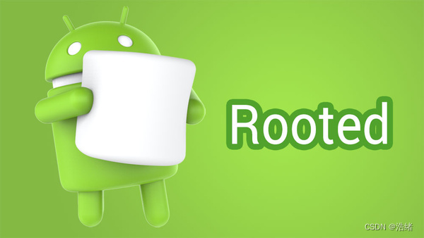
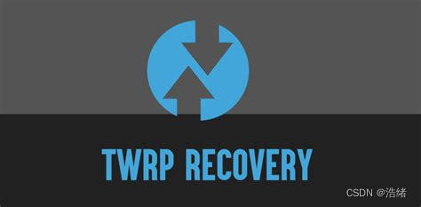
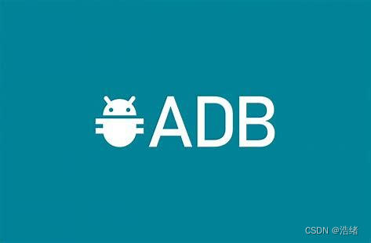
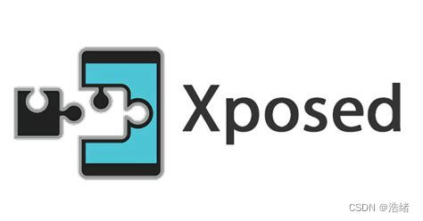
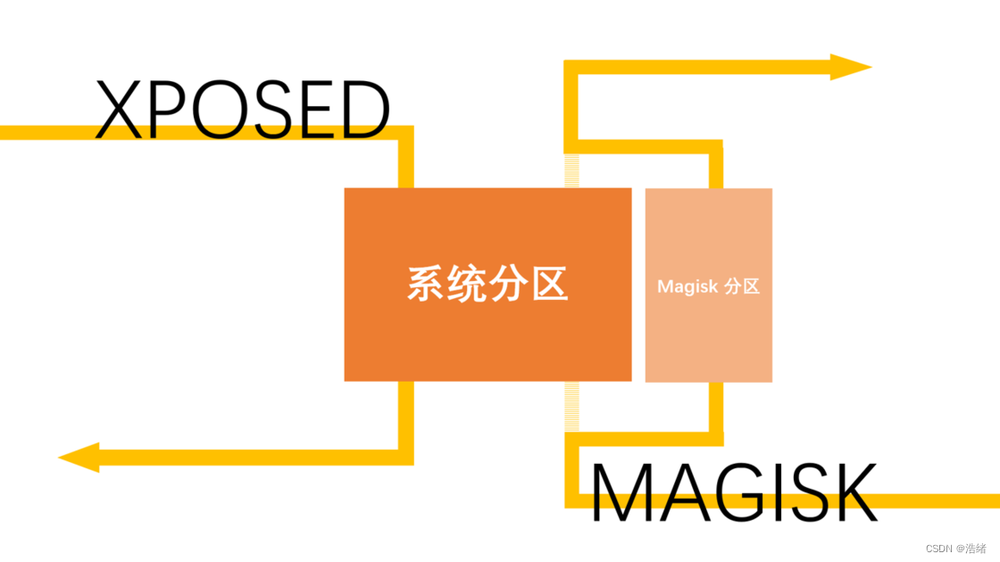
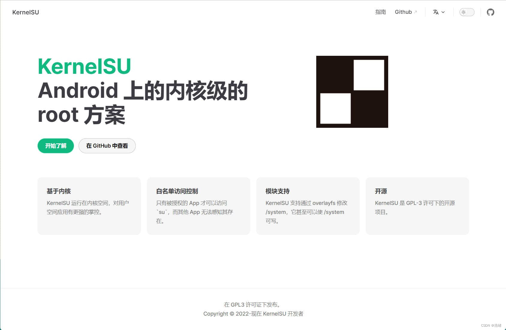

# 一些废话
作为Android极客入门的辞典和一些个人的碎碎念。

# 正文

## 关于Android和root，SuperUser



其实我这里写了解一下什么什么，不太好，因为百度怎么也比我讲的详细，比如：

<font color=purple>安卓（Android）是一种基于Linux内核（不包含GNU组件）的自由及开放源代码的移动操作系统。		--百度百科</font>

开卷第一分点想阐述的只是一个事情：

Android和Linux有着近乎父与子的关系。所谓的Android的root权限相当于Linux的root权限。

要知道这个权限是相当高的，你甚至可以自由的删除所有系统文件。

但是众所周知，Linux的root权限是可访问的，在sudo或者su的帮助下一个用户可以自己提权到root权限。但是Android没有这样的机制，权限被严格管控，用户层禁止访问。追求开源和自由的Android用户拒绝了这样的严格管控，并根据Linux的特性为Android提供了获取root的能力。

对于一个系统来说，权限最暴露最容易获取的途径不多，其中一个是自带的漏洞，早期的root大师什么的这类应用就是通过这个方法实现的，进而实现对全局root权限调用的管控。当然呢这样的方法很不安全。

再后来漏洞渐渐地被修复，通过漏洞获取root权限的可能性越来越小，越来越多人倾向于非漏洞方式，也就是Linux自己的方式，也就是我们之前提到的Linux的su。这也就诞生了很有名的SuperUser。SuperUser严格意义上不实现root功能，最最根本的root实现来自用户自行更换/system/bin路径下的su文件，并把SuperUser放到/system/app目录下作为一个权限管理器。这样每当全局使用su权限时，就会调用SuperUser进行拦截或放行。同时这个新放进去的su文件是777权限，也就相当于为全局解锁了root权限。

再到后来Android厂商的不断更新断送了更换su文件的方式，于是极客把目光投向了更更根本的地方——系统启动。如同一个刚出生的婴儿，一个刚启动的系统羸弱不堪，很容易被更改其启动过程中的某些东西，进而被获取root权限。

这也就诞生了大名鼎鼎的Magisk。

## 关于BootLoader

从知乎上扣了一张图，[原文](https://zhuanlan.zhihu.com/p/127074795)。
第一步是Boot Rom的启动，这个东西是直接写死在主板上的，你可以把它想成是BIOS。

第二步是启动BootLoader。来看百度：

<font color=purple>在嵌入式操作系统中，BootLoader是在操作系统内核运行之前运行。可以初始化硬件设备、建立内存空间映射图，从而将系统的软硬件环境带到一个合适状态，以便为最终调用操作系统内核准备好正确的环境。</font>

什么意思呢，大概就是说BootLoader是系统的引路人，它告诉硬件哪里是系统，应该启动哪里，也会做一些必要的检测来阻止非预期的分区改变(如阻止更改boot分区，因此Magisk使用必须解锁BootLoader)。它会是第一个运行的程序，控制了BootLoader也就间接可以控制整个系统。

也正是因为这个原因，绝大多数手机厂商想尽办法把BootLoader对用户隐藏，也就是常说的**BootLoader锁**。不过有些厂商也很够意思，没有隐藏BootLoader，如一加，小米等等。

我们常说的**解锁**，**bl锁**等等，说的都是BootLoader。

BootLoader的阶段实际上是看的出来的，如果你稍微留意一下手机的开机动画你会发现一般开机动画是分两段的(可能两段之间会有动画过渡之类的)，前一段动画就是BootLoader的启动动画，而后一段动画则是手机目前使用的系统的动画(这个是可以直接改文件修改的)。

## 关于Android的文件系统分区

Android的分区不采用和Linux一样的etc，usr这样的路径。

大致的有这几个分区：

**Boot分区：**开机启动相关的文件存储在这里，一般BootLoader正常运行时第二步就会来到这里，指导启动kernel，ramdisk等等。刷入Magisk时会涉及它。

**System分区**，顾名思义，这个分区存放的是系统相关的文件，刷机刷系统也是操作这个分区。

**Data分区**，存放内部存储文件，也就是用户数据，照片视频qq下载的文件这一类。

**Vendor分区**，不同手机厂商的定制内容就放在这里，这些定制内容和手机的定制硬件有关，如摄像头，体感设备等等。因此这个分区不能随便删除，否则手机的一些硬件会直接罢工并且几乎不能恢复。

**Cache分区**，存放一些缓存文件，这个倒是不太重要。

**Recovery分区**，存放了一个小型的操作系统，你可以把它想成是一个Windows下的PE系统，它可以提供必要的维修功能，Android10以前通过这个分区实现系统升级。所说的**刷TWRP**就是操作这个分区。

还有一些别的基本用不到的分区，比如BootLoader的分区，我就不一一写出来了了。

这里还必须提到一个事情是Android的几项更新：原本的System，Boot，Recovery都是单独的分区，并且有一套系统升级流程。这种单个分区式称为**non-AB分区**或者**AOnly**。

后来出了个新活，称为**AB分区**，它把System拆了两个出来，平时用一个，另一个用来作为备份和升级用，升级系统时选择不使用的进行更新，这样就不会因为更新系统影响用户体验了。除此之外，这种分区方式下不再有Recovery分区了，它被塞到了Boot分区里，升级的事情几乎交给了系统的一个内置服务。

具体技术细节解读可以看[这篇文章](https://zhuanlan.zhihu.com/p/364003927)。

这样直接合并Recovery分区和boot分区的操作让AOnly刷入第三分Rec和AB刷入第三方Rec的操作不一样。AOnly刷入到单独的Recovery分区即可，而AB需要先刷入到boot分区，然后借助第三方Recovery自己的功能进行固定。

其次它对adb和fastboot的影响是，你需要在刷入镜像文件时在命令行中指定分区。查看目前在使用的是哪个分区的方法很多可以自行百度。
## 关于Recovery和TWRP



前面说到Recovery是一个类似于PE的小型系统，我们可以在启动BootLoader后让BootLoader引导到Recovery中对系统进行一些修复之类的的操作。

但是官方标配的Recovery系统，功能真的太少了。

于是，出现了TWRP，全称TeamWin Recovery Project，是一款多功能触屏的Recovery，你可以把它理解为提供了很多黑科技的超级PE。

通过TWRP的功能实现刷入补丁包(又称卡刷包)，刷入镜像文件(如向boot分区刷入Magisk补丁文件，向System分区刷入系统文件)，称为**卡刷**，因为这个过程一般需要借助一张外部存储卡，(也可以不需要)。

因为TWRP本身也需要通过改变Recovery分区文件，所以使用TWRP之前百分百会进行一次**线刷**(后面会讲)。

根据TWRP的高级清除功能的不同选择会有很多种分区清理方式，它们被称为**四清**，**三清**，**双清**。

**四清**指清除System，Data，Cache，Dalvik Cache四个分区，这个过程会删除整个系统和所有用户数据。

**三清**即清除Data，Cache，Dalvik Cache三个分区数据，它会保留下原有的系统，相当于一次超级干净的恢复出厂设置。

**双清**即清除Cache，Dalvik Cache两个分区，只删了点缓存，当然呢也有特别的用途。

除此之外TWRP提供了一种模块安装功能(准确的说是系统文件替换功能)，通过这个功能可以修改某些系统API。这个功能也可以帮助Magisk在不修补boot镜像文件的情况下安装，也可以帮助实现XPosed框架功能。

## 关于Fastboot

Fastboot是可以由BootLoader引导进入的一个操作主板的模式，与Recovery大有不同。它没有界面，没有提示，没有触碰，甚至简单的只有一张图(，所有操作通过另一端的fadtboot软件实现。

Fastboot被写死在主板上，无法更改，同时它的权限也很高。通过数据线连接设备和Android官方的Fastboot工具可以实现对设备的许多操作，如重新刷入boot分区的文件等等。这样通过数据线连接和Fastboot模式进行刷机的方式，称为**线刷**。

Fastboot基本每个手机都有，不同手机进去的方式也不同，但是Fastboot提供的功能都一样。使用Fastboot之前不需要解锁BootLoader，但是你向分区刷文件什么的就需要了。


## Magisk


Magisk是当前最最流行的Root方式，其核心原理就是修改和替换了负责安卓系统启动的boot.img中的Ramdisk部分，该映像包括了一系列初始化init进程和启动时使用的rc文件。通过这个更改可以构建出一个在system基础上能够自定义替换，增加以及删除的文件系统，随后，Magisk几乎可以通过这个拟系统分区**拦截一切**。

只要愿意动手，它无所不能。

Magisk还实现了许多别的黑科技功能。这些黑科技功能通过Magisk实现启动时文件替换和执行脚本，称为**Magisk模块**。

Magisk可以通过修补系统镜像并进行重新刷入实现(线刷)，也可以通过使用TWRP直接更换系统文件的方式安装(线刷)，操作的分区是boot分区。

另外在AOnly分区下TWRP的安装涉及到System分区的一些修改，如果手机带有System分区完整性验证，那在刷完TWRP并重启后就会变砖了。关闭完整性验证的方式是额外刷如入Magisk的zip格式卡刷包，这也是为什么老是说Magisk还有个功能是**巩固Recovery**。

你可以到Github上找到Magisk项目。

## 卡刷包，线刷包，ROM包(固件包)和Magisk模块包

**卡刷包**指一般是指代ota格式的更新包，我们用TWRP刷XPosed框架和Magisk时用的就是这种，它拥有差分更新的能力(在某些场合，卡刷包只包含新旧文件的差别以节省空间。如果不使用这个特性，ota格式的包也可以接近成为完整的刷机包)，需要一个能操作单个文件的平台上才能执行(即Recovery)。卡刷包的格式大多是Zip格式，其内部按照一定的文件组织形式存放的文件会在安装时有序的**替换到对应的目录**。

**线刷包**指的是分区镜像，使用fastboot刷入的boot.img和recovery.img就是线刷包。线刷包直接访问闪存，改动范围非常大，甚至可以改变BootLoader，当然要实现这种改动需要在主板芯片组的帮助下，也就是我们熟悉的Fastboot模式。

除了刷机之外，线刷包和卡刷包更多的用来更新系统，这也是检测boot.img是否对应版本的一种方法。

**Magisk模块包**是另一种类型的更新包，其作用和线刷包相似，都是向目录替换/注入文件实现的(意味着Magisk的模块包也可以通过TWRP刷入，但是不建议这样干)。不过鉴于Magisk的实现机制，这样的替换首先在Magisk创建的分区中进行，然后同步到真实的分区中(这也是为什么Magisk模块刷出事后还可以救砖)。

**固件包(也称ROM包)**指的是ROM image(ROM包即此简称)，全称为Read-Only Memory image，即只读内存镜像，其中包含了完整的一个安卓系统和驱动程序。在历史条件下其被赋予这个名字。通常ROM包有两种格式，一种是供fastboot使用的img格式，一种是供Recovery使用的zip格式，很明显后一种是不包含有Recovery镜像的。通过刷入(或者称烧录)ROM包的方式可以为手机更换安卓系统。


## adb和fastbooot


adb全称为Android Debug Bridge，是Android官方为开发者准备的一套调试工具，通过数据线连接电脑和手机后，可以通过adb命令和fastboot命令(该命令只能在fastboot模式下运行)来对手机进行调试。

后来adb被广泛应用于(便宜给)极客刷机使用。

## XPosed，EdXposed和LSPosed



前面提到Magisk提供了一种模块机制。

XPosed也是一款为用户提供类似的模块功能的开源软件(准确地讲是一个框架)，不同的是Magisk提供的是**系统级**模块，如更改CPU频率等，XPosed提供的更倾向于**应用级**模块(它只修改/system/bin下的一部分文件实现拦截和注入功能，而且是半路拦截)，如QQ防撤回。

专业一点地说法：

它通过替换 /system/bin/app_precesss 程序控制zygote进程，使得它在系统启动的过程中会加载Xposed framework的一个jar文件即XposedBridge.jar，从而完成对Zygote进程及其创建的Dalvik虚拟机的劫持，并且能够允许开发者独立的替代任何class，例如系统UI又或者随意的一个app。除此之外使用这种方法的好处是ROM，APP都没有产生任何变化，因此理论上就不会造成设备变砖，同时撤掉修改也非常容易，仅需要停用 Xposed Framework 即可完全恢复原样。


这和Magisk是不同的，可以看下图：



XPosed已经停止支持，最终支持的Android版本为Android9，EdXPosed接续了XPosed并支持到了安卓11，LSPosed是EdXPosed的一个分支，对其进行了优化，提供同样的功能的情况下可以支持更多的功能，而且支持更高版本Android12。

LSPosed不再像XPosed一样需要使用TWRP刷入文件，它使用Magisk模块支持的方式。

## AVB2.0验证

验证启动（Verified Boot）是Android一个重要的安全功能，主要是为了访问启动镜像被篡改，提高系统的抗攻击能力，简单描述做法就是在启动过程中增加一条校验链，即 ROM code 校验 BootLoader，确保 BootLoader 的合法性和完整性，BootLoader 则需要校验 boot image，确保 Kernel 启动所需 image 的合法性和完整性，而 Kernel 则负责校验 System 分区和 vendor 分区。

简单的说，就是部分厂商机型可能由于avb2.0验证boot.img是否被修改，导致刷入magisk或者三方Recovery后陷入假变砖无限重启的情况，此时需要将ROM包中提取到的的vbmeta.img重新刷入并关闭验证即可。你可以使用fastboot进行这个过程，也可以在TWRP第一次安装时通过刷入Magisk卡刷包实现。

除此之外，因为AVB2.0的出现Magisk的最新版本也在修补boot.img文件的选项中加入了同步修补vbmeta.img镜像的选项。不过呢这个选项非常鸡肋，对于定制系统的国内厂商的镜像而言，勾选这个选项后大概率会刷成砖。

```bash
fastboot --disable-verity --disable-verification flash vbmeta vbmeta.img
```

## KernelSU




前面说到Magisk的工作方式是构造一个新的文件系统来充当系统分区然后进行拦截。

KernelSU是针对GKI(通用内核镜像计划)的逐渐发展提出的一种全新的Root方案，它直接工作在内核模式下，可以提供内核级别的拦截。它的作者是维术老师(中国人)，维术老师同时也是太极框架的作者。

这里需要一点操作系统的**内核态**和**用户态**的知识。Magisk即使拦截出一个系统分区，那也只是用户态而已。

KernelSU工作在内核空间，可以对内核中的几乎任意函数进行拦截，比如拦截系统调用，过滤openat、inofity等。内核级别的HOOK，意味着对所有所有进程完美的控制，除非你的对手也是 root 进程(但是这怎么可能)。

KernelSU的原理也使它拥有几乎完美的Root隐藏功能，这个功能是Magisk一直捉襟见肘的。不过，KernelSU的发展还需要时间，它目前还在不断完善其模块功能。

因为KernelSU和Magisk的底层原理完全不同，所以**二者可以共存**，同时作为Root权限管理器。

KernelSU的工作原理也决定了其安装方式，即向boot分区中使用fastboot刷入被定制编译好了的img文件。这也是为什么它基于通用内核镜像计划，因为一旦内核镜像是被厂商定制了的，那KernelSU的刷入要么会造砖，要么无效。但是厂商定制内核镜像对Magisk是无影响的，Magisk可以自己修补镜像。同时，如果手机可以刷入通用的Android镜像，那就可以直接让Magisk修补这个通用镜像，然后你将得到Magisk+KernelSU的双Root镜像(但是有点像爹管儿)。

当然还有一种解决办法，那就是自己提取被定制的镜像，然后自己编译，这个操作就涉及Linux内核编译了。

## 高通QPST线刷

这是使用高通CPU的手机共有的一种非常底层的刷机模式，又称为Download模式，9008深度刷机等等。

即使Fastboot，Recovery分区都被摧毁，QPST线刷依然可以正常使用。

高通QPST线刷其实就是利用高通芯片自带的9008端口，将手机系统内的所有分区的镜像文件，直接刷写手机。这个刷机方式比Recovery卡刷和Fastboot线刷，更底层、高效、强大。这种方式，不需要进入手机的任何分区，就可以直接刷写手机固件。就算手机开不了机了，一样可以刷入，只要9008端口能连接就可以刷。这就是高通线刷既可以刷入系统又可以救砖的原理。

由于QPST极其底层的存在，绝大多数高通CPU的手机都可以绕过解锁BootLoader进入QPST直接刷写Revovery分区和Boot分区实现刷入第三方Recovery或者Root。

QPST大多数时候需要拆开手机后盖直接在主板上面短接触点。


