# 说明
GitHub Actions 是 GitHub 的持续集成服务，于2018年10月推出。通过Github Actions可以实现诸多自动化功能，比如自动打包，自动发布Release等等。除此之外，GitHub Actions完全免费。

[GitHub Actions 文档](https://docs.github.com/zh/actions)：

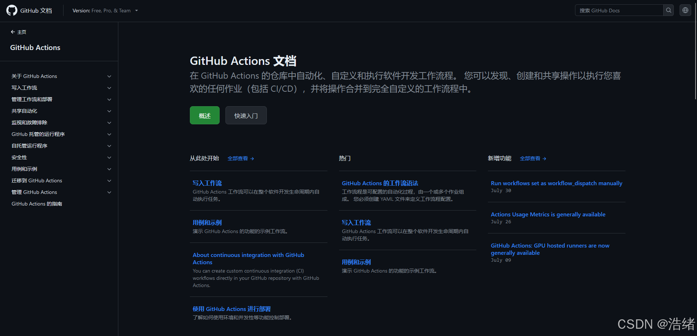
# 正文

## 1.设置仓库密钥
GitHub Actions多数时候会调用一个叫做`github-actions`的机器人进行工作，这意味着我们必须为仓库添加Token才能让GitHub Actions正常工作。

访问你的`settings`页面，找到`Developer settings`，选中`Personal access tokens`，选中子选项`Token (classic)`，点击右上角`Generate`后再次选择`classic`，在密钥的设置界面取个名字，设置日期，<font color=red>勾选框图中的三个权限</font>即可。
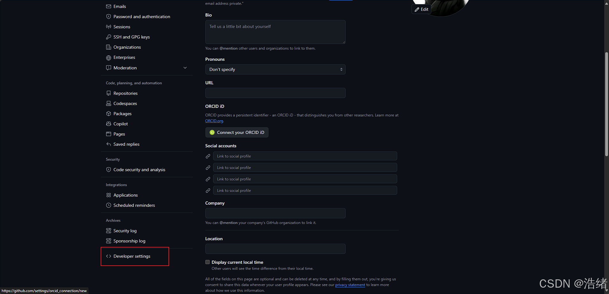  
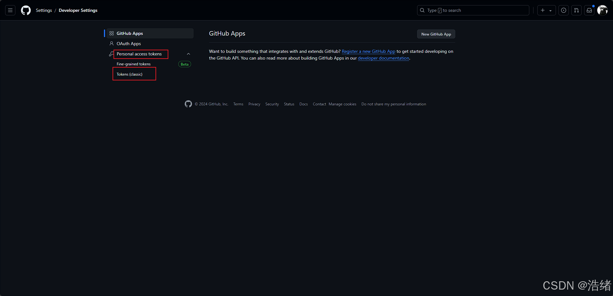  
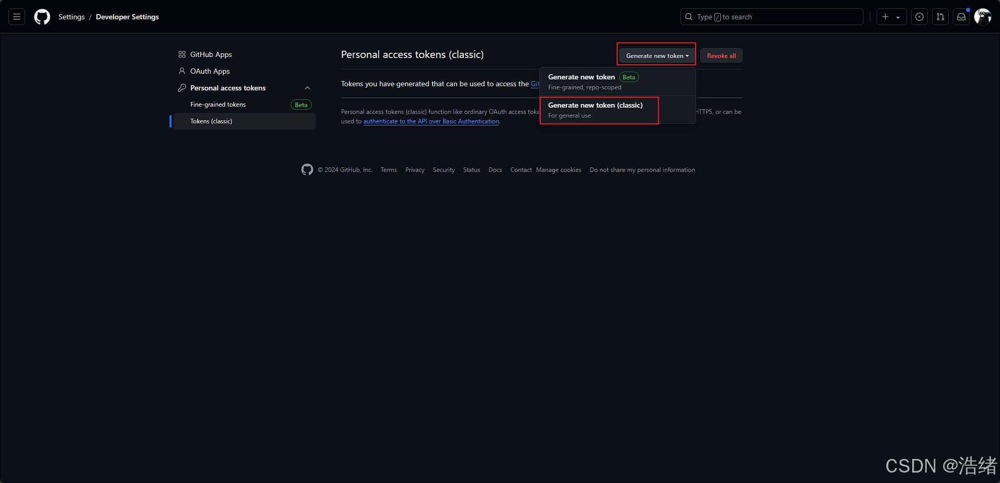  
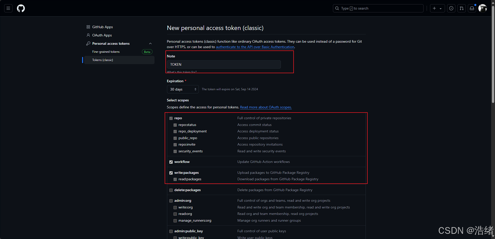

拉到最下方点击`generate`后，复制密钥信息：

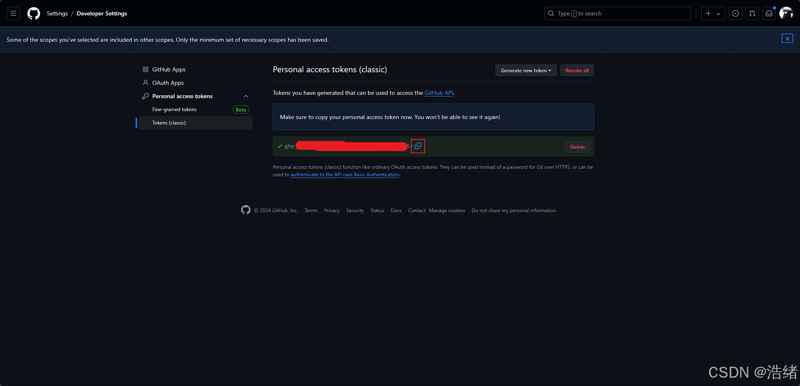

打开你的项目的`settings`页面，找到`Secrets`选项卡，选中`Actions`，选中下方`New secret`，<font color=red>名字不重要可以随便取，但是这个名字要记住后面要用</font>，填入刚刚的密钥后保存即可。

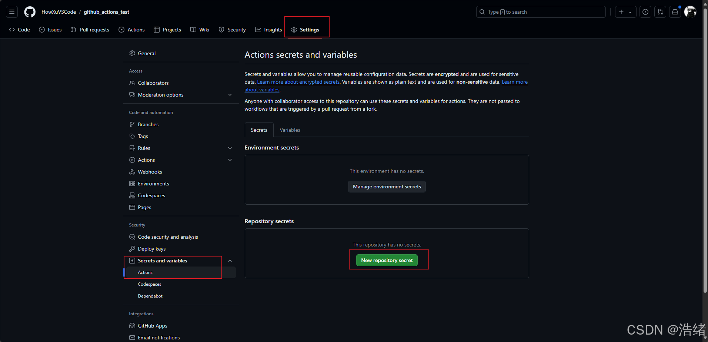  
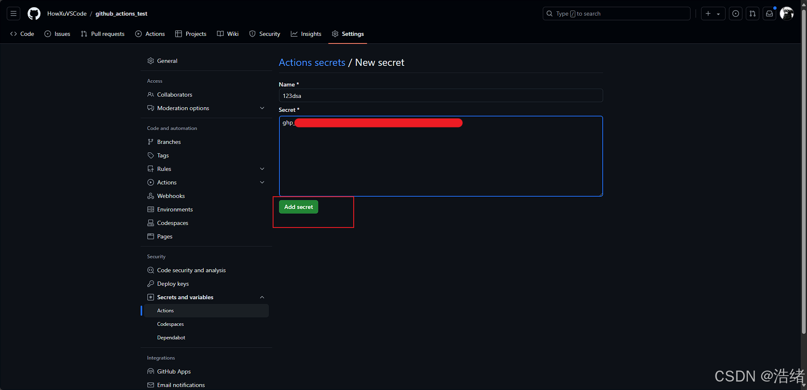

## 2.打开仓库权限

因为Release涉及文件读取，因此要把`setings-Action-general`中的读写权限开启：

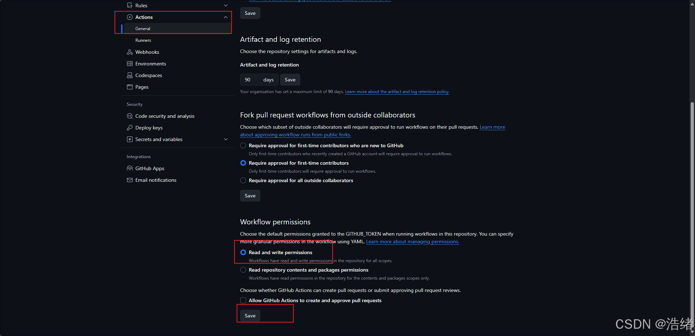


## 3.配置自动化文件
GitHub Actions的自动化信息来自项目根目录下`.github/workflows`文件夹下后缀为`.yml`的文件(其文件格式遵循yaml)

Yaml文件在GitHub Actions中具有条件判断能力，你可以设置多个文件来满足不同的需要。

新建一个Release文件，填入以下内容即可：

```yaml
name: Build and Release

on:
  push:
    tags:
      - "v*"

jobs:
  build:
    runs-on: ubuntu-latest

    steps:
      - name: Checkout
        uses: actions/checkout@v2

      - name: Install gcc
        run: sudo apt install -y gcc

      - name: Make Build dir
        run: mkdir build

      - name: Build
        run: gcc a.c -o ./build/release

      - name: Release
        uses: softprops/action-gh-release@v2
        with:
          token: ${{ secrets.123dsa }}
          body_path: ./CHANGELOG.md
          files: |
            ./build/**
            ./CHANGELOG.md

```

我不会细致地解释为什么这样写，在[说明](#说明)的文档超链接里有所有内容。

`name`:这个自动化的名称，会在GitHub Actions中作为分别选项卡进行区分
`on`:执行条件。因为支持通配符，这里的设置为**当此push的标签为v开头时执行**
`jobs`:很显然是做些什么
`build`:其中的`runs-on`指定在最新的ubuntu系统上运行
`steps`:执行内容，其中`name`指名称(不是很重要)，`run`指定执行的代码。需要注意的是所有`run`命令的工作目录都是项目根目录

第一步为**通用步骤**，复制源代码并检查哈希值。

二三四步为一个简单的gcc构建。

第五步为构建发布，使用了[GH Release](https://github.com/marketplace/actions/gh-release)这个Action，`with`指定了参数，`token`指定给机器人用的token，与上文添加密钥时的名字一致，，`body_path`指定从根目录的`CHANGELOG.md`文件读取内容作为Release的内容(不加这一行也可以)，`files`指定Release的文件，`|`为Yaml的特定符号，其下可以使用多行文字。通配符`**`代表build目录下所有文件。

效果:

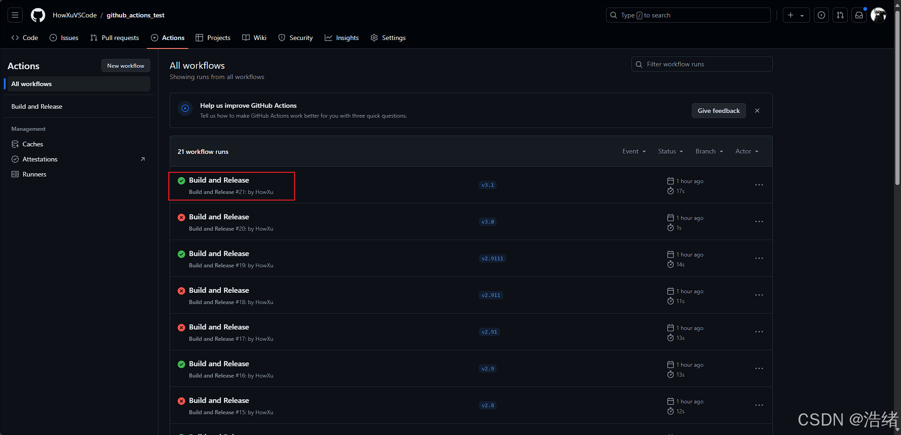  
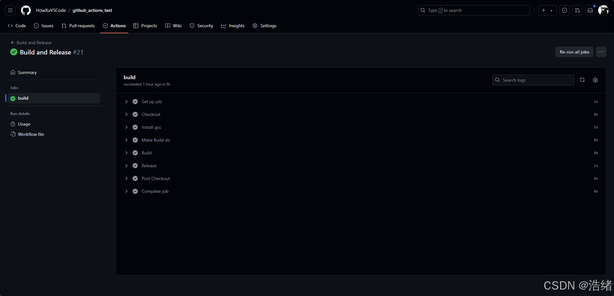  
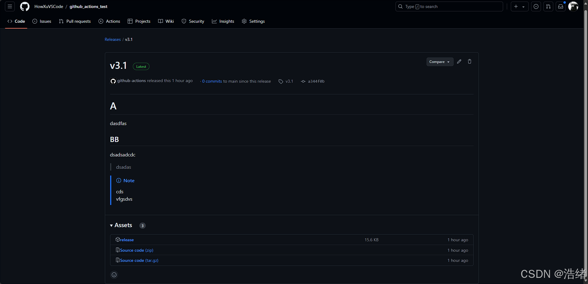
## 4.写在最后
GitHub Actions自带有很多的参数，例如`github.ref`代表本次执行时传入的标签，并且`GH Release`这个Action还具有设置pre-release等等功能，可以自定义出相当实用的自动化。
