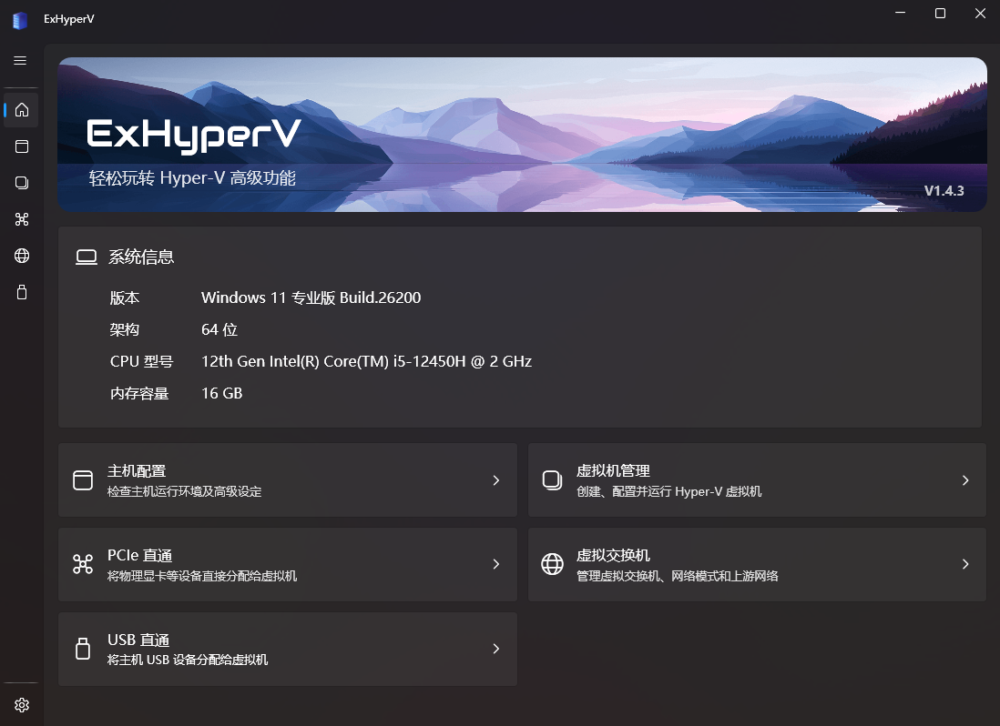
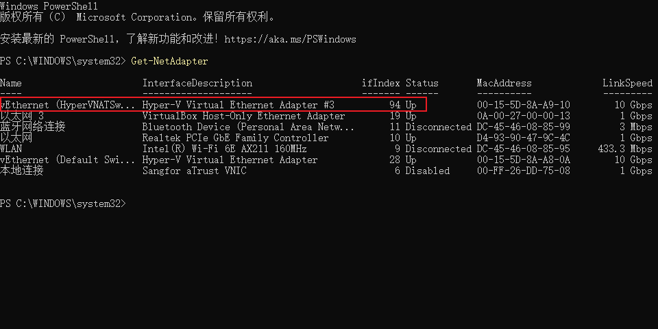

据说Hyper-V性能比WSL和VMWare，Virtual Box都要好，而且我最近打算研究一下Linux Kernel编程，WSL想做Linux Kernel编程很麻烦，所以我就决定装个Hyper-V用一下。

有一个管理器很好用，[ExHyperV](https://github.com/Justsenger/ExHyperV)，就是标题图那个，用这个就可以获得类VMWare的体验了。

安装一个发行版是非常简单的，但是我没想到配静态IP能有这么麻烦，麻烦了一个下午，把我复习毁了😭。

# 流程

## 概览

Hyper-V想要配静态IP关键在于它的一个叫做**虚拟交换机**的这个东西，首先在本次流程里是完全不需要打开Windows自带的Hyper-V Manager的。

想要实现Hyper-V直接通到Windows主机的网络环境上，同时保留访问外网能力，需要用到Windows一个自带功能叫做NAT，这个东西直接用Powershell管理员就能使用。

解释一下NAT和虚拟交换机在Windows里的概念。

### 虚拟交换机

你可以把它理解成Windows凭空捏出来的一块虚拟网卡（界面名长这样：`vEthernet (NATSwitch)`），这块虚拟网卡一头连着你的物理网卡，另一头连着Hyper-V里的虚拟机。虚拟机选哪块虚拟交换机，它的流量就从那块虚拟网卡进/出。

Hyper-V有三种模式：

- **External**：连到物理网卡，能访问外网
- **Internal**：只和主机互通，**不能直接访问外网**，要靠NAT
- **Private**：只和同交换机下的虚拟机互通

我们要的就是Internal，自己再叠一层NAT。

### NAT

NAT就是网络地址转换。虚拟机发出去的所有包，Windows主机会用自己的IP替换掉源IP再发出去，回来的包再换回去。对外只暴露主机的IP，虚拟机之间共享主机的网络出口。

Windows自带`New-NetNat`这条命令可以直接搞，不用装任何东西。

## 创建虚拟交换机

管理员身份开Powershell，先看看现在有啥：

```powershell
Get-VMSwitch
```

一般是空的（或者只有个Default Switch，那个是自动分配的DHCP）。新建一个内部(Internal)的：

```powershell
New-VMSwitch -Name "HyperVNATSwitch" -SwitchType Internal
```

`HyperVNATSwitch`这个名字随便改，后面用到的地方同步改就行。

## 给虚拟网卡配网关IP

首先查询刚刚创建的`HyperVNATSwitch`的索引是多少:

```powershell
Get-NetAdapter
```

找到`HyperVNATSwitch`对应的索引值:



这里是94。

给它配一个静态IP，这个IP就是后面虚拟机里的网关：

```powershell
New-NetIPAddress -IPAddress "192.168.2.1" -PrefixLength 24 -InterfaceIndex <你的接口索引>
```

`192.168.2.1`就是给虚拟机的网关。

这个网段其实比较随便，192.168.0.0这一段比较多，192.168.1.1给了本地网关，我就拿了个192.168.2.1。

## 创建NAT网络

```powershell
New-NetNat -Name "HyperVNATNetwork" -InternalIPInterfaceAddressPrefix "192.168.2.0/24"
```

这条命令的意思是：针对`192.168.2.0/24`这个网段启用NAT。

要查状态：

```powershell
Get-NetNat
```

要删掉重来就输这个：

```powershell
Remove-NetNat -Name "HyperVNATNetwork"
```

## 虚拟机里配静态IP

我的是Kali Linux，所以下面以Kali为例。

```bash
sudo vim /etc/network/interface
```

```conf
auto eth0
iface eth0 inet static
    address 192.168.2.10
    netmask 255.255.255.0
    gateway 192.168.2.1
    dns-nameservers 8.8.8.8 114.114.114.114
```

注意这个 `iface eth0 inet static`, `eth0` 是Kali内部的对应网络交换机的网络。

然后`sudo systemctl restart networking`。

## 验证

回到虚拟机里：

```bash
ping 192.168.2.1   # 通主机
ping 8.8.8.8       # 通外网
ping baidu.com     # DNS解析
```

如果第一通、第二通、第三不通，就是DNS问题，`cat /etc/resolv.conf`看一下nameserver有没有。

如果第一就不通，回去检查Hyper-V里虚拟机的网络适配器是不是接到`HyperVNATSwitch`了，以及Kali里面`ip a`看到的网卡名和nmtui里选的网卡对不对得上。

# 总结

就这么点事，网上没一个教学是人看得懂的，全是些什么高手教学，AI出的也是基于这些博客的教学，这么点事忙活一个下午，那我的期末周怎么办呢😭。