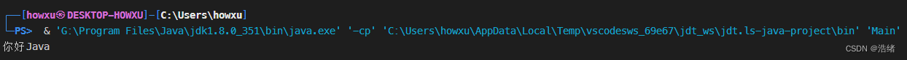

@[TOC](目录)

# 直入主题

我也不过多地解析什么案例什么的(想必各位遇到的比我都多)，直接开始进入主题：
Java的中文乱码是多方面的，它与以下三个设置息息相关：

**1.Java编译器自动选择的编码格式**
**2.所使用的命令行工具的编码格式(如Terminal，cmd等)**
**3.源代码文件的编码格式**

也就是说，只要这三者有任何一个与其他两个不相同，或者是不同后没有合适的转换(特别是没有IDE的情况下)，都会出现中文乱码问题。

需要注意的是，如果使用Gradle开发，那还需要加上一个:


**4.Gradle项目配置中指定的编码格式**

另外，使用其他的IDE也会有所不同

## 1.Java编译器自动选择的编码格式

很遗憾，这个问题我们并不能按照自己的意愿解决。Java编译器的编码格式选择完全取自于我们使用的操作系统和地区语言设置，比如当我们使用Windows 11 中文版时，Java编译器会自动使用GBK编码，目前我还没有想到什么办法解决。

当然，对于Linux用户来说这算不上什么，因为Linux上的Java会自动使用UTF-8编码（无论语言）。

## 2.所使用的命令行工具的编码格式
拿cmd举例：

在cmd中键入`chcp`

 
获得的`65001`，代表当前cmd使用的编码为UTF-8。

获得的`936`，则说明使用GBK编码。

这个编码应该和Java编译器保持一致，我们可以使用`chcp 936`更改为GBK编码。

控制台的编码与编译后文件的输出相关，改它很有必要。

## 3.源代码文件的编码格式
这也是其他教程经常提到的一点，文件的保存格式也会对编译产生影响。

在微软自带的记事本里不能把文本保存为GBK，则应该使用`ANSI`。（这一点我不太理解，毕竟ANSI并没有中文编码）

## 编译器+命令行+源文件编码统一

如果在windows系统上使用gbk编码，请将在文件另存为时选择编码格式为`ANSI`，这样就可以实现JDK编译器，cmd命令行，文本格式的统一。

但是，如果想在windows里使用UTF-8编码编译，就需要借助IDE或者Gradle这样的项目管理工具。

如果使用IDEA，VSCode等IDE，可以直接把文本编码改成使用UTF-8，然后使用IDE自带的编译启动(就是不用命令行，使用如IDEA的main函数旁边的启动这样)，就可以用上UTF-8了。

## 4.Gradle项目配置中指定的编码格式

如果使用了Gradle管理项目，我们需要特定的搭配


**Java编译器GBK+控制台GBK+文本编码UTF-8+build.gradle配置为UTF-8**


打开项目的`build.gradle`文件，向其中加入下列代码
```bash
tasks.withType(JavaCompile){
    options.encoding="UTF-8"		//这里最好选择UTF-8
}
```

下次编译将会使用指定的编码编译

## 5.关于一些注意事项
首先，在编译命令`javac`后添加`encoding=utf-8`真的不是一个有效的方法，除去繁杂一说，还存在许多不可言说的BUG

其次，所谓的将Windows操作系统更改为`beta版的IUTF-8编码`(即下图)，也不建议，确实，这样一启动CMD就是utf-8编码了，但是Java编译器仍然会使用GBK(而且控制台会中文乱码)。


另外，如果使用VSCode，其默认使用PowerShell进行编译，我们需要的编码应该是**Java编译器GBK+控制台GBK+文本格式UTF-8**，因为VSCode的Run会帮我们设置编码，所以需要特别的安排一下。


# 写在最后





