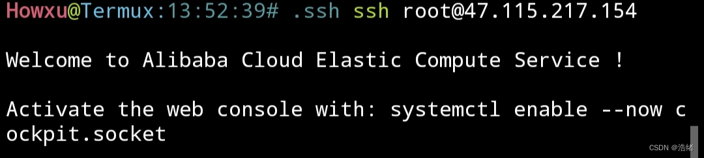

# 写在最前

&emsp;Termux作为强大的终端模拟软件，通过ssh可以轻松的连接到云服务器上，这里以连接阿里云服务器为例

## 1.连接服务器

&emsp;一般在服务器运营商上购买的服务器都开启了远程连接服务。先在ternux上安装openssh。

```shell
pkg install openssh
```

&emsp;安装完成后，在服务器控制台找到需要连接的服务器的ip地址，以47.115.217.154为例，在termux中键入

```shell
ssh root@47.115.217.154
```

&emsp;其中的root是用户名，如果以其他的用户名登录应更改命令中的`root`部分，`@`后面接的是服务器ip地址，ip地址可以从服务器控制台找到。再之后按照提示输入密码就可以连接成功了。


## 2.为服务器和termux添加ssh免密登录

&emsp;每次连接服务器都需要输入一次密码，我们可以为服务器添加公钥来实现免密登录。

&emsp;首先键入

```shell
ssh-keygen -t rsa
```

&emsp;遇到任何选项都回车，具体原因的详细说明可以看上一篇博客[链接](http://t.csdn.cn/wEctz)，生成的密钥文件会保存在termux的home目录下的.ssh文件夹中(这个文件夹不可以对group组开放权限)，使用cd命令进入该文件夹

`/data/data/com.termux/files/home/.ssh`

&emsp;之后使用vi或者vim打开`id_rsa.pub`(或者使用cp将`id_rsa.pub`文件拷贝到其他可读文件夹用txt格式打开)，将里面的内容全部复制。

&emsp;登录服务器，进入用户目录(如果是root就进入/root)，之后cd进入.ssh目录，ls后找到其中的**authorized_keys**文件，使用vim打开，然后把复制的内容全部粘贴进去，保存退出(不懂使用vim的可以自行百度一下vim基础使用)。

&emsp;再次使用`ssh root@47.115.217.154`登录服务器就不需要密码了。



## 3.使用Termux连接另一台手机上的Termux

&emsp;首先，需要让两台设备都处于同一局域网下(或者被连接的设备处于可被访问的场景下)。

&emsp;在被连接设备上键入下面命令查看当前局域网内该设备的ip:

```shell
ifconfig
```

&emsp;找到当前局域网的ip之后，换到被连接的设备上操作，使用下面命令打开Termux的ssh连接。其中的`-p 1234`指定了ssh连接的端口，这个可以根据需求选，不添加改参数则将默认使用8022端口:

```shell
sshd -p 1234
```

&emsp;之后使用下面命令为被连接设备创建一个密码。根据提示键入两次密码即可:

```shell
passwd
```

&emsp;之后，在另一台设备上使用:

```shell
ssh -p 端口(默认8022) user@ip地址
```

&emsp;根据提示键入密码即可连接。

&emsp;同样的，我们可以在被连接设备上设置ssh公钥实现免密连接。

&emsp;在被连接设备上使用vim打开并编辑位于`~/.ssh/authorized_keys`文件，将之前获取到的`id_rsa.pub`中的内容粘贴进去保存即可。注意`authorized_keys`文件权限必须是600。

&emsp;上述操作也可以实现其他设备连接手机上的Termux终端。

## SSH的简单配置文件
&emsp;如果没有zsh或者其他的命令行插件，每次重新复制粘贴或者找ip，找密码确实是个麻烦的事。我们可以通过配置ssh文件来实现快捷登录。

&emsp;首先，在用户的`.ssh`文件夹下新建一个名称为`config`的文件，注意*不需要扩展名*。Termux的.ssh文件夹一般在`～/.ssh`。

在config文件里的配置可以这样写:

```bash
Host 任何你想要的缩写类型，如ut，rt
Hostname 指定连接的ip地址
user 指定连接的用户名
port 指定连接的端口
```

&emsp;比如这个样子:

```bash
Host ut
Hostname 192.168.1.1
user ubuntu
port 66
```

&emsp;之后就可以通过缩写快捷ssh登录(搭配ssh密钥使用更佳):

```bash
ssh ut
```


