# 关于WSL的碎碎念
WSL，全称为The Windows Subsystem for Linux，中文名适用于Windows的Linux子系统。WSL出来已经很长一段时间了，有人说它不好也有人说它好。说不好的认为WSL高度阉割，Bug频繁，资源占用多，不如用虚拟机。说好的认为它启动快，部署简单，磁盘占用小，适用于个人开发环境。

我个人是比较倾向推荐WSL的，尤其是WSL目前已经更新到了WSL之后。对于个人开发环境，比如编译一个Linux内核之类的，或者涉及Linux编译的操作，WSL都是不二之选，尤其是其具有**快速访问物理机磁盘**的功能（虽然这个功能也有一些Bug），但是总的来说还是很好用的。不过涉及某些跨度比较大的操作(比如网络操作)，WSL就不太建议了。具体可以看这篇[文章](https://zhuanlan.zhihu.com/p/459480602)。

# 准备工作
WSL有很多安装方式，但是在此之前需要做一些简单的配置：

## 更改新内容保存位置

大多数安装WSL的方式都是直接安装在C盘，如果你的C盘比较富裕可以跳过这一节。

WSL安装过程有很多分步下载，建议在最开始就更改保存位置。以Win10为例，如下方式进行更改。

你也可以直接搜索（

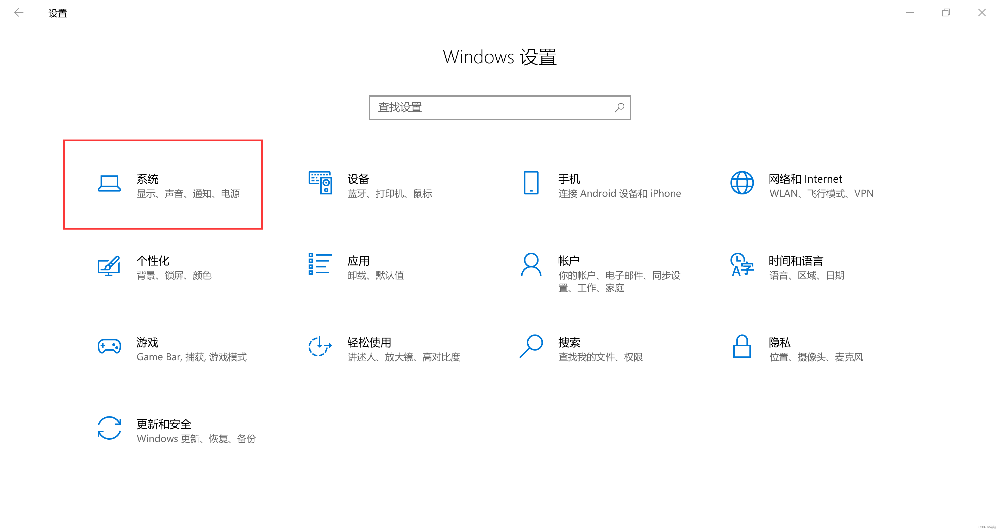  
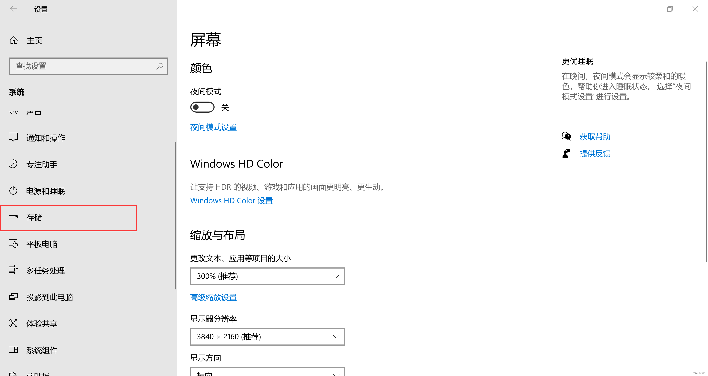  
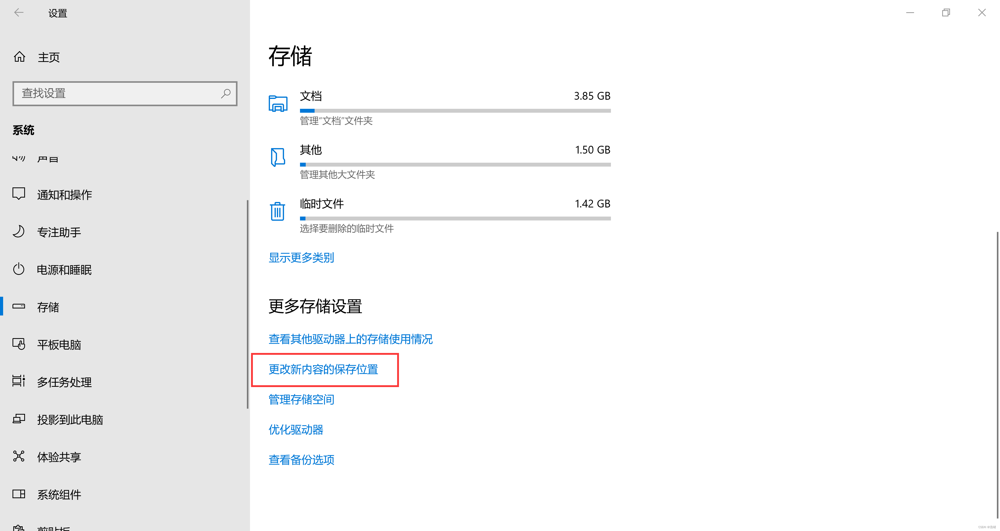  
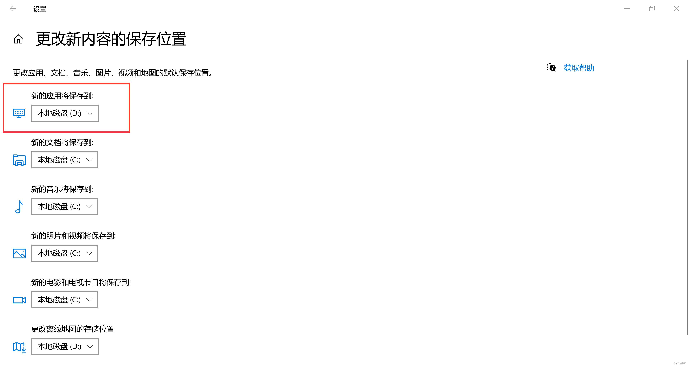
## 开启WSL选项
你不能说你找不到控制面板吧（


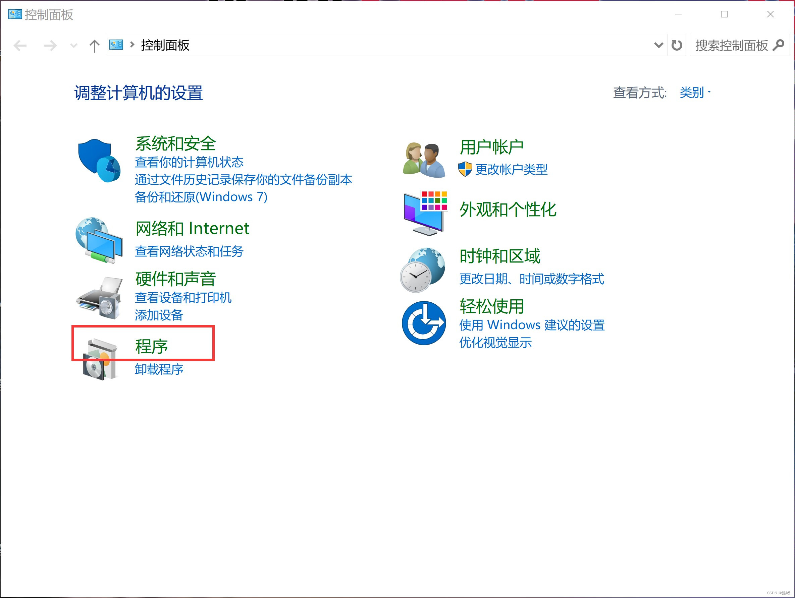  
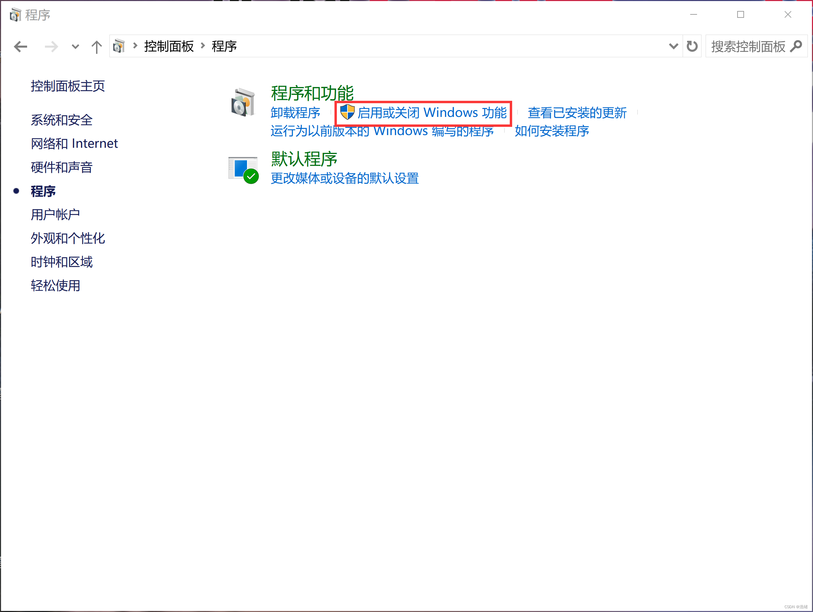  
勾选如下三个选项：  
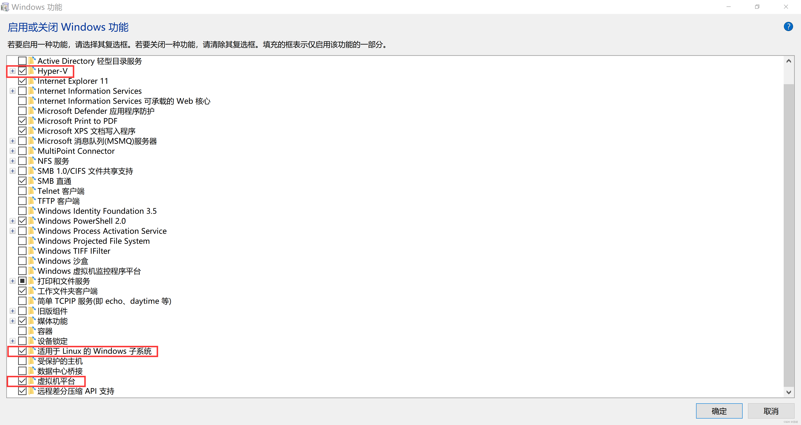

然后就可以重启了。

# WSL更新

使用`wsl --update`更新一下WSL：

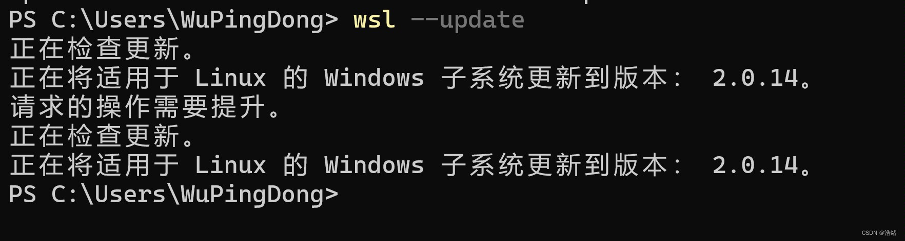

之后务必重启一下不然会出乱子。


# 安装

## 方式1：在Microsoft Store安装

直接打开你的Microsoft Store，搜索你喜欢的WSL，如Ubuntu，直接下载打开就可以了。打开之后依次输入用户名和密码即可得到全新的WSL系统。

**优点**：无脑安装快捷简单
**缺点**：可自定义程度低，可能需要魔法

## 方式2：使用离线安装包安装

你可以在[微软WSL官方安装教程](https://learn.microsoft.com/en-us/windows/wsl/install-manual)找到如下页面。

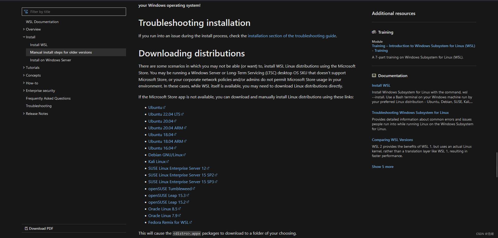  
下载其中的appx文件，双击打开就可以安装。

**优点**：解决了网络带来的问题。
**缺点**：和微软商店安装没有差别。

有些教程说这样安装可以更改安装位置。实际上不能（

## 方式3：直接使用WSL命令行安装

你可使用`wsl --list --online`获得所有的官方WSL的名称：
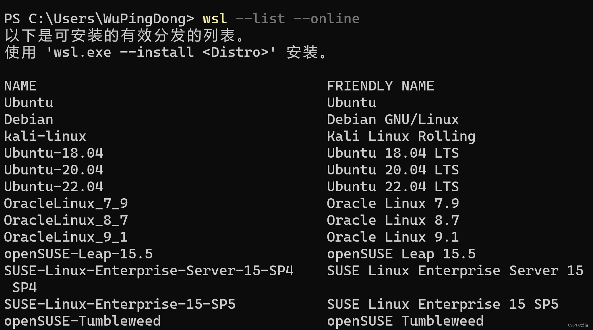

选择其中一个使用`wsl --install 发行版名称`进行安装，如：

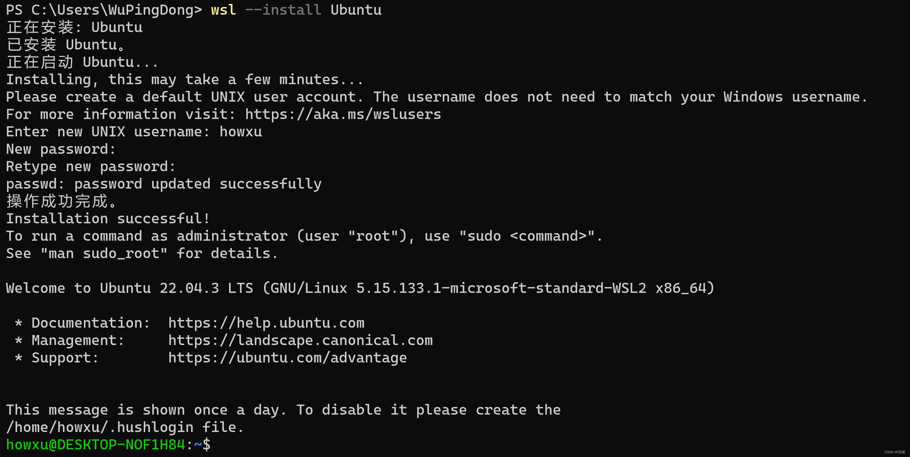

这种安装方式和微软商店安装依然没有任何差别。


## 方式4：使用导出包进行安装

WSL可以选择导出整个WSL系统，通过导出-导入的操作我们可以更改WSL的系统位置。

如果你有现成的导出文件可以直接导入，否则只能先下载到C盘，再导出，再导入。

这个方法我推荐安装Debian，因为Debian的WSL特别小。

官方操作说明：

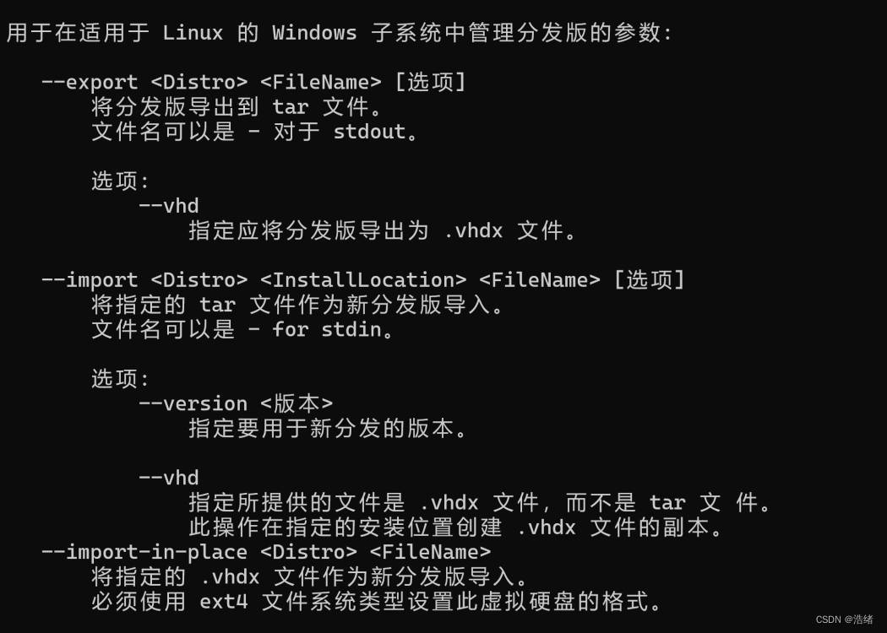


退出WSL系统，首先使用`wsl --shutdown`停止WSL，再使用如下命令导出：

```bash
wsl --export 发行版名称 导出文件位置(必须加上文件扩展名)
```

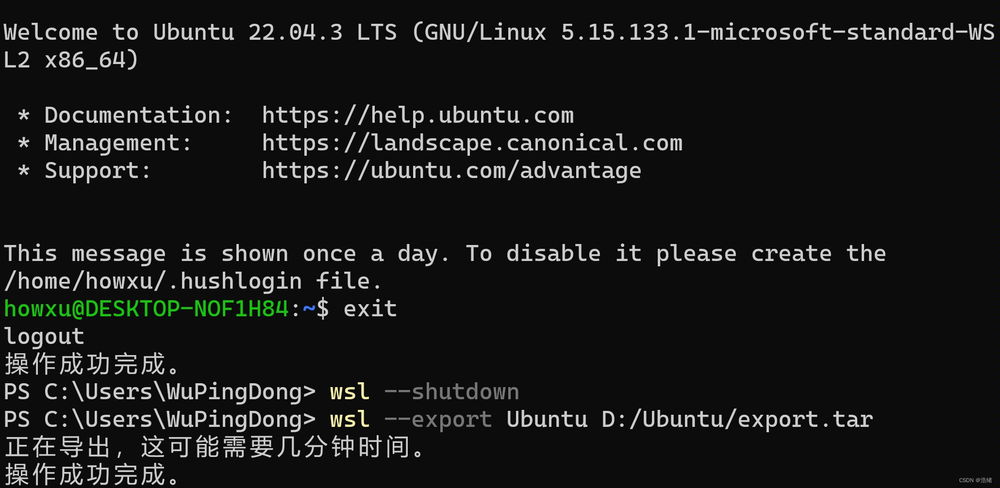

之后就可以到对应位置找到导出文件：

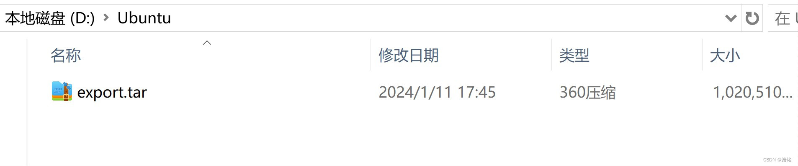  
然后就可以删除原本的WSL了：

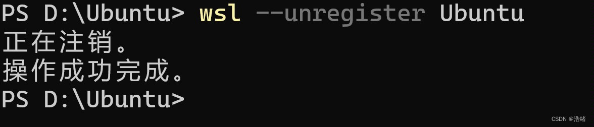


再以如下方式导入，注意：

```bash
wsl --import 导入的发行版名称 导入位置 导入文件 --version 2
```


文件夹下会多出磁盘文件：  
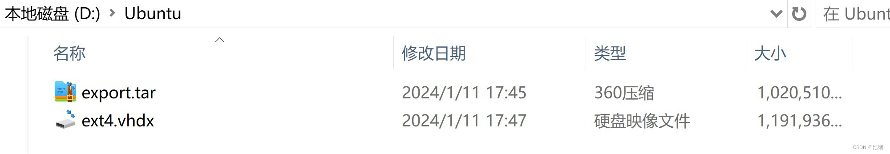


之后就可以直接用`wsl`登录默认WSL或者`wsl -d 发行版名称`登录指定的发行版。

# 一些优化工作

[WSL高级设置_微软官方](https://learn.microsoft.com/zh-cn/windows/wsl/wsl-config#configure-global-options-with-wslconfig)

## 方式4带来的用户名问题

使用方式4安装后默认用户名都是root。

如果你使用Ubuntu系统，可以使用官方程序直接修改默认用户名：

```bash
Ubuntu config --default 用户名
```

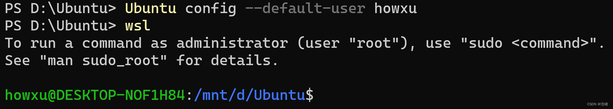

如果是其他发行版，则需要先以root登录WSL，之后运行如下命令：

```bash
myUsername=需要的用户名
echo -e "[user]\ndefault=$myUsername" >> /etc/wsl.conf
```

或者手动创建`/etc/wsl.conf`文件，填入以下内容：

```yaml
[user]
default=你需要的用户名
```

## WSL的内存使用问题和处理器个数问题

你可以修改物理机上的`C:\Users\用户名\.wslconfig`文件(如果没有则需要新建)，向其中填入或者修改如下内容:

```yaml
[wsl2]
processors=4 #设置最多处理器个数
memory=8GB #设置最大内存
swap=0 #无交换文件
```

# 结尾

WSL的Windows Terminal启动和快速挂载只需要不到5秒钟，真的很香，而且可以直接在资源管理器里操作WSL的文件：

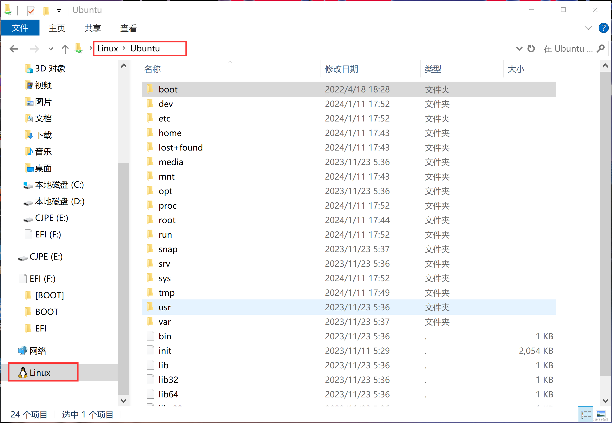


