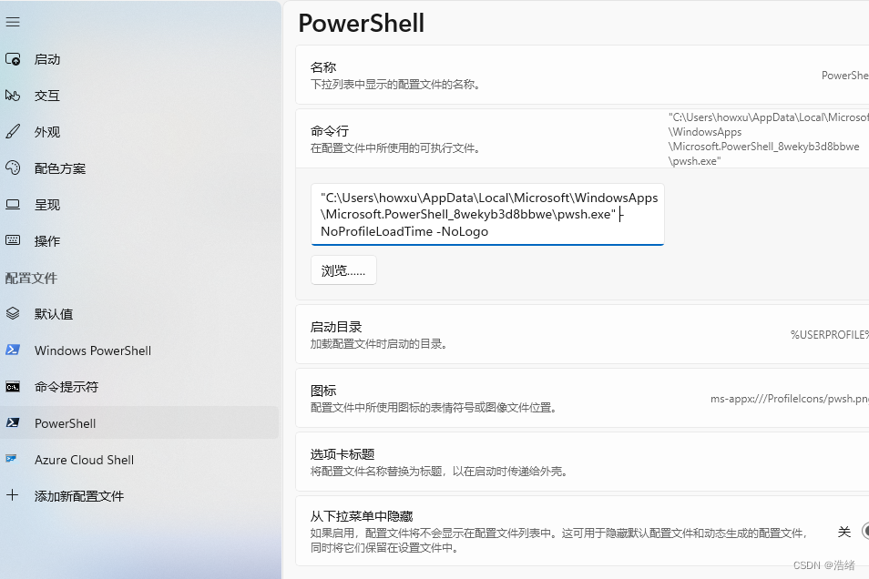

# 写在最前

写这篇文章纯属是因为windows自带的PowerShell和ubuntu系统原有的终端实在太丑陋了。

# Linux系统下的终端美化

zsh 是一个兼容 bash 的 shell，相较 bash 具有以下优点：

- Tab 补全功能强大。命令、命令参数、文件路径均可以补全。
- 插件丰富。快速输入以前使用过的命令、快速跳转文件夹、显示系统负载这些都可以通过插件实现。
- 主题丰富。
- 可定制性高。

关于 zsh 的更多的信息，可以访问 [zsh.org](https://www.zsh.org/) 查看。

本文使用ubuntu系统作为演示。

## 1.安装zsh

这一步很简单，在多数Linux系统的包管理器内都可以直接命令安装。

```bash
sudo apt install zsh
```

之后可以通过```cat /etc/shells```来查看已经安装的Shell。


使用`chsh -s /bin/zsh`就可以切换为zsh终端，新开会话就可以切换到zsh了。最开始使用zsh会进入下图的配置界面。


zsh完整的配置比较复杂，有耐心可以自己研究。接下来安装oh-my-zsh

## 2.安装oh-my-zsh

在zsh的github发布页有完整的配置脚本可以直接使用。需要注意的是整个oh-my-zsh的配置都只是对当前用户有效的，切换用户后先前的配置就无效了。

安装oh-my-zsh之前一定要先安装git

```bash
sudo apt install git
```


使用curl安装：

```bash
sh -c "$(curl -fsSL https://raw.github.com/ohmyzsh/ohmyzsh/master/tools/install.sh)"
```

使用wget安装:

```bash
sh -c "$(wget https://raw.github.com/ohmyzsh/ohmyzsh/master/tools/install.sh -O -)"
```

如果下载过慢可以把github换成kgithub加速节点。如
```bash
sh -c "$(wget https://raw.kkgithub.com/ohmyzsh/ohmyzsh/master/tools/install.sh -O -)"
```
获得这样的提示安装就成功了。


## 3.修改zsh主题

在当前用户的目录下有一个``.oh-my-zsh``文件夹，进入后有一个themes文件夹，里面存放着默认的一些zsh主题。


如果安装其他的主题只需要把主题的``.zsh-theme``文件放到这个目录就可以了，可以使用git，wget等等方式。

打开``~/.zshrc``文件，编辑其中的``ZSH_THEME``选项，这个选项默认把存储路径定在``~/.oh-my-zsh/themes``文件夹中，直接把对应的主题的名字修改进去就可以了，可以是在下一层文件夹中。


修改完成后保存，使用``source ~/.zshrc``即可让配置生效。

## 4.安装zsh插件

zsh内置了git插件，另外有两个插件我比较推荐：

[zsh-autosuggestions](https://github.com/zsh-users/zsh-autosuggestions)：一个命令提示插件。

[zsh-syntax-highlighting](https://github.com/zsh-users/zsh-syntax-highlighting)：命令语法校验插件。

zsh的插件安装只需要把插件的文件复制到插件文件夹``~/.oh-my-zsh/custom/plugins``中，再在``.zshrc``文件声明即可。复制文件的过程可以直接用git clone。

```bash
git clone https://github.com/zsh-users/zsh-autosuggestions ${ZSH_CUSTOM:-~/.oh-my-zsh/custom}/plugins/zsh-autosuggestions
git clone https://github.com/zsh-users/zsh-syntax-highlighting.git ${ZSH_CUSTOM:-~/.oh-my-zsh/custom}/plugins/zsh-syntax-highlighting 
```

慢的话还是可以把github换成kgithub加速。

之后编辑.zshrc文件,找到plugins这一行：


插件之间用回车隔开就可以了。


之后``source ~/.zshrc``就可以生效使用了。

## 额外:[2023.12.10更新]绝美主题powerlevel10k

powerlevel10k是zsh的一个优秀的主题，最关键的是它非常的美观，并且配置非常简单。

[开源地址](https://github.com/romkatv/powerlevel10k.git)

如下命令即可安装:

```bash
git clone --depth=1 https://gitee.com/romkatv/powerlevel10k.git ${ZSH_CUSTOM:-$HOME/.oh-my-zsh/custom}/themes/powerlevel10k
```

之后编辑.zshrc文件，把主题改为powerlevel10k:

```bash
ZSH_THEME="powerlevel10k/powerlevel10k"
```

之后使用source刷新.zshrc文件，自动进入powerlevel10k的配置界面，最多十个键即可获得绝佳定制主题:

```bash
source .zshrc
```

如果配置完成后觉得不好，还可以用如下命令重新配置:

```bash
p10k configure
```

[解释了每个配置步骤的文章](https://juejin.cn/post/7293342627814244367)

[参考文2](https://www.cnblogs.com/zhangtianli/p/p10k.html)


# Windows下的PowerShell美化

如果系统是win7就可以退出这一部分了。

## 1.安装终端控制台

首先在微软自带的应用商店里安装新版PowerShell和新的终端控制台。


Win11自带终端。注意分辨PowerShell的图标。

然后在设置里将其设置为默认终端。


## 2.安装PowerShell字体

官方文档已经说的很明确了，主题是居于Nerd Fonts 字体设计的。

从这个[链接](https://www.nerdfonts.com/font-downloads)下载一种字体文件，然后解压，全选，为所有用户安装。我个人比较喜欢Fira Code多一点。


之后到终端的设置里选择PowerShell，选择外观，将字体改为Nerd Font系列的字体。不用关心前缀，后缀必须是Nerd Font。保存即可。


## 3.安装oh-my-posh

在PowerShell中运行如下命令：

```powershell
winget install JanDeDobbeleer.OhMyPosh -s winget
```

安装完成后的样子：


使用下面的命令切换到oh-my-posh:

```bash
oh-my-posh get shell
```


## 4.编写默认配置文件

运行下面命令生成默认配置文件：

```powershell
New-Item -Path $PROFILE -Type File -Force
```


编辑``Microsoft.PowerShell_profile.ps1``加入以下内容：

```bash
oh-my-posh init pwsh --config '$env:POSH_THEMES_PATH\jandedobbeleer.omp.json' | Invoke-Expression
```

之后使用下列命令重新加载配置文件：

```bash
. $PROFILE
```

## 5.修改主题

```bash
Get-PoshThemes #获取所有主题
```


各个主题都有对应的名称，把``Microsoft.PowerShell_profile.ps1``文件中的对应部分更改为想要的主题即可，如：

```bash
oh-my-posh init pwsh --config '$env:POSH_THEMES_PATH\你想要的主题名称.omp.json' | Invoke-Expression
```

之后使用下列命令重新加载配置文件：

```bash
. $PROFILE
```

另外有些主题需要特别的图标，需要安装图标库：

```bash
Install-Module -Name Terminal-Icons -Repository PSGallery
```

在把下面这行加入配置文件中：

```bash
Import-Module -Name Terminal-Icons
```

## 6.关闭提示

每次启动PowerShell都有提示，可以在终端->设置->PowerShell里找到命令行，然后在启动命令后面加上``-NoProfileLoadTime -NoLogo``参数，第一个-之前有空格。



# 结束

