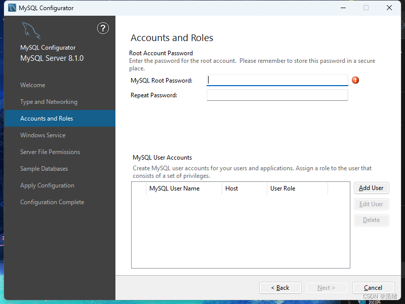
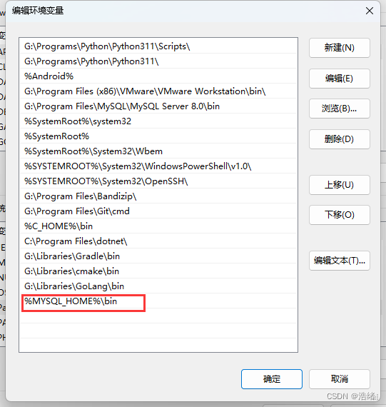
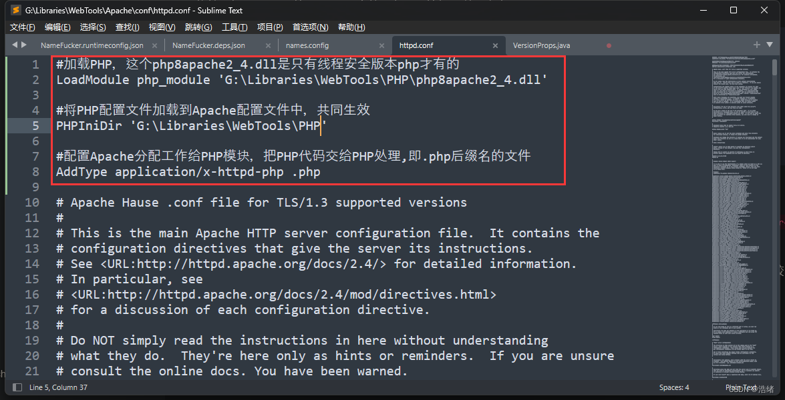
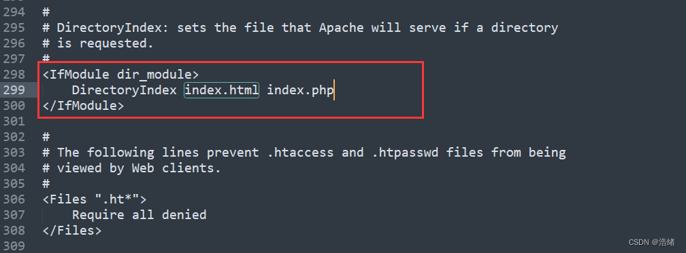

# 前言


打不开msi文件看这篇[文章](https://blog.csdn.net/m0_74075298/article/details/132562795)

关于Linux环境变量的一些事情[文章](https://blog.csdn.net/mayue_web/article/details/97023615) [文章2](https://blog.csdn.net/weixin_48896613/article/details/127170565)

有时候遇上多种环境，常常改写环境配置文件或者Windows打开系统设置很麻烦，可以使用两个系统的环境变量更改命令，更进一步可以写个C程序(利用system函数)来调用。

Windows:

```sh
setx /M 要更改的变量名称 更改内容
setx /M JAVA_HOME %JDK8%
#注意这个命令可以用%%符号直接获取环境变量的内容
#具体可以自己搜索一下
```

Linux下可以使用update-alternative命令，因为Linux文件组织和程序运行的特殊机制，只需要用这个命令更改/usr/bin/下的文件软连接就可以了。在命令最后使用&可以返还控制权实现命令后台运行，使用`| /dev/null`可以直接将命令输出销毁。

# ★语言环境
# Java
## Windows / Linux
推荐参考[关于JDK一些概念和JDK的安装配置(Linux/Windows适用)](https://blog.csdn.net/m0_74075298/article/details/132562410?spm=1001.2014.3001.5501)
# C
首先简要地说一下gcc，clang，msvc等的区别。

C语言主要是需要编译器链接器等等一系列工具链和一些默认的头文件，这种一系列的工具文件成为工具链。C/C++目前很多个这种工具链，如:

**1**.GNU项目的GNU套件(包括熟知的gcc，gdb，g++等)。GNU项目原本是独Linux有的，后来有了两个Windows移植版本，一个是Mingw，还有一个是Cygwin。Cygwin还额外可以模拟Linux环境使用GNU套件的autotools工具。

**2**.Apple的LLVM套件。LLVM是在GNU的基础上形成的一套工具链(高达2个G的大小)，其中包含了也非常有名的clang和clang++编译器。LLVM也是Object-c项目的默认编译套件。**使用LLVM，即使用clang不需要GNU**

**3**.微软的MSVC套件。全称为Visual C++ Building Tools。MSVC是使用Visual Studio时默认下载使用的编译器套件(即安装界面选择**C/C++桌面开发环境**下载的环境)，也是包括了编译器(文件名为cl.exe)，链接器(文件名为link.exe)等等一系列完整工具的工具链。


第三个只需要无脑安装一个VS就可以拥有了。
你也可以看一下[这篇文章](https://www.zhihu.com/question/48968569)
[visualstudio官网_独立的MSVC套件下载](https://visualstudio.microsoft.com/zh-hans/visual-cpp-build-tools/)
[【笔记】C++独立MSVC编译配置（命令行+sublime）](https://blog.csdn.net/m0_37809890/article/details/85103109)
[Windows 如何仅安装 MSVC 而不安装 Visual Studio](https://blog.csdn.net/m0_57309959/article/details/139815240)

对于GNU，你可以不用mingw-w64而使用cygwin[链接](http://cygwin.com/install.html)。

可以参考的文章:

[知乎](https://www.zhihu.com/question/445921363?utm_id=0)
[MinGW-w64安装教程——著名C/C++编译器GCC的Windows版本](https://zhuanlan.zhihu.com/p/76613134?utm_id=0)
## Windows
### 选择1：Mingw64
下载MinGW-w64库，推荐在Github上下载，[链接](https://github.com/niXman/mingw-builds-binaries/releases)。

也可以在Sourceforge的官方网页下载不同的发布 [链接](http://sourceforge.net/projects/mingw-w64/files/mingw-w64/mingw-w64-release/)或者使用它的在线安装器 [链接](https://sourceforge.net/projects/mingw-w64/files/mingw-w64/)(这个安装器已经很老了，只能用到8.1.0版本)

我选择在github上下载13版本。

Sourceforge官方页面：  
在线安装器页面：  


Github页面：


需要选择win32版本，不同的后缀及前缀有不同含义，参考[【软件教程】MingW-W64-builds不同版本之间的区别](https://blog.csdn.net/zhangjiuding/article/details/129556458)

下载后在某一位置解压，为解压出的文件夹的/bin目录添加环境变量的系统变量Path即可，这个过程可以参考Java安装过程中的环境变量配置。


之后就可以在命令行中直接使用gcc等命令。

另外，mingw的make程序名字不是"make"，而是"mingw-make"，你可以到解压的文件夹中的bin中找到。可以把它复制一份在bin下，然后改名为make。

### 选择2：LLVM

之后访问LLVM的[官网](https://clang.llvm.org/)，下载llvm安装器并打开：

安装的时候不用勾选创建桌面图标，但是可以勾选添加到Path中。

实在想不通clang有整整2.5个G。

安装完成后拿Terminal验证一下就可以了。


### 选择3：Cygwin

Cygwin是Windows上的一个拟Linux环境的命令行工具，在Cygwin的命令行里可以运行绝大多数Linux环境下的命令，包括make等等，具体的安装方法很简单，可以参考这篇[文章](https://zhuanlan.zhihu.com/p/488477322)，写得比我好。

我在这里写一下怎么在Windows的Terminal里面使用Cygwin：

打开Terminal终端后，新建一个配置项，别的可以随便改一改（比如把它默认的图标加上去），然后关注一下启动命令行的选项：

bash文件是取得Cygwin安装目录下的bin文件夹下。因为bash是一个用户交互的终端，所以要加上--login参数，这样就可以直接在Terminal里面使用Cygwin了，同样的方法还可以拿到VSCode里面用.

如果比较有追求，可以把Terminal里Cygwin的默认启动终端换成zsh(只需要把bash换成zsh就行了。我非常建议这样做，极少的付出可以换得极大的使用体验升级)，但是同样应该加上--login参数。

Cygwin使用zsh看这篇[文章](https://www.cnblogs.com/candlia/p/11919999.html)

## Linux
一条命令：

```bash
sudo apt install build-essential gcc g++ gdb make #安装gnu

sudo apt install clang #安装clang
#某些发行版中你也可以在后面指定版本
sudo apt install clang-3.8
```

说句老实话，Linux上gnu就是神，没必要用llvm。


# C Sharp
载开始之前我先说明一些概念。

<font color=red>C#是.Net框架的一部分</font>，也就是说C#是依附在.Net框架上存在的。只是C#的发展大大超出了原本的预料，导致.Net框架甚至可以跨平台了(Java2?)。所以说C#不像C语言一样，有gcc，clang，msvc很多种编译器，它主要只使用一种编译器，配置C#开发环境实际上是配置.Net SDK环境。

.Net以前的版本称为.Net Framework(最后一个版本是4.8.1)，它只服务在Windows系统上，但是又因为.Net是一个开源项目，所以很快有了另外的开源实现[mono](https://www.mono-project.com/)（需要魔法访问）。后来.Net更新了许多版本，并从.Net Framework改名到.Net Core(第一个.Net Core版本是6)，并且实现了跨平台。鉴于新的.Net Core，这里不会有mono配置教程。

Unity里面使用的C#更像是一种脚本语言，Unity不是编译器，它只是利用了C#。

我们无法安装.Net Framework作为开发环境，它只能作为Visual Studio的一个子配件，在.Net Framework中没有编译器也没有包管理器。建议至少使用.Net Core6

[.Net Core官网](https://dotnet.microsoft.com/zh-cn/languages/csharp)

## Windows

访问官网后找到下载页面，选择对应架构的zip二进制文件下载。

使用安装器安装会给你塞到C盘的Program Files的某个小角落，非常的阴险(。

我强烈建议使用zip安装包。

  
左边的ASP不用管(真还有人用asp.net？)旁边的SDK是我们的目标，在其下方还有以前的版本可下载。我这里选择了x64。

  
下载之后找个地方解压，然后配置环境变量三步走。


你可以在终端中使用如下命令查看安装情况，出现正常的版本信息即安装成功。


## Linux

这个和Windows的步骤基本一模一样，依然是下载文件，然后找个地方解压。

但是我们有更好的办法，使用Microsoft的官方存储库，然后使用apt命令安装

[Microsoft官方存储库说明文档_.Net](https://learn.microsoft.com/zh-cn/dotnet/core/install/linux?WT.mc_id=dotnet-35129-website)

我使用Ubuntu系统，按照下面方式执行命令:

```shell
# Get Ubuntu version
declare repo_version=$(if command -v lsb_release &> /dev/null; then lsb_release -r -s; else grep -oP '(?<=^VERSION_ID=).+' /etc/os-release | tr -d '"'; fi)

# Download Microsoft signing key and repository
wget https://packages.microsoft.com/config/ubuntu/$repo_version/packages-microsoft-prod.deb -O packages-microsoft-prod.deb

# Install Microsoft signing key and repository

sudo dpkg -i packages-microsoft-prod.deb

# Clean up

rm packages-microsoft-prod.deb

# Update packages

sudo apt update
```
之后运行

```shell
sudo apt install dotnet-sdk-6.0
```

你可以用Tab补全一下，可以发现8.0也是可以下载的。

安装完成之后就可以使用dotnet命令了。

如果是非Microsoft列出的系统就只能老老实实像Windows一样下载二进制包然后解压了。

这里把它解压到了`/usr/lib/dotnet-6.0`目录下，然后配置环境变量。

  
之后也可以使用dotnet命令了。

## 附一些dotnet的东西
.Net的所有核心都在dotnet这一个命令上。

```shell
#直接用dotnet创建一个控制台应用，注意它不会创建文件夹

dotnet new console
```
  
可用的模板:  


.Net实际上的编译器名字叫csc。你可以在.Net Framework的文件夹中发现它的影子。

mono的编译器名称为msc。早期使用mono可以实现Linux上运行exe文件的壮举。

# Golang
先说好，1.13以上的Golang已经有成熟的包管理器了，<font color=red>不要纠结GOPATH环境变量的问题了</font>

我一直觉得Golang的Logo的眼神很睿智怎么回事(？)

[Golang官网](https://golang.google.cn/)
[Golang下载_官网](https://golang.google.cn/dl/)
[Golang中文社区](https://studygolang.com/)
[Golang_UTSC镜像站](https://mirrors.ustc.edu.cn/golang/)

## Windows
访问GoLang官网下载安装器(进不去就去UTSC的镜像网站下载)，然后找个地方安装就可以了，注意不要下载rc版本。

  
(你们真的不觉得这个图标给人一种很蠢的感觉吗)

Golang安装时自动配置了环境变量，我在下一步自己调了一下，你可以跳过这一步不调整。注意其中的`GOPROXY`是我按照推荐设置的。


## Linux

你依然可以按照下载解压环境变量三部曲。


但是Debian库里有Golang：

```shell
sudo apt install golang
go version #输出版本
```

安装就完成了

## 强烈建议的操作:设置代理和更改包路径

安装玩Golang后执行(Linux/Windows):

```shell
go env -w GO111MODULE=on
go env -w GOPROXY=https://goproxy.cn,direct
```
之后添加两个环境变量，这个上文已经教过你怎么做了。

环境变量名称|内容
--------|----
GOPROXY|https://goproxy.cn/|

**其次**是关于Go默认下载的包，我们不配置GOPATH变量它会默认下载在用户目录的go文件夹下，我们可以通过软连接的方式把这个文件夹移到别的路径。

你可以用`go env`查看所有的go环境变量并使用上述的`go env -w`来设置。
# Node.JS

Node的脚手架npm在安装Node时就一并安装了。

## Windows

前往Node的官方网站下载安装包，[链接](https://nodejs.org/zh-cn)
  
下载后是一个msi文件，找个地方安装就行了，它会自动设置环境变量。

**可选操作：**

```bash
npm config set registry=http://registry.npmmirror.com #npm更换淘宝源

npm config set ELECTRON_MIRROR https://npmmirror.com/mirrors/electron/
##npm更换Electron源

npm config set cache G:\ShareCache\nodejs\node_cache #这个文件夹会被用于cache文件
npm config set prefix G:\ShareCache\nodejs\node_global #这个文件夹会被用于全局文件
```

设置node脚本全局可访问:  
  
后面那个`node_modules`文件夹是固定的


## Linux

使用apt直接下载是最简单的办法，但是大多Linux发行版Node.js版本都比较老，比如Ubuntu版本只有12。

所以我们使用官网安装的方式。

访问nodejs的[官网](https://nodejs.org/zh-cn/download)，下载最新LTS版本的tar.xz文件，也可以直接wget。

```bash
wget https://nodejs.org/dist/v18.17.1/node-v18.17.1-linux-x64.tar.xz
```

解压，随便什么方式，然后把它移动到一个想要的目录去，个人建议是`/opt`目录下

```bash
tar -xf node-v18.17.1-linux-x64.tar.xz
sudo mv node-v18.17.1-linux-x64 /opt/nodejs
```

打开~/.bashrc文件，向其中加入环境变量(参考Java)

安装就完成了。

## 可选的一些操作

```bash
npm config set registry http://registry.npmmirror.com/
#npm更换淘宝源

npm config set ELECTRON_MIRROR https://npmmirror.com/mirrors/electron/
#npm更换Electron源
```

npm默认在用户目录下设置缓存下载和安装，建议更换位置。

```bash
npm config set cache /opt/nodejs/cache #这个文件夹会被用于cache文件
npm config set prefix /opt/nodejs/global #这个文件夹会被用于全局文件
```

再设置一个环境变量，指向npm的global路径下实现所有的npm插件可访问；

```bash
export NODE_PATH=/opt/nodejs/global/node_modules #后面这个文件夹名称是固定的
export PATH=$PATH:$NODE_PATH
```

<font color=red size=3px>npm的使用事项</font>
Linux环境下如果是全局下载，即npm使用了参数-g，是必须使用sudo权限才能成功下载的。

除此之外，全局下载如果要使用镜像，也必须使用sudo权限**重新设置一遍镜像**。

**使用yarn**

Yarn是基于npm的一个更高级的管理工具，它非常好用，强烈建议

无论操作系统，在安装完node.js后都可以这样安装:

```sh
sudo npm install yarn -g
yarn config set registry http://registry.npmmirror.com 
#更换淘宝源

yarn config set electron_mirror https://npmmirror.com/mirrors/electron/ 
#更换Electron源
```

-----2023.12.10更新-----
淘宝源地址从
"https://registry.npm.taobao.org"
更换成了
"https://registry.npmmirror.com"

望周知。

# Rust

Rust的开发环境安装其实很简单，官网下个exe然后夸夸一顿点就行了，但是我们遇到的问题有：

1.默认安装在home或者C盘。

2.Windows上默认使用msvc编译套件，而我想要用MinGW套件。

3.安装下载速度极慢。

我们要的是完全自定义的安装(

[Rust官网](https://www.rust-lang.org/zh-CN/)

## Windows


在官网很容易找到如下的下载界面，我下载了64位的版本，运行之后**真的很慢**，经过漫长的等待后是这样的：


第一，我不想它安装在C盘，第二，我不用msvc套件。

自定义安装过程如下：


在系统变量中新建如下表格中的变量，然后把其中`CARGO_HOME`和`RUSTUP_HOME`添加到Path变量中。
| 变名称|内容 |
|--|--|
|CARGO_HOME|你想要cargo安装的位置|
|RUSTUP_HOME|你想要rust安装的位置|
|RUSTUP_DIST_SERVER|https://mirrors.ustc.edu.cn/rust-static|
|RUSTUP_UPDATE_ROOT|https://mirrors.ustc.edu.cn/rust-static/rustup|

之后再次运行安装程序：  


这里已经更改安装位置了，但是改不了使用的套件。

**以管理员权限运行**：

  
出现这样的界面就正常了。选择2开始自定义安装：  
  
在这里会出现修改选项，向其中键入**x86_64-pc-windows-gnu**即可更改为MinGW套件。之后直接回车等待安装完成。

输入命令查看版本：  


## Linux

前面说到Rust是默认安装在home目录下的，而且下载很慢。在Linux下我们也可以配置几个环境变量来改变它。

如果不是安装在/usr/lib这种目录下，这个环境变量配置为用户变量即可，但是我这里要把它塞到/usr/lib下，所以我在/eyc/profile里配置。

首先新建我们需要它安装的文件夹(真的抽象新新建)，一个是.rustup文件夹，一个是.cargo文件夹

<font color=red>一定要先新建文件夹</font>

然后配置环境变量，前四个修改了安装位置，后面的修改了安装镜像:

然后运行安装脚本

```shell

curl --proto '=https' --tlsv1.2 -sSf https://sh.rustup.rs | sh
```
因为我安装到/usr/lib下，所以我会先把/usr/lib/rust文件夹权限修改为可任意访问，不然无法在当前用户下安装。

这个过程会非常的快。

可以看到已经安装到我们希望的地方了。  
  
然后选择1即可。

  
因为有了镜像加速所以过程是非常得快的。

别忘了先按照提示source一下。


## 可选的操作:配置代理

这个操作可以加速

打开`.cargo`文件夹(与环境变量设置的cargo路径一致，在使用默认配置时该文件夹在用户目录下)，创建名为`config`的文件，写入以下内容:

```shell

[source.crates-io]
registry = "https://github.com/rust-lang/crates.io-index"

replace-with = 'tuna'
[source.tuna]
registry = "https://mirrors.tuna.tsinghua.edu.cn/git/crates.io-index.git"
#replace-with = 'ustc'
#[source.ustc]
#registry = "git://mirrors.ustc.edu.cn/crates.io-index"
[net]
git-fetch-with-cli = true

```

# ★开发工具

# MySQL
## Windows
参考文[链接](https://www.zhihu.com/tardis/zm/art/296292628?source_id=1005)

在MySQL的官方网站下载安装包(不建议下载zip格式自己配置)，不付费只能下载Community版本，安装包格式是msi格式。[下载连接直达](https://dev.mysql.com/downloads/mysql/)  
  


下载msi文件后打开安装包。选择第二个。

  
更换这里的环境之后直接下一步Install。

这里记得勾选`Run MySQL Configurator`，自动进入下一步配置：

  
一直下一步直到这里，这里是输入默认root用户密码的，也可以新建User

这里是设置Windows服务项，下面的勾选是自启动：  
这里建议选No

  
之后一直下一步安装完成就可以了。

然后像JDK一样为它添加Path变量:  
  
如果在安装时没有添加新的用户，默认最开始应该使用root用户登录：

```bash
mysql -uroot -p
```


**可选的步骤：设置缓存路径**

找到安装时声明的数据路径，一般在`C:\ProgramData\MySQL`目录下，把其中的`my.ini`文件复制出来更改。搜索其中的`datadir`和`uploads`，修改为其他路径，**注意斜杠**

然后，**一定要把原来的Data文件夹复制到新的位置并且改成配置文件里的名字**：

之后拖入`my.ini`更换，重新启动Mysql。

```bash
net stop mysql #这个mysql是安装时注册的服务名称，开启mysql
net start mysql #关闭mysql
```

也可以直接在任务管理器里找到Mysql服务进行开启，关闭，重启操作。

在mysql命令行使用下列语句查询更改是否成功：

```sql
show variables like '%datadir%';
```

## Linux

参考文[链接1](https://zhuanlan.zhihu.com/p/610793026)，[链接2](https://zhuanlan.zhihu.com/p/610793026)

一条命令：
```bash
sudo apt install mysql-server
```
可能会提示安装包依赖未满足，则使用下面的：

```bash
sudo apt install mysql-server --fix-missing
```

```bash
sudo service mysql start #启动
sudo service mysql restart #重启
sudo service mysql stop #停止
sudo systemctl enable mysql #允许开机自启动
```

安装后进行安全设置：

```bash
sudo mysql_secure_installation
```
怎么选直接看百度翻译。**如果是个人开发者建议第一个密码策略直接回车掉减少心智负担**

之后登入以root身份登入mysql并修改root用户的密码：

```bash
sudo mysql #刚安装只能用这个
ALTER USER 'root'@'localhost' IDENTIFIED WITH mysql_native_password BY '想要的密码';
flush privileges; #刷新权限
```
之后重启一下就可以了。

**可选：更改MySQL数据库缓存路径**

首先，Ubuntu和其他Debian发行版不太一样，所以建议自行移步到百度搜一下。

其次，因为权限的问题，**无论如何这个数据库都不可能改到/home路径下**。

```bash
sudo systemctl stop mysql # 一定要先停Mysql
```

然后把原有的数据库文件夹移动到别的地方，默认是`/var/lib/mysql`，我假设移到了`/kk/mysql`。

编辑`/etc/mysql/mysql.conf.d/mysqld.cnf`文件，把datadir修改为移动后的MySQL文件夹：


```bash
sudo systemctl start mysql # 重新启动MySQL数据库
```


# Web工具(Apache nginx php以及两两交互)

这里是设置和配置php，Apache，Mysql，nginx使能正常交互。

下载都是直接到官网找二进制文件找个地方解压就可以了，Linux可以直接包管理器，就不赘述了，直接上对应配置
[Apachehaus官网](https://www.apachehaus.com/cgi-bin/download.plx)
[php官网](https://www.php.net/)
[nginx官网](https://nginx.org/)
记得php选择线程安全版本：


**对应架构三者要是一样的位数，比如Apache是64位，那PHP也要是64位**


## Windows
### Apache配置

下载解压Apache_Httpd之后打开其目录下的conf文件夹，找到其中的`httpd.conf`文件，把其中的DEFINE_ROOT目录改成下载解压的位置：
`httpd.conf`同样是Apache的配置文件，下面这个位置是设置Apache反向代理的网站的根目录的，暂时可以不管它：  
然后向Windows注册Apache服务，在Apache目录下的bin文件夹中打开终端，cmd和PowerShell都可以，但是**一定要管理员权限**，输入以下命令：

```bash
httpd -k install -n 自定义的服务名称
```
  
然后打开任务管理器右键，选择启动Apache服务就可以了。  
访问localhost就可以看到效果：


### Apache php mysql配置
依然是打开Apache的httpd.conf文件，在最开始加入以下内容：

```json
#加载PHP，这个php8apache2_4.dll是只有线程安全版本php才有的
LoadModule php_module '你的php路径\php8apache2_4.dll'

#将PHP配置文件加载到Apache配置文件中，共同生效
PHPIniDir '你的php路径'

#配置Apache分配工作给PHP模块，把PHP代码交给PHP处理,即.php后缀名的文件
AddType application/x-httpd-php .php
```
  
再找到index.html所在位置，添加一个index.php：  


在php的目录下有`php.ini-development`和`php.ini-production`两个文件，这两个文件是`php.ini`的模板文件，你可以自己打开然后丢到网易有道里看一下。

配置php，复制`php.ini-development`文件并改名为`php.ini`，查找改一下这些地方：
  
把extension_dir前面的分号注释去掉，把路径改成绝对路径，也就是php目录下的ext文件夹。

把这些扩展前的分号去掉基本上就够用了。

然后mysql没什么需要配置的，重启Apache服务就可以了。

### Nginx php mysql 配置
因为Nginx是即开即用，就是你直接运行解压缩文件中的nginx.exe，它就会自动读取配置文件然后后台代理，所以可以不用做Nginx的配置直接配置三者联系。

打开php.ini文件，找到`cgi.fix_pathinfo`，把注释取消掉：  


再找到Nginx的配置文件，在对应server代理里做一些配置，这是我原本的配置：  


把下面自带的php配置的注释删掉，再改一下`fastcgi_param`就可以了，最后是这样的：


保存后来到php的目录下，使用下面的命令开启cgi服务：

```bash
php-cgi.exe -b 127.0.0.1:9000 -c php.ini #后面这个ini文件位置因人而异的
# 端口是上面nginx指定的那个端口
```

执行之后没有马上结束或者报Error就可以去打开Nginx.exe文件开启反向代理，就结束了。(出现一大堆乱码是正常情况)

## Linux
Linux下Apache，Nginx，Mysql安装都只需要用包指令就可以了。

```bash
sudo apt install apache2 #安装apache
sudo apt install nginx #安装nginx
sudo apt install php  #安装php 
sudo apt install libapache2-mod-php #php apache插件 
sudo apt install php php-fpm #php nginx插件
sudo apt install php-mysql #php mysql插件
```

### Apache配置

没什么要配置的，下面的命令是开启和关闭的：

```bash
sudo service apache2 start #开启
sudo service apache2 restart #重启
sudo service apache2 stop #关闭
```

### Apache php mysql配置

截止目前2023.9.30，通过上面的命令直接安装Apache和php，不需要任何配置就可以直接让Apache反向代理php文件，并且可以访问mysql。

如果要安装其他的php组件也可以用apt安装。

### Nginx php mysql配置

先在你的当前的nginx配置里面加上index.php扩展名。

默认配置文件在`/etc/nginx/sites-available/default`和`/etc/nginx/sites-enabled/default`：


然后再加上同样的反向代理配置：  
  
**其中fastcgi_pass字段是和php-fpm的设置有关系的**，具体是查看`/etc/php/版本号/fpm/pool.d/www.conf`文件中的listen字段，如果是端口号就要写端口号，如果是文件就应该用文件套接字。

最慵懒的办法是直接改成端口号:( 。


然后修改php-fpm的配置文件，一般在`/etc/php/版本号/fpm/php.ini`的位置，找到下面的字串并把注释去掉：


```bash
sudo service php版本号-fpm start #开启php代理
sudo service nginx restart #重启nginx
```

就可以正常访问了。

# Gradle(Java的开发工具)

## Windows

Gradle没有msi文件，直接在[官网](https://gradle.org/releases/)下载解压到一个地方，然后配置环境变量：

**可选(强烈建议):软链接修改.gradle文件夹位置**

.gradle文件夹为Gradle的缓存目录，默认在C盘用户下，建议修改到其他地方，软链接可以看[文章](https://blog.csdn.net/m0_74075298/article/details/132562547)

```bash
mklink /J C:\Users\howxu\.gradle G:\Share\./gradle
```

## Linux
Apt仓库中的Gradle太老了，建议在官网下载最新的，然后找个地方解压，配置环境变量。

```sh
wget https://downloads.gradle.org/distributions/gradle-8.3-bin.zip
unzip gradle-8.3-bin.zip
sudo mv gradle-8.3-bin /opt/gradle
```

然后一样配置环境变量，打开`～/.bashrc`加入这些内容。

```sh
export GRADLE_HOME=/opt/gradle
export PATH=$PATH:$GRADLE_HOME/bin
```

# Xmake(C/C++最好用的脚手架)

xmake是刚刚流行的C/C++构建工具，在此之前开发大多使用VS(有多笨重我不说)，或者写make的Makdfile(这个难度真的是特别大而且繁杂)，cmake的CMakeList(cmake的反人类语法也是恶心)，此外还有ninja，gn等等构建工具[ninja和gn_知乎](https://zhuanlan.zhihu.com/p/136954435)。以上几种主流办法相信在不久的将来都会被xmake取代，这个就叫自信。

xmake是**中国人写的开源项目**，在github和gitee上都可以找到，并且有**中文文档**，其构建使用lua脚本，这是一种非常自然语言的脚本，而且xmake提供了类似gradle的一键上票功能，最多两个指令，就可以跑出来HelloWorld程序了，至于包管理功能等等更是数不胜数。

跟不不敢想Xmake+VSCode有多爽！

[Xmake官方文档](https://xmake.io/#/zh-cn/guide/quickstart)

[C/C++ 构建系统，我用 xmake_知乎](https://zhuanlan.zhihu.com/p/370008884?utm_id=0)

[xmake入门，构建项目原来可以如此简单](https://zhuanlan.zhihu.com/p/35051214?utm_id=0)

[Xmake安装指导_官网](https://xmake.io/#/guide/installation)

[c++基础00-如何让程序运行起来？_实际是一篇关于构建工具的文章](https://zhuanlan.zhihu.com/p/461471983)

## Windows 

Windows下可以使用PowerShell安装或者安装文件安装:

```sh
Invoke-Expression (Invoke-Webrequest 'https://xmake.io/psget.text' -UseBasicParsing).Content
```

[Windows安装文件下载](https://github.com/xmake-io/xmake/releases)

安装文件方式安装完成后需要像这里所有教程一样配置环境变量。

## Linux
注意，Linux不推荐使用root用户安装，也不推荐在root权限下使用。

最通用的安装方式是wget或者curl(务必加上sudo):

```bash
sudo wget https://xmake.io/shget.text -O - | bash
sudo curl -fsSL https://xmake.io/shget.text | bash
```

在官方安装指导上还有关于不同系统的方式，但curl和wget是全通用的。

**可选的操作(建议)**(Windows/Linux通用)

**1**.设置国内镜像代理:

```sh
xmake g --proxy_pac=github_mirror.lua
#v2.6.3 之后有效
```
或者参考[xmake代理_官网](https://xmake.io/#/zh-cn/package/remote_package?id=镜像代理)

**2**.更改存储包默认路径

```sh
#Linxu
xmake g --pkg_installdir=/example/example

#Windows(在PowerShell或者cmd下)
xmake g --pkg_installdir=E:/example/
#如果C盘无敌大大可以忽略:>
```

# Docker
[Docker官网](https://www.docker.com/)
[Docker下载中心](https://www.docker.com/get-started/)

## Windows
Docker为Windows提供了一体化配置的安装包，直接从官网下载安装包安装就可以了。

我不建议在Windows上使用Docker。
## Linux

<font color=red>1.官网下载安装</font>

因为Docker一些历史原因所以Docker在不同的发行版中的包**可能被改过**，建议从官网下载安装。
  
  

下载到deb包之后安装就可以了。

这个办法大概率会因为缺少依赖包挂掉(

<font color=red>2.直接包管理器安装</font>

```shell
sudo apt install docker
```

一键就搞定了(

## 题外话

**关于Linux环境变量的事情**
在整篇文章中我都推荐Linux上配置环境变量是更改**~/.bashrc**文件。了解Linux的读者会知道很多比如`.bash_profile`，`/etc/bash.bashrc`，`/etc/environment`，`/etc/profile`等。

其中有些文件关系系统的等级比较高，配置错了就会让整个系统shutdown，还有一些文件是特定发行版才有的，但是.bashrc文件是通用的，因此文章中配置环境变量都在这个文件里。

但是这也有缺点。.bashrc是Bash Shell的配置文件，严格意义上不能为整个系统添加上环境变量(某些程序调用系统级函数读取环境变量是不经过Shell的)，而只是在新开的Bash中有用(如果你用的是zsh，那这个东西更没用，得在.zshrc里配置才有用)。

我的建议是先在.bashrc文件中配置，配置无误后(即新开Bash Shell时Shell不报错，运行命令也正常)，转到系统级的配置文件`/etc/profile`中(需要root权限。这个文件也是Linux都有的，而且优先级很高，可以直接为整个系统设置变量而不仅仅是Bash)。

有些时候在/etc/profile里配置了环境变量但是没用。这个是因为.bashrc文件把/etc/profile顶掉了，只需要在.bashrc末尾加一句`source /etc/profile`就可以解决了。

参考文章[操作系统：Linux 环境变量配置的 6 种方法](https://blog.csdn.net/xishining/article/details/119283522)


**关于Windows在VSCode里面写C代码的事**

有一个叫做RunCoder的扩展，它确实非常好用一个右键就能出手，可以减少心智负担。

