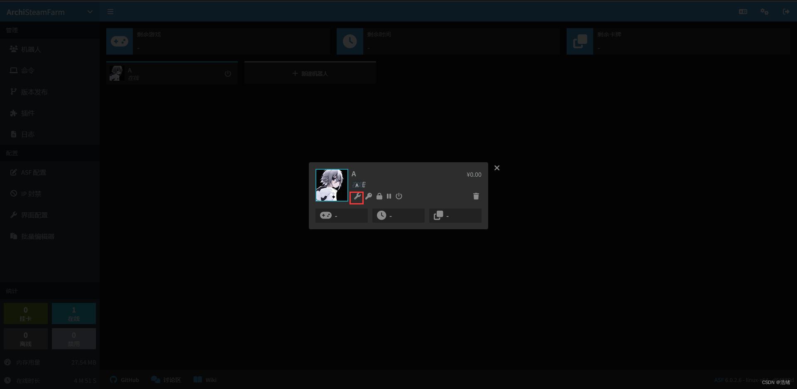

# 前言
我遇到的最大的问题是，网络问题

其实不然，各大厂商的云服务器后台都有流量监控，意味着依靠一般方法是不能正常访问Steam社区的，ASF无法正常工作。

但是一不小心看到了这篇文章[Steam社区屏蔽分析绕过方法](https://www.cnblogs.com/night-ray/articles/15964334.html)

# 正文

## 1.安装下载

我的服务器部署在腾讯云上，系统为Ubuntu amd64，下面的wget使用了萌歪大大的GH代理，所以可以直接一条一条地输入。

首先直接用下面的三段式下载一下ASF：

```bash
sudo apt update
sudo apt install dotnet8 -y
mkdir ASF
cd ASF/
wget https://github.moeyy.xyz/https://github.com/JustArchiNET/ArchiSteamFarm/releases/download/6.0.2.6/ASF-linux-x64.zip
unzip ASF-linux-x64.zip
rm ASF-linux-x64.zip
```

## 2.编辑配置文件

ASF社区推荐用自动Bot来写Json文件，但是哥几个难不成几句Json还能写错了？

`cd config`进入ASF文件夹的config目录，编辑以下文件：

`bot.json`(名称可以随意)：

```json
{
  "Enabled": true,
  "SteamLogin": "你的steamID",
  "SteamPassword": "你的steam密码"
}
```

下一个文件设置IPC面板的密码，这是必须设置的。

`ASF.json`(必须这个名字)：

```bash
{
	"IPCPassword" : "你希望的IPC密码"
}
```

下一个文件设置IPC面板可在外部访问：

`IPC.config`：

```bash
{
        "Kestrel": {
                "Endpoints": {
                        "HTTP" : {
                                "Url" : "http://*:1242"
                        }
                }
        }
}
```

## 3.设置Steam社区证书

参考本文最开始的文章提到的方法，他写得已经很详细了，我这里亲测是有用的。当然如果你是海外服务器可以直接跳过这一步。

2024.6.29更新
这个方法已经失效了，但是你可以Google一下Linux使用Steam302的教程，使用该教程部署Steam302也可以达到同样的效果。

## 4.启动ASF

回到ASF文件夹根目录下，执行`./ArchiSteamFarm`，ASF会进行初始化，完成后自动登录Steam账号，这个时候在Steam手机客户端守着，然后**先同意登录，然后选择N，在输入一遍验证码**才能确保登录。


（我放的图是第二次启动）：


看到IPC Ready就可以访问`服务器IP:1242`了：


输入密码访问IPC面板：


这样就算部署完成了。


## 5.给游戏挂时长

ASF会自动挂卡，但是不会自动帮你挂时长，ASF的官方Wiki上有所有用法的解释，其中挂时长是如下步骤：





下拉在最后找到`GamesPlayedWhileIdle`选项卡，appID是什么我就不解释了。


## 6.进阶-ASF自动启动且后台保活

因为是服务器所以做个service会比较好，用&或者scene也可以。

创建`/usr/lib/systemd/system/ASF.service`文件，输入以下内容：

```bash
[Unit]
Description=ASF Service
StartLimitIntervalSec=0

[Service]
Type=simple
Restart=always
RestartSec=1
WorkingDirectory=ASF文件夹绝对路径
ExecStart=./ArchiSteamFarm
User=ubuntu
Group=ubuntu #用户看你自己是什么，你也可以无脑root
ExecStop=./ArchiSteamFarm
ExecReload= 

[Install]
WantedBy=multi-user.target
```

其中的有关自动重启的部分如下：

```bash
StartLimitIntervalSec=0

Restart=always
RestartSec=1
```

保存后就可以使用`systemctl`命令进行管理：

```bash
sudo systemctl enable ASF #开机自启动
sudo systemctl stop ASF #停止
sudo systemctl restart ASF #重启
```

## 7.ASF配合nginx反向域名代理

直接看[官网](https://github.com/JustArchiNET/ArchiSteamFarm/wiki/IPC), 这里贴一下官网的nginx配置:

```nginx
server {
	listen *:443 ssl;
	server_name asf.mydomain.com;
	ssl_certificate /path/to/your/certificate.crt;
	ssl_certificate_key /path/to/your/certificate.key;

	location ~* /Api/NLog {
		proxy_pass http://127.0.0.1:1242;

		# Only if you need to override default host
                # proxy_set_header Host 127.0.0.1;

		# X-headers should always be specified when proxying requests to ASF
		# They're crucial for proper identification of original IP, allowing ASF to e.g. ban the actual offenders instead of your nginx server
		# Specifying them allows ASF to properly resolve IP addresses of users making requests - making nginx work as a reverse proxy
		# Not specifying them will cause ASF to treat your nginx as the client - nginx will act as a traditional proxy in this case
		# If you're unable to host nginx service on the same machine as ASF, you most likely want to set KnownNetworks appropriately in addition to those
		proxy_set_header X-Forwarded-For $proxy_add_x_forwarded_for;
		proxy_set_header X-Forwarded-Host $host:$server_port;
		proxy_set_header X-Forwarded-Proto $scheme;
		proxy_set_header X-Forwarded-Server $host;

		# We add those 3 extra options for websockets proxying, see https://nginx.org/en/docs/http/websocket.html
		proxy_http_version 1.1;
		proxy_set_header Connection "Upgrade";
		proxy_set_header Upgrade $http_upgrade;
	}

	location / {
		proxy_pass http://127.0.0.1:1242;

		# Only if you need to override default host
                # proxy_set_header Host 127.0.0.1;

		# X-headers should always be specified when proxying requests to ASF
		# They're crucial for proper identification of original IP, allowing ASF to e.g. ban the actual offenders instead of your nginx server
		# Specifying them allows ASF to properly resolve IP addresses of users making requests - making nginx work as a reverse proxy
		# Not specifying them will cause ASF to treat your nginx as the client - nginx will act as a traditional proxy in this case
		# If you're unable to host nginx service on the same machine as ASF, you most likely want to set KnownNetworks appropriately in addition to those
		proxy_set_header X-Forwarded-For $proxy_add_x_forwarded_for;
		proxy_set_header X-Forwarded-Host $host:$server_port;
		proxy_set_header X-Forwarded-Proto $scheme;
		proxy_set_header X-Forwarded-Server $host;
	}
}
```


