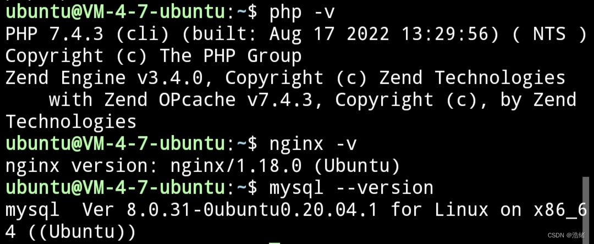
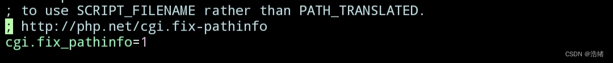

# 写在最前

&emsp;近来在腾讯云上搞了个服务器，并琢磨着拿来干点事情之类的，于是准备把多年没用的WordPress搭建起来。深感无语的是，目前网上大多数Nginx+PHP+MySQL教程质量一言难尽，所以干脆自己写一篇。

&emsp;本篇文章使用腾讯云自带的Ubuntu系统，腾讯云的Utuntu软件库有大多数需要的扩展，不需要再多花费时间去网上找对应的源码包或者安装源(奇怪的是Debian和Centos系统却没有)。

&emsp;因为目前遇上的最大的困难是软件安装问题，但这个问题是最好解决的(百度什么都有)，所以讲核心的配置比较多一点。


# 教程部分


## 安装Nginx、PHP、MySQL

&emsp;这个就不用多说了，按照下面的命令运行:


```bash
sudo apt install nginx #安装nginx
```


&emsp;腾讯云的Ubuntu系统是自带有PHP7.4和MySQL安装的，所以只需要重复这个命令，当然呢，也会有些许不同

```bash
sudo apt install mysql-server #安装Mysql
```

&emsp;安装MySQL(奇怪的是并没有让我设置密码，当然也不需要，如果遇上困难大可以走百度)

```bash
sudo apt install php7.4
```
```bash
sudo apt install php7.4-fpm
```
```bash
sudo apt install php7.4-mysql
```

&emsp;安装PHP和一些组件包(因为WordPress使用PHP7.4，所以我指定了下载版本，这个可以自行根据需要选择安装)。

&emsp;至此安装部分完成，如果系统不一样大可以走百度搜索安装教程，这部分真的不难。

&emsp;安装完后可以使用`nginx -v`，`php -v`，`mysql --version`查看安装版本:




```bash
service nginx start #启动nginx
service php7.4-fpm start #启动nginx php交互
service mysql start #启动mysql
```
&emsp;三个命令启动环境，可以先不马上启动，至此安装部分结束。

## Nginx的配置

&emsp;因为腾讯云服务器的PHP和Nginx会不明所以地删掉监听文件，所以我建议使用端口监听的方式。

&emsp;使用cd 到Nginx的目录`/etc/nginx`，找你的nginx的配置文件。

全局配置文件名为`nginx.conf`。自定义的配置文件放在`sites-available/`下，安装好自带一个`default`文件。按个人需求找到配置文件改就完事。

&emsp;找到你预备使用的Server{}配置目录下的关于监听的部分，添加下面的内容：
```php
location ~ \.php$ {
# fastcgi_pass unix:/run/php/php7.4-fpm.sock;
fastcgi_pass 127.0.0.1:9000;
fastcgi_param  SCRIPT_FILENAME $document_root$fastcgi_script_name; 
include fastcgi_params;
}
```

&emsp;将原有的fastcgi监听改成使用本地9000端口监听，添加`fastcgi_param`和`include`。(记得在9000端口设置安全组规则)

&emsp;之后打开默认配置文件`nginx.conf`，将`user`设置为一个存在的但不为root的用户(如果它已经不是root了那就可以不动它)。**这一点非常重要，因为php-fpm无法以root用户运行**，可以改成安装nginx时自动创建的nginx，也可以改成ubuntu系统自带的ubuntu用户。

&emsp;保存后使用`service nginx restart`重启服务，访问`http://公网ip:预设的端口号`，能看到welcome to nginx就说明安装成功了

&emsp;如果使用的不是默认80端口，需要到腾讯云控制台的安全组里面添加规则，其他服务器也是这样。很高概率的拒绝访问都是因为没配置安全组。

&emsp;至此，nginx的配置结束（就俩步，改配置，改用户）

## PHP的配置

&emsp;首先先找到默认的`www.conf`文件，进去修改PHP-fpm的用户。我的php7.4的默认配置路径在`/etc/php/7.4/fpm/pool.d`，使用其他版本会有不一样。

&emsp;之后找到`group`和`user`两个选项，都修改为`nginx`(或者`ubuntu`，这里看刚刚配置nginx的时候使用的什么)。

&emsp;之后去到`/etc/php/7.4/fpm`(别的版本可能不一样，大致在`/etc/php`目录下)找到`php.ini`，使用vim编辑器打开，在命令框使用`？`查找`cgi.fix_pathinfo`，把注释去掉，并改成`cgi.fix_pathinfo=1`。




&emsp;然后使用`service php7.4-fpm restart`重启服务即可。


## 安装WordPress


&emsp;配置好nginx和php之后就可以打开wordpress的页面了，把源代码放在可以访问的路径(建议在`/var/www/html`目录下)。


&emsp;在浏览器打开`http:/公网ip:预设端口`就可以来到WordPress的欢迎页面了。当然事情还没有结束。


## 配置MySQL

&emsp;使用`mysql -u root -p`进入控制台，中间可能要求输入密码。

&emsp;使用`create database wordpress;`创建一个名为wordpress的数据库。

&emsp;之后创建一个新用户，我个人是不建议在Wordpress用root用户的。

```bash
create user 'wordpress'@'localhost' identified by '你想输入的密码';
```

&emsp;提示OK之后，为wordpress用户添加访问权限

```bash
GRANT ALL PRIVILEGES ON wordpress.* TO 'wordpress'@'localhost';
```

&emsp;后面的wordpress是用户，前面的是wordpress是数据库名。**注意，不同版本的mysql的用户授权命令是不一样的，我这里使用的是适合自己版本的命令**。

&emsp;之后使用`flush privileges;`(也可能是`FLUSH PRIVILEGES;`)刷新一下缓存。

&emsp;至此，MySQL的配置安装结束。

## 尾声

&emsp;再之后的事情就简单了，再次访问Wordpress的安装页面，输入数据库名`wordpress`，用户`wordpress`，密码，数据库地址可以是`localhost`(不行的话换成公网ip)，数据库表头不用改，安装就完成了。
