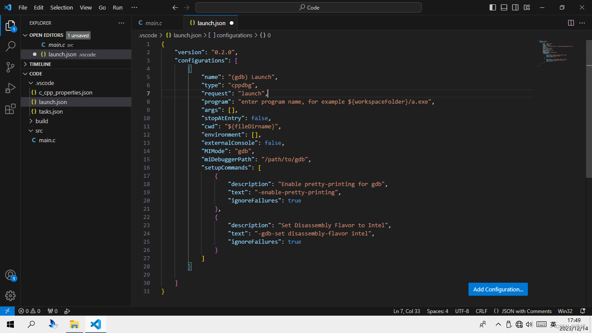

# 杂谈

C语言作为一款年龄非常大的语言，其在各个方面都可以表现出和新一代语言竞争的实力。但是很多人(包括我)都会对C项目的配置和构建感到烦恼。

Java有Gradle的支撑，JS有npm等等一系列成串的脚手架(甚至连Vue，TypeScript这些类似分支的东西也有搭配的构建工具)，Rust有Cargo等等。

但是C语言呢，它是：

`./configure`，`make`，`make install`

或者一长串的gcc命令。

说句老实话，make文件的编写真的远远不如`gradle init`夸夸两下就完事来的方便省力，cmake的反人类语法也是让人摸不着头脑，ninja和gn用着也不舒服，qmake只是qt的亲兄弟，如果真的是写个小的很的分离式编译软件要上Clion和VS的话(叹气)。

初学者如何面对这一切呢？或者是去先扣着脑袋学make或者cmake语法？

虽然这种要求对一个上了年纪的语言不算高，但是为什么使用体验会如此差呢。

[知乎专栏_GCC和Make的历史](https://zhuanlan.zhihu.com/p/638986464?)

# 关于C的分离式编译

C的分离式编译或许是为后来的语言开了错误示范，以至于命名空间，包这样的概念在新生代语言中几乎成了标配。

先浅谈一下C语言分离式编译。

分离式编译是一个很复杂的东西，我这里其实说的不多或者简略也看不懂，不妨直接看看实际操作是怎样的。

分离式编译的核心之一，就是.h头文件。

头文件可以把函数声明和结构体声明从.c语言中分离出来。比如两个文件`func.c` `func.h` `main.c`，其中func.h定义了几个函数，而func.c引入了func.h并实现了它们。

这样只需要在main.c文件中引入func.h头文件，就可以直接调用函数，只需要在编译链接中引入func.c的构建产物就可以正常编译通过并且正常使用。这个过程减少了编译用的时间，并且减少了组织文件需要的开支，同时增加了抽象和封装。

需要指出的是，<font color=red>使用引号""，即相对路径引入的头文件不需要向编译器指定头文件目录或者头文件位置，编译器会自动根据路径寻找</font>，<font color=blue>使用<>引入的，不指定路径的头文件需要环境变量支持或者手动指定目录，如引入OpenCV库</font>

func.h文件:

```c
int max(int a,int b);
//定义一个比较大小的函数
```

func.c文件:

```c
#include "func.h"
//引入头文件

//一个很简单的比较大小的函数
int max(int a,int b){
	if(a != b){
		return a > b ? a:b;
	}else{
		return 0;
	}
}
```

main.c文件:

```c
#include <stdio.h>
#include <func.h>

int main(){
	int result = max(10,11);
	if(result == 0){
		printf("两数相等\n");
	}else{
		printf("%d\n",result);
	}
	return 0;
}
```

编译命令:

```shell
gcc main.c func.c -o main
#编译必须带上func.c 
```

问题在于当多文件组织，多个头文件，多个路径时，这个命令会很难写，而且容易出错。

# 正文
## 1.我的第一个C程序(纯命令行的gcc编译)
按照每个语言不成文的规矩，第一个事情当然是Hello World：

```c
#include <stdio.h>

int main(int argc, char** argv)
{
    printf("Hello Kitty!\n");
    //问就是比较有文化
    return 0;
}
```
接下来就会遇到遇上编译第一步：

```bash
gcc HelloKitty.c -o main
```

这条命令将是每个C语言初学者遇上的第一个编译相关的东西，可能大同小异，可能用的是clang而不是gcc，但是这些都不重要。

这其实很快了，如果真的是只写HelloWorld的话。

但是如果遇上这样呢：


它的编译指令是`gcc ./apple/m1.c ./apple/m2.c  ./cup/c1.c ./cup/c2.c ./main.c - o xxxx.out`。

显然这太长了，每次都输一次很不方便，如果把它写在一个单独的shell文件里，每次新建文件又要改。不方便，所以，我们要想出新的办法。

## 2.初识make

好了这里我其实不会留下任何东西。因为make真的学起来很恶心，而且有这个心思学make语法，为什么不去学比make简单的cmake呢？

[GNU make/Makefile 简明实用教程](https://zhuanlan.zhihu.com/p/376493209)

## 3.初试cmake
虽然cmake很烦人，但是，也不是不能用对吧。那就对那有一堆文件的项目处理一下。事先声明，我这个项目的头文件等等的布局很不规范，你只需要稍微看懂一下Cmake的功能就可以了。

**假设项目文件夹名称为hello**，那么我们在hello目录下新建一个`CMakeLists.txt`文件，这个文件名称的大小写是不能变的。一个最简单的帮助编译的CMakeLists文件如下：

```shell
cmake_minimum_required (VERSION 3.5)
project (Hello)
file(GLOB_RECURSE SRCS "./src/*.c") #递归查找src目录下所有的后缀为c的文件，并保存在SRCS变量中

set(CMAKE_RUNTIME_OUTPUT_DIRECTORY "./build") #设置输出路径为build路径
add_executable(Hello ${SRCS}) #用src下的源文件生成一个叫Hello的可执行文件
```

当然呢这是一个很简单的CmakeLists，一般情况下也不会想把别的C文件直接链接到入口文件里(一般是额外编译为静态库)。

之后在CMakeLists.txt所在目录下执行这条命令，让cmake生成MakeFile：

```bash
cmake -G "MinGW Makefiles" #Windows下生成MinGW的MakeFile

cmake -G "Unix Makefiles" #Linux下生成Gnu的MakeFile
```

然后make一下就大功告成了：

  
这是在Linux下的执行结果。


这相比干写make文件已经是舒服很多了，毕竟一共就几行:)，你可以把生成的MakeFile打开看看，看看它里面多少东西。

还有一种写法是把子目录下的源文件编译成一个静态库，然后再链接，这个过程需要写两个CmakeLists.txt文件。

假设src下有一个main.c文件和一个g2文件夹，g2文件夹中有一个g2.c文件。在根目录的include文件夹下还有一个g2.h头文件。在g2文件夹下新建一个CmakeLists.txt，内容：

```shell

file(GLOB_RECURSE LB "./*.c") #一样递归获得g2目录下所有C文件
add_library(G2 STATIC ${LB}) 
#声明用这些文件编译一个叫做G2的静态库，如果括号里的是"G2 SHARED ${LB}"，则会生成动态库，Linux下是so格式，Windows下是dll格式。

#在这个文件里可以有些别的操作，比如用set更改静态库的输出位置等等
# set(LIBRARY_OUTPUT_PATH "../../build/lib")

# 动态库和静态库的差别可以自己百度一下，其中静态库的生成位置和主程序文件生成位置的相对关系直接与程序是否能够运行挂钩。
```

然后根目录下的CmakeLists.txt文件：

```shell

cmake_minimum_required (VERSION 3.5)
project (Hello)
file(GLOB_RECURSE SRCS "./src/*.c") #递归查找src目录下所有的后缀为c的文件，并保存在SRCS变量中

add_subdirectory("./src/g2") 
#这里把g2加入为项目的子目录，意味着cmake也会到这里面执行CmakeLists.txt文件

set(CMAKE_RUNTIME_OUTPUT_DIRECTORY "./build") #设置输出路径为build路径
add_executable(Hello ./src/main.c ./src/msg.c) #为了防止把静态库的c文件也递归进去了所以直接指定

target_link_libraries(${PROJECT_NAME} G2) 
#声明编译包括一个叫G2的库，会由cmake在子文件夹中寻找，并根据配置定位lib文件

```

需要注意的是，cmake不会因为你的变量名有错而报错，但是make会。假如你不小心把${PROJECT_NAME}写错了，那么make编译一定会报undefined reference to。

相对来说cmake已经是相当好用了，但是还有更好用的。


## 4.从山顶洞人变成现代人之xmake：

xmake是一个中国人做的项目，所以我就不多解释了，自己到[官网](https://xmake.io/#/)看文档。

[一篇关于怎么使用xmake的文章](https://zhuanlan.zhihu.com/p/461471983)

既然xmake在cmake的后面，那它肯定比cmake好用，怎么个好用呢，比如我现在，把**整个hello文件夹都删了**，重新来，怎么做：

```shell
xmake create -l c hello #-l参数指定这是一个c语言项目
```
之后就会发现，一个基本的骨架就出现了，附带还有一个xmake.lua文件（你可以认为这是xmake的CMakeLists.txt），它的内容是这样的：
```lua
add_rules("mode.debug", "mode.release")

target("hello") 
    set_kind("binary")
    add_files("src/*.c")
```
也只有四行，而且还是它自动帮你生成的，而且还是lua语言，几乎是人可以直接看懂的自然语言。稍加修改就可以像刚刚的CMakeLists.txt文件一样：

```lua
add_rules("mode.debug", "mode.release")

target("hello")
    set_kind("binary")
    add_files("src/**.c")
```

没错，我确实只改了两句话。因为xmake的寻找文件编译和链接是随机的，也就是说它不一定先编译main文件然后以main文件作为入口文件进行链接。

通配符*只能匹配当前目录下所有文件，**可以使add_files递归匹配文件夹内(包含子目录)所有的c源文件。

xmake默认把输出目录设定为项目路径下的build文件夹。

那么接下来，只需要三行命令就可以编译看到效果：

```bash
xmake f -p mingw --mingw=path\mingw -c #这里的path\mingw换成你自己的mingw文件夹
xmake #启动编译
xmake r #运行编译后的产物
```


简直薄纱cmake有没有。

除此以外，xmake还有极强的包管理能力，多种编译器支持，具体可以到官网看看。

## 5.VSCode的生成和调试

不会真有人拿记事本写c语言代码吧?o.O

VSCode可以是一个强大的IDE，只需要稍加配置，就可以获得更好的体验。然而实际上，单纯依靠VSCode来实现C项目的配置还是不方便，它虽然也可以实现分离式编译，但是实现逻辑和单纯使用命令行没什么区别。


我这里换了一台电脑演示。

<font color="red">关于VSCode的生成</font>

VSCode实际上是根据.vscode文件夹下的tasks.json和launch.json两个文件进行自动配置，生成和调试等等任务的。

VSCode可以自动为我们生成这两个文件。

tasks.json配置了生成可执行文件，构建等任务
launch.json配置了调试任务。

<font color="red">配置</font>

首先是安装C的扩展组件：  


回到项目页面，按下Ctrl+Shift+P，打开C/C++编辑配置UI，然后稍微配置一下编译器什么的。这个不能省略，否则项目文件夹不会唤起C的相关配置。

我这里是Windows平台，使用gcc编译器。  


<font color="red">1.自动生成tasks.json</font>

指定一下编译器和代码提示方式，然后回到main.c的页面。

记住**一定要在main.c的编辑器页面**上。

选择**终端 -> 配置生成任务**，就会出现配置生成任务的选项，因为我前面设置的是gcc编译器，所以这里我会选择gcc，然后选择gcc生成任务:

  


VSCode会自动生成一个tasks.json文件，内容是这样的：


我这里是这样的:

  
因为我会演示分离式编译，所以我还会稍作更改，更改后是这个样子:


在这一步已经可以感觉到不便了。

之后选择运行任务，选择运行这个配置好的生成任务，就可以实现自动构建可执行文件的操作了(也要在main.c的编辑器页面上)。  


**除此以外，VSCode还支持调试，可以为程序打断点**

<font color="red">2.自动生成launch.json</font>


还是在main.c的编辑器页面上，依次选择**运行 -> 添加配置**，然后选择含gdb的选项，VSCode就会在.vscode目录下生成一个launch.json文件(但是是空的)：


  
点击右下角的添加配置，会自动唤醒配置栏。选择其中gdb launch型任务(attach型的任务是在程序启动后附加调试，并不是我们需要的)。

  
这是选择后的默认配置，接下来我们需要手动更改一些地方:  



在main.c界面按下F5，它会自动开始编译和调试:  
  
很抽象的一个事情是，刚刚写完tasks.json文件时就可以打断点按F5了，不需要launch配置。(看不懂)

你可以在debug选项卡里选择自己想要的调试配置。


## 6.VSCode+Xmake

实际是是不难的，根据前几点的经验，我们可以让VSCode集成所有的好处。

tasks.json和launch.json文件实际就是两个自动化的文件，稍微修改一下tasks.json中的参数和调用命令就可以调用xmake生成，修改一下launch.json文件实现附加调试。


大体来说用起来还算舒服。


