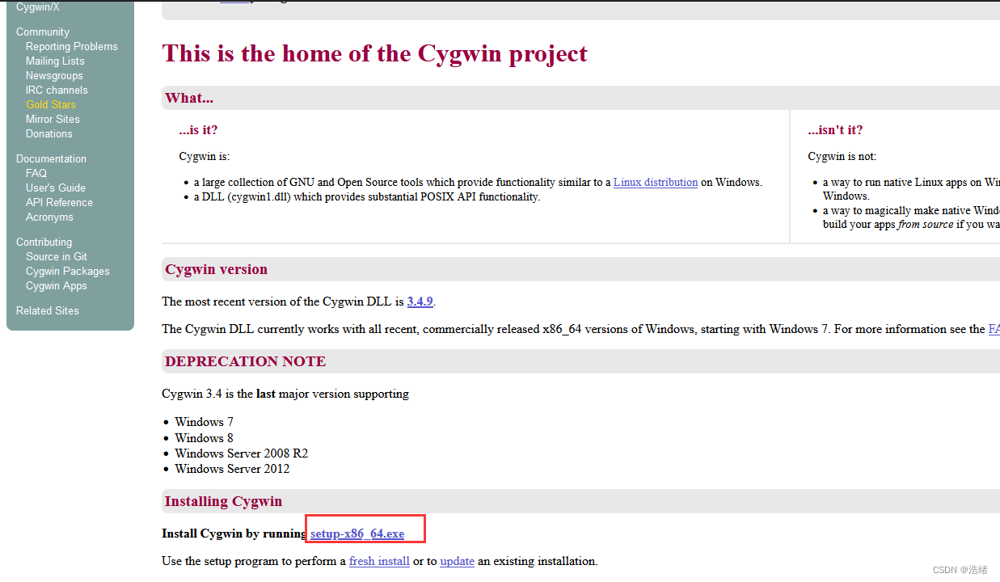
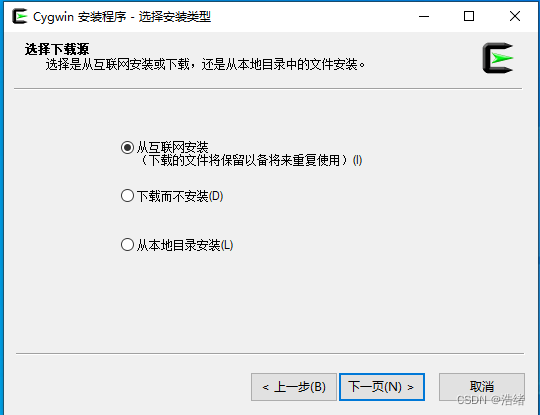
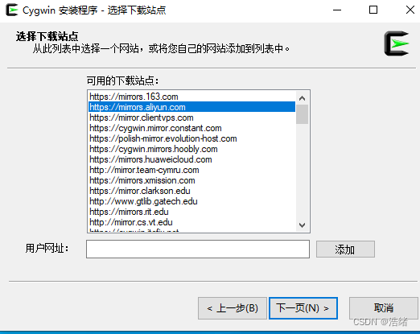
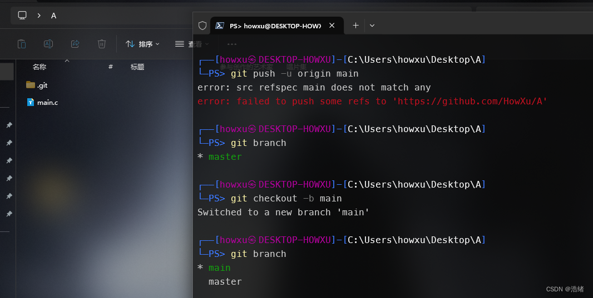
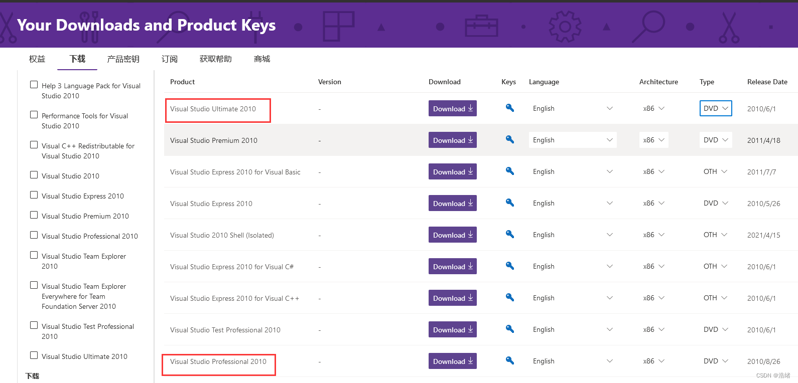
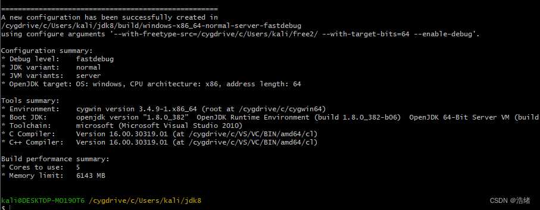
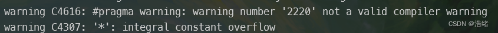

# 前言

作为一个苦兮兮的Java开发者，最开始的时候还在为用什么JDK而烦恼，不过现在渐行渐远，已经是到了可以给自己定制一个JDK(用来装杯)的时候了。

因为OpenJDK一直是个开源项目，所以可以直接拿代码下来自己改一改然后编译什么的。因为OpenJDK只提供了make编译方式，所以**在哪个平台编译就只能获得该平台的可执行文件，包括对应的平台架构**。

如果有一点点玩Linux的经验这个文章还是很好懂的。

参考文章：
[ Win10下编译OpenJDK8](https://www.cnblogs.com/jpfss/p/11641045.html)
[Windows下编译OpenJDK9](https://zhuanlan.zhihu.com/p/29599520)
[ubuntu 20.4 编译 openjdk11 和 8](https://blog.csdn.net/qq_42676880/article/details/113726614)
[OpenJDK官方编译指南(全英)](https://openjdk.org/groups/build/doc/building.html)
[JDK9的更新版编译指南(全英)](https://hg.openjdk.org/jdk-updates/jdk9u/raw-file/tip/common/doc/building.html)

# 正文

我用OpenJDK8来做演示，更高版本的JDK比JDK8的编译简单的多所以特地挑个复杂的演示。

注意OpenJDK8只能用iso11的C语言编译器(因为确实很老了)，所以对于现在大多数发行版都要切换gcc和g++的版本，大概切到gcc-8就可以了。

JDK源代码我是拿的Alibaba的[DragonWell](https://github.com/dragonwell-project/dragonwell8)项目

# Windows下编译

## 准备环境

主要是安装一个C语言编译器和Linux模拟环境(提供make,unzip的软件)。


### 1.模拟Linux环境-Cygwin

在官网找到Cygwin的安装包下载打开。



直接下一步：



一直下一步到这里：



选中阿里云的镜像然后下一步

之后就会来到软件到选择页，这里直接点击下一步就可以了。

  
安装完成后退出，**不要删除安装包exe文件**。在安装包exe文件所在目录下打开cmd或者PowerShell，直接通过其命令行格式安装依赖包：

```bash
setup-x86_64.exe -q -P autoconf -P make -P unzip -P zip
```

可以看到只需要autoconf make unzip zip四个包，编译工具完全来自Visual Studio。


### 2.BootJDK

需要先随便下载一个JDK，官方说是boot JDK，至少是当前JDK版本-1，随便找个地方下载一个JDK8安装，配置环境变量就完事了。

### 3.VS 2010
可以在[链接](https://my.visualstudio.com/Downloads?q=visual%20studio%202010)这里找到安装包。注意要下载English版本。建议安装Professional版本，Ul版本会安装很久。

  
打开的时候选择C++环境就可以了。VS2010非常地弱智，安装很简单但是卸载非常麻烦，你可以在**安装时选择Custom**，在组件中**只选择VC**，卸载时可以极大地减少心智负担。

你也可以使用VS2017，但是最好不要超过2017版本。JDK11以下都最好使用VS2010。

**划重点：VS2010必须安装在C目录下，而且最好路径不要有空格，不能有中文**
### 3.Freetype
[Freetype](https://freetype.org/)

一个字体库，JDK要用的，但是没有可执行文件要自己编译成dll库。不过JDK的configure有自动编译源代码的选项，这一步可以直接跳过。


在官网下载(2.5.3以上)然后找个地方解压就行了。

## 开始编译

打开`CgyWin-Terminal`。这里说一下就是在Terminal里面是模拟一个Linux文件环境，比如原本是C盘目录，在Terminal里面是`/cgydrive/c/`目录。

`cd /cygdrive/c/`进入c盘目录，如果在别的盘就进别的目录，然后一路cd来到项目根目录下。

执行：

```bash
./configure --with-freetype-src=/cygdrive/c/Users/kali/free/ --with-target-bits=64
# 这里的freetype路径要换成自己的，记住最后要有个/
```

如果提示找不到bootJDK，就要在参数里面加上bootJDK的路径

```bash
./configure --with-freetype-src=/cygdrive/c/Users/kali/free/ --with-target-bits=64 --with-boot-jdk=你自己的bootJDK路径，也要加上/
```

configure还有很多别的参数，具体意义可以到Google上看看。

如果在configure的时候遇上`Cannot locate a valid Visual Studio installation`的报错，就需要加一个参数`--with-tools-dir=/cygdrive/c/VS/VC/Auxiliary/Build/`后面这个路径取决于你自己的VS路径下的VC路径。这个参数会定位WindowsSDK的几个dll文件的路径，configure会根据这些文件路径反推出VS的完整路径。

成功之后是这样

  
然后

```bash
make images
# 只编译我们需要的镜像文件
```

你可能会遇上下面的报错：

这两个warning会带来一个Error停止编译，解决办法是找到这个cpp文件，在开头添加忽略警告的预处理命令：

```cpp
#pragma warning(disable: 4616 4307)
```


就可以去撸把原神了。这个事情大概要个20分钟左右。

完成后是这个样子：


在`jdk项目目录\build\windows-x86_64-normal-serve-xxx\images\j2sdk-images`路径下可以找到jdk文件。


# Linux

建议直接找版本旧一点的发行版自带gcc-8。

 ## 开始编译

Linux就比用Windows省心多了，只需要先安装一个**BootJDK**。

直接cd到项目目录下执行：

```bash
chmod u+x configure
./configure
```

之后会提醒缺什么什么包，让你用`apt-get install xxx`下载，直接照着下载就行了。成功后和Windows一样的图，执行

```bash
make images
```

如果用的是版本比较新的发行版，里面的gcc版本比较高(通常会报错什么Erroe ISO 17 register)，就需要到仓库里找版本比较低的gcc。换gcc版本这个事情百度就可以解决。

编译完成后在`\build\linux-xxx\images\j2sdk-images\`下可找到jdk相关文件。

## 顺带一提

不知道有没有用的经验可能有用，只针对JDK8：

`jdk8\langtools\src\share\classes\com\sun\tools\javac\main` javac -version输出版本信息有关
`jdk8\jdk\src\windows\resource\icons` 图标文件
`jdk8\jdk\src\share\classes\sun\misc\Version.java.template` java -version输出版本相关文件

JDK8以上的JDK编译之后不会有jre镜像，需要调用jlink进行导出：

```bash
jlink --module-path jmods --add-modules java.desktop --output jre
```

将会自动导出到当前目录的jre文件夹下。


