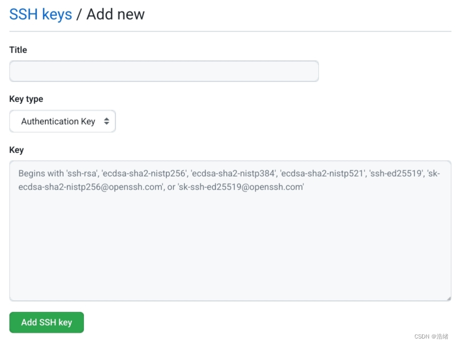

# 写在前面-Termux

  &emsp;Termux 是一个 Android 终端仿真应用程序，用于在 Android 手机上搭建一个完整的 Linux 环境。 不需要 root 权限 Termux 就可以正常运行。Termux 基本实现 Linux 下的许多基本操作。因此，我们同样可以通过termux使用git将项目提交到github。  
  
  &emsp;文章中git语法同样适用于windows，linux操作系统下的git提交。
  
# 准备工作

首先打开termux，使用下面的命令安装git工具包  

```bash
pkg install git -y
```

安装完成后，使用cd命令进入项目文件夹中。

&emsp;当然别忘了在github上新建一个项目仓库，不懂使用github的可以自行百度。

# 正文

## 1.使用git上传源码

首先，在cd进入项目文件夹后，我们在termux键入

```bash
git init -b main
```

&emsp;其中的`git init`会将当前文件夹初始化为本地仓库，`-b main`参数则是把该本地仓库的默认分支修改为main。

&emsp;当然也可以不使用`-b main`这个参数，但是由于github某次更新后，github新建仓库的默认远程分支由master变成了main，而termux镜像源中的git工具包在初始化时**仍然使用master作为默认分支**，在不修改的情况下后续提交会有很多难以处理的问题。我这里还是建议使用这个参数。

&emsp;之后我们一般会得到这样的结果:


&emsp;视不同的操作系统后面的路径会不同。

 然后，键入
 
```bash
git add .
```

&emsp;其中的`git add`是用于标记作为仓库文件的命令，在后面接上.会标记该目录下的所有文件。键入后一般我们会得到这样的结果:


&emsp;git告诉我们这是一个未认证安全的位置，我们只需要按照它的提示键入提供的命令即可，不同的项目文件夹路径提供的命令也不同，比如这里提供的是`git config --gpobal --add  safe.directory /storage/....`，在windows系统上后面的路径可能是`C:/Project/....`。

&emsp;按照提示键入命令后再次使用`git add .`，如果未收到提示说明标记完成了。

 再然后，我们键入:
 
```bash
git commit -m "提交说明"
```

&emsp;`git commit`可以将本地仓库的项目提交到github的缓存区，在不使用`-m "提交说明"`会默认使用一个文本编辑器(在linux或者termux上是使用vi)创建一个文件，要求在该文件中键入提交说明并在用户保存后开始提交，很繁琐，所以建议直接使用`-m`参数，提交说明的内容可以自己填，因人而异。

&emsp;第一次使用`git commit`会提示需要配置账户信息。直接键入以下命令

```bash
git config --global user.name "Example"
git config --global user.email e@example.com
```

 其中
`"Example"`是你在github上注册时的用户名  
`e@example.com`是你注册github时的邮箱  

 &emsp;然后再次输入`git commit -m "提交说明"`
 


&emsp;提示的内容是因情况而异的，但是基本上看到类似这样的提示说提交缓存已经成功了。

 接下来，我们再键入
 
```bash
git remote add Remote名称 你的仓库的地址
```

&emsp;这串命令的含义是为项目添加一个Remote，该Remote绑定了一个仓库地址，其中的Remote名称和仓库地址都由个人决定，仓库地址可以在github仓库页上找到，注意，这里应该使用**https地址**，键入后没有命令提示说明remote添加成功了。

&emsp;我们可以使用这个命令做到为一个项目添加多个仓库地址。

添加remote之后使用

```bash
git push -u 你添加的remote名称 main
```

&emsp;之后会要求输入你的用户名和密码，**注意！！这里的密码指的不是github账户的密码，而是指令牌token**！！我们需要在github的设置中申请一个token。

首先，打开github的设置，找到Developer settings


之后找到Personal accese tokens


选择创建一个新的令牌，之后输入密码验证，即可跳转到密钥生成页，下方的权限可以靠谷歌翻译自己选择，时限也可以自己定，最后得到密钥之后使用`git push -u 你的remote名称 main`并按照提示键入用户名和密钥，请注意，**在Termux或者linux系统中输入密码是不会显示已输入的密码的。**
如下图


说明github的提交已经成功了


## 2.进阶-关于分支

&emsp;git有一套强大的分支管理系统，这里会提供一个简单的关于termux环境下关于修改默认提交分支的教程。

&emsp;首先，在最开始使用`git init -b main`初始化时，我们就可以不使用main作为初始化默认分支。github的分支分为本地分支和远程分支，在github的网页上我们可以删除，添加，修改自己的分支，而在本地，我们也可以通过命令删除或者添加分支，这里只提供termux如何在本地不使用默认分支上传的方式，更多的命令可以自行百度。

&emsp;首先在github仓库中新建一个分支，基本上有谷歌翻译就能做到。然后记住新建分支的名称，以`1234`为例，在命令行中键入以下命令新建本地分支

```bash
git branch 1234
```

&emsp;之后再使用一次提交命令

```bash
git add .
git commit -m "提交说明"
git push -u remote名称 1234
```

&emsp;即可将项目上传到新的分支上，使用`git branch -D 1234`可以删除本地分支，但是该命令不能直接删除本地默认分支，具体修改方法移步百度。

&emsp;同样的我们也可以在创建仓库时将默认分支先行修改为自己想要的内容，在使用`git init -b main`时就可将main修改为自定的默认分支。

## 3.进阶-使用SSH方式上传github项目

&emsp;频繁的输入token上传文件是个很烦人的事情，我们可以在termux中通过使用openssh为自己的github添加ssh公钥，实现ssh无密码提交项目。

首先在termux中安装openssh

```bash
pkg install openssh
```

安装完成后键入

```bash
ssh-keygen -t rsa
```

之后会得到提示


&emsp;在termux下的openssh只会识别安装目录下的.ssh文件夹，并且只识别名称为`id_rsa`的密钥文件，所以这里直接回车。之后会提示`Enter passphrase (empty for no passphrase)`，因为是想实现无密码传输，所以这里直接回车两次。之后ssh密钥即生成完成


&emsp;之后根据save目录cd进入，使用ls看到有两个文件，一个是`id_rsa`，另一个是`id_rsa.pub`，我们使用vim或者vi打开`id_rsa.pub`(不会使用vim和vi可以使用cp命令将该文件拷贝到其他可用文件浏览器打开的位置，直接使用txt格式打开)，复制文件中所有内容。回到github的setting页面，找到SSH and GPG Keys，新建一个SSH Key。



&emsp;在title中随便输入想要的内容，key type不更改，在key中填入刚刚复制的`id_rsa.pub`中的内容并保存。

保存之后可以到Termux上验证一下，如下命令:

```
ssh -T git@github.com
```

第一次运行会询问是否允许未验证的服务器，输入yes回车后会收到github的欢迎词，如下:


&emsp;之后就可以使用`git remote add`为你的仓库创建一个ssh的remote(ssh链接可以在github的仓库页找到)，使用`git push`上传时将原有https的remote换成ssh的remote，就不需要输入密码认证了。当然，你也可以继续用https的remote，`git push`时也不需要输入密码。


## 4.暴力上传

&emsp;在有些时候由于文件内容不同(如在最开始构建时加入了readme.md，但是没有在本地新建readme.md)，文件修改时间落后上传文件，github的提交会失败，这时可以使用`git push -u remote名称 分支名称 -f`暴力上传文件。

&emsp;非常不建议这样做，因为暴力上传后文件恢复方式很复杂，在多人协作时也会引起一系列麻烦。

# 写在最后

&emsp;以上就是所有关于Termux环境下使用git的我个人的一些心得，感谢阅读。


