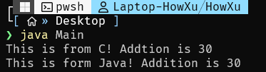
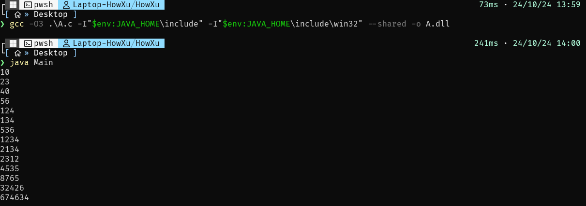

# 前言

Java虽然是一个跨平台的语言,但是实践中很难避免需要使用其他语言,如Rust和C,来编写更加高性能的算法函数来提高性能,或者获取更好的管理内存的能力. 

这就必须谈到JNI. JNI是自JDK1.1起推出的一种调用外部库的方法(还有一种方法是JNA),使用JNI可以使Java程序调用外部的C动态运行库来执行某些操作. 调用JNI是一个稍显繁琐和复杂的过程,但其实做一些简单实践并不难. 同时,因为Java和C语言的函数传参方式,数据类型(尤其是类)等等并不完全相同,使用JNI时需要尤其弄清逻辑.

在继续之前，我应该假设你具备以下知识点和技能：
1. java 了解Java编译相关
2. C和gcc编译器 了解动态库和编译相关命令
3. 知道MinGW

环境:
1. JDK 8
2. Mingw64 13

# 简单实践

## Java部分

写一个`Main`文件和`A`文件，其中`Main.java`包括主函数,创建了一个`A`实例,并调用A类的add方法.

```java
public class Main{
    public static void main(String[] args){
        A a = new A();
        System.out.printf("This is form Java! Addition is %d\n",a.add(10,20));
    }
}
```

接下来的`A.java`文件就不太一样了，先上代码:

```java
public class A{
	static{
		System.loadLibrary("./A");
	}
	public native int add(int a,int b);
}
```

首先,使用静态块来保证`System.loadLibrary`一定会加载`A.dll`这个文件(在Windows下为`A.dll`,Linux下为`libA.so`),然后,使用`native`修饰`add`这个方法,表明这是一个外部库实现的方法.  

需要指出`System.loadLibrary`寻找文件的机制:  

如果填入为`xx`,JVM会在JDK自带的lib库中寻找,再到`-Djava.library.path`参数指定的目录寻找  

如果填入为`.xx`,JVM会在执行`java -jar`或者`java xxx`时的工作目录下寻找,比如是`/home/howxu/Desktop> java Main`,这个动态链接库文件会被指定为`/home/howxu/Desktop/xx`.

接下来编译Java文件:  

```bash
java ./Main.java ./A.java #请确保二者在同一目录下
```

我们会获得`Main.class`和`A.class`文件,还没完,先前提到Java和C语言的数据类型问题,也就是说你直接写一个同名函数是**无效的**.我们需要专门的头文件和专门的函数声明,按照这个头文件来编写C库,这样才能确保C库中的函数被正确加载,参数正确传递.当然,这一点Java早就考虑到了.

```bash
javah A
```

会获得一个`A.h`文件,接下来写的C库就和这个东西有关了.

## C部分

先来看一下生成的`A.h`文件的内容:

```c
/* DO NOT EDIT THIS FILE - it is machine generated */
#include <jni.h>
/* Header for class A */

#ifndef _Included_A
#define _Included_A
#ifdef __cplusplus
extern "C" {
#endif
/*
 * Class:     A
 * Method:    add
 * Signature: (II)I
 */
JNIEXPORT jint JNICALL Java_A_add
  (JNIEnv *, jobject, jint, jint);

#ifdef __cplusplus
}
#endif
#endif
```

首先,导入了`jni.h`这个头文件,这个头文件是JDK带有的,一会儿编译的时候需要指定参数带上去  

`extern "C"`,表明以下内容会按照C语言标准格式进行编译.

`JNIEXPORT jint JNICALL Java_A_add (JNIEnv *, jobject, jint, jint);`这个显然就是`add`函数的声明了。

可以看到这里做了很多更改,首先`JNIEXPORT`,这个符号在`JNI.h`中定义为`#define JNIEXPORT __declspec(dllexport)`,大体含义指的是这是一个外部导出的函数,可以交付给其他项目使用.

`jint`,JNi定义的int类型,本质是`long`.

`JNICALL`,本质是`__stdcall`,一种函数调用参数的约定,表明函数参数从右到左保存.(暂时不知道有什么用)

`Java_A_add`对`add`函数重命名,格式想必是`Java+Java内路径+函数名`.

`JNIEnv`,一个指向JNI运行环境的指针，后面我们会看到，我们通过这个指针访问JNI函数.

`jobject`,指的是`A`这个类,我们用它代替`this`.

最后两个`jint`就是参数了.

接下来简单实现一下这个函数就行了.

```c
#include "A.h"
#include <stdio.h>

JNIEXPORT jint JNICALL Java_A_add(JNIEnv *env, jobject this, jint a, jint b){
    printf("This is from C! Addtion is %d\n",a+b);
    return a+b;
}
```

编译成dll文件(使用Mingw,powershell,确保你的JAVA_HOME环境变量正确):

```pwsh
gcc -O3 .\A.c -I"$env:JAVA_HOME\include" -I"$env:JAVA_HOME\include\win32" --shared -o A.dll
```

这样就可以获得`A.dll`文件

## 运行

确保`A.dll`,`A.class`,`Main.class`在同一目录,看看效果:

```bash
java Main
```



符合预期

## 干票大的

既然说了JNI也可以实现函数,不妨试试写一个冒泡排序出来,这里就不解释了,直接上代码(Java中传递数组是地址传递):

`Main.java`:

```java
public class Main{
    public static void main(String[] args){
		int[] arr = {10,40,23,56,2134,536,8765,1234,4535,32426,674634,124,2312,134};
        A a = new A();
		a.sort(arr);
		for(int ele : arr){
			System.out.println(ele);
		}
    }
}
```

`A.java`:

```bash
public class A{
	static{
		System.loadLibrary("./A");
	}
	public native void sort(int[] arr);
}
```

`A.c`:

```c
#include "A.h"

//jintarray 本质是一个 _jobject 类对象指针
JNIEXPORT void JNICALL Java_A_sort(JNIEnv *env, jobject this, jintArray arr){
    jint* array = (*env)->GetIntArrayElements(env,arr,NULL); //转换成C可操作数组
    jsize len = (*env)->GetArrayLength(env,arr); //获取长度
    // 冒泡排序
    for (size_t i = 0; i < len; i++)
    {
        for (size_t j = 1; j < len - i; j++)
        {
            if (array[j] < array[j-1])
            {
                array[j] ^= array[j-1];
                array[j-1] ^= array[j];
                array[j] ^= array[j-1];
            }
        }
        
    }

    //释放C数组
    (*env)->ReleaseIntArrayElements(env, arr, array, 0);
}
```

结果:


