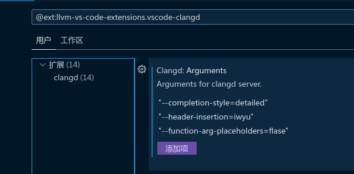

# 碎碎念

# 关于OpenCV带FFmpeg支持的编译

很早之前做过一个OpenCV的毕业项目.[链接](https://github.com/HowXu/CaiFish).里面有一个明显没有处理好的点就是其运行需要外置命令`ffmpeg`可用:


这是一个非常抽象的问题,当时就发现是因为编译的OpenCV没有FFmpeg支持,但是碍于不可抗力因素又不得不搁置,最近突然想起来了就又试着做了一下.

首先是关于源代码问题,早期OpenCV是可以很好的编译FFmpeg支持的,当时FFmpeg用的还是make系统,后来FFmpeg的构建文件经历了爆改,导致很长一段时间内编译带FFmpeg支持的OpenCV相当复杂困难,不过到现在,这个问题已经很好地解决了.

你可以直接在OpenCV的Github Release页面下载到源代码,比如[4.10.0](https://github.com/opencv/opencv/releases/tag/4.10.0),这个源代码不分平台的,都可以编译成功.

然后是FFmpeg,因为我是在Windows平台进行的开发,所以要去下载Windows版本的,并且因为要手动编译OpenCV,FFmpeg应该要带上`include`和`lib`文件.


在[FFmpeg Download](https://ffmpeg.org/download.html)找到Windows的[gyan.dev](https://www.gyan.dev/ffmpeg/builds/)镜像,下载Release的essentials版本:


里面的目录结构如下:


然后进到OpenCV源代码目录,新建`build`目录.新建一个目录其实是大型Cmake项目的一贯做法,但是我以前用Cmake就是喜欢直接源代码里构建(T_):

```bash
mkdir build
cd build
```

接下来调整Cmake的参数,我在Windows平台直接用的`MinGW`进行构建:

```powershell
cmake -G "MinGW Makefiles" `
    -D CMAKE_BUILD_TYPE=Release `
    -D WITH_FFMPEG=ON `
    -D OPENCV_FFMPEG_INCLUDE_DIR="C:\Users\HowXu\source\ffmpeg\include" `
    -D OPENCV_FFMPEG_LIBRARY="C:\Users\HowXu\source\ffmpeg\lib" `
..
```

设置构建类型为`Release`,开启带入FFmpeg构建,指定FFmpeg的头文件和Lib目录,最后..指定是上层文件夹的CmakeLists.txt文件,最后应该可以看到是这样的:


其中的FFmpeg选项是On.

然后你就可以`make`了,最好指定`-j`参数加快构建速度,比如我的就是`make -j10`.

结果是这样:


这样的过程还可以在Linux上干一遍,相当地简单,下载源码我就不说了,你只需要像下面这样:


```bash
sudo apt install ffmpeg
sudo apt install -y build-essential cmake git libgtk-3-dev libavcodec-dev libavformat-dev libswscale-dev

# 在OpenCV源代码目录 建议新开一个终端
mkdir build
cd build
cmake -D CMAKE_BUILD_TYPE=Release \
      -D WITH_FFMPEG=ON \
      -D WITH_V4L=ON \
      ..

# Cmake文件生成完成之后
make -j16
```

然后等待构建完成就可以了.

# 关于VSCode的C语言插件问题

这其实是一个老问题了,我就直说了,微软官方给的C/C++插件就是一坨.当然呢我们现在有更好的替代品`clangd`.

clangd在语法提示和智能补全这方面做的相当好,因为我之前用惯了C/C++插件的调试功能,(如果你也习惯了的话)所以我这里**只更换智能提示插件为clangd**.

对于Windows:

首先要下载`clangd`,因为它只是llvm的一部分,你可以不需要下载整套llvm.[Github](https://github.com/clangd/clangd/)

找个地方解压就行了,不需要配置环境变量.

然后打开VSCode,找到这个插件:


安装后重启VSCode,在设置里找到clangd的插件设置:


然后找到下面两个选项:


第一个选项是全局的头文件搜索库,我用的是MinGW所以直接填两个目录就行了,注意格式是`-Ixxxxxx`,大写的I.第二个选项是clangd.exe的位置,也是照着填就行.

最后,关掉C/C++插件的智能提示就可以了:


那Linux下的操作就简单多了:

```bash
sudo apt install clangd
```

然后安装插件,关掉C/C++的智能提示,就完事了.是的,尊贵的Linux用户不需要手动配置clangd.


然后再说一个简单的配置问题,完全的配置你可以在[知乎](https://zhuanlan.zhihu.com/p/398790625),我只配置了两个比较顺手的东西:



```json
"clangd.arguments": [
        "\"--completion-style=detailed\"",
        "\"--header-insertion=iwyu\"",
        "\"--function-arg-placeholders=false\""
    ]
```

第一个是完全补全(其实是默认的),第二个是自动补全头文件,第三个是函数不会完全补全参数(这个功能其实也还行,你可以用Tab键跳到下一个参数).