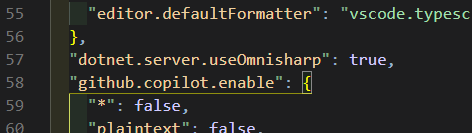
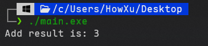

# 关于VSCode的C#插件的经验之谈

我个人是不太喜欢Windows上装SDK用msi安装包的形式的，所以早期我的C#开发(.Net 6.0)是直接用的二进制SDK. 当时还好，现在VSCode的C# Dev插件更新了很多，带来了很多问题.  

首先第一个, Dev插件对SDK路径的检测明显有些问题, `.Net Install Tool`,`C#`,`C# Dev Kit`的dotnet路径检测各有自己的多重的配置选项(有些还有问题), 以至于后端的OmniSharp开不起来. 配置了很长时间, 即使没有运行报错, 也没有很好的语法补全和跳转功能(悲).  

但是上述的所有问题在使用Microsoft官方的SDK安装包不情不愿地向C:/Program Files文件夹装入.Net 9.0之后迎刃而解:(. 检测也好了, .Net Install Tool也不会自作主张地在User目录下载单独的SDK了, LSP后端也好了, 语法提示自动补全啥都好了. 微软真有你的.  

强制使用OmniSharp作为LSP后端只需要配置:  


# C语言内联汇编的一些说法

大一上做C语言作业的时候实在受不了这种无脑力的东西, 就在VS2019里试了一下内联汇编, 大概是访问一个二阶数组矩阵的值什么的, 当时还不知道只能是x86才能直接内联, x64要放在外面单独编译才能链接. 所以最近单独拿出来玩一下.

首先, 汇编有很多种编译器, 不同的编译器适合不同的平台, 同时不同的编译器也使用不同的语法(或某一语法的有些许差别的变种):  
AT&T语法: 是GNU项目的汇编语法, 适合Unix/Linux平台, Mingw/GNU Assembler(GAS, 也就是常用的as命令的编译器)支持, Mingw也支持intel语法.  
Intel语法: NASM/MASM(Microsoft Macro Assembler，Windows 专用)/VS使用的语法, 其中NASM也可以在Linux平台上使用.  

个人更喜欢Intel语法, 所以下面的小示例也是Intel语法的.  

理论上来说, 很多语言都可以拿去和C混编, 这些语言之间也有混编的用法, 其本质是通过编译器转化为可链接文件, 通过各个语言的特定的外部函数声明进行调用, 最后依靠链接器将函数声明和可链接文件中的函数部分组合到一起(其实不太严谨, 熟悉编译原理应该能理解这个流程). 因此不说C内联汇编, 也有Rust内联汇编, Rust内联C等等用法.  

那这个流程就很清楚了, 首先写一个简单的C程序

```c
#include <stdio.h>

extern int add(int a, int b); // extern关键字

int main(){
    printf("Add result is: %d\n",add(1,2));
    return 0;
}
```

extern 是 C/C++ 中的一个关键字 主要用于 声明变量或函数是在其他文件或模块中定义的 告诉编译器“这个符号的定义不在当前文件，链接时再去其他地方找”. 它通常用于多文件编程，避免重复定义. 在这里声明add这个函数是外部定义的, 如果是C++ 这里应该写成extern "C".  

然后是汇编部分(Intel风格 windows平台):
```asm
section .text ; 划分为代码区
global add  ; 声明为全局符号

add:
    push eax
    mov eax, edi
    add eax, esi
    ret         
    pop eax
```

不同的约定下这个传入参数的寄存器位置是不同的, 上面是x64版本, x86版本是这样的:
```asm
section .text
global add

add:
    mov eax, [esp+4]
    add eax, [esp+8]
    ret
```

这里使用NASM编译器(MSYS)和mingw进行编译:
```shell
nasm -f win64 add.asm -o add.o # -f指定编译格式 除了win64还有elf32 elf64
gcc main.c add.o -o main.exe # 这里其实应该把main.c也做成.o文件再链接
```

结果:


也可以使用AT&T语法，直接使用mingw的as编译器:  
```asm
.section .text
.global add

add:
    movq %rcx, %rax
    addq %rdx, %rax
    ret            
# 这下面一定要多一行
```
```shell
as --64 -o add.o add.asm
gcc main.c add.o -o main.exe
```
结果也是一样的. 你也可以用intel语法, 然后给as添加参数`-msyntax=intel`