# 前言
最近这个AI领域是越来越火了，连我也忍不住多玩几把。LLM发展真是一浪盖过一浪，一边学底层一边学AI，[VibeCoding](https://x.com/karpathy/status/1886192184808149383)、[MCP](https://modelcontextprotocol.io/)，还有新出的[ACP](https://agentclientprotocol.com/)。[Claude Code](https://docs.anthropic.com/en/docs/claude-code)、[CC-Switch](https://github.com/farion1231/cc-switch)直接绕过，再加上内置插件和AI IDE，真是应接不暇了。在时代里的一粒沙，真的也是个人的一座山啊。

不过这期不是写AI的，我以后也不会写怎么怎么搞一个CC-Switch + Claude Code + DeepSeek API的教学之类的东西，因为我觉得那算不上教学，只是经验积累起来之后就能达到的效果，就像不会说自己在用什么工具。

而是安利一下我最近在用的工具。

本文在 [OpenCode](https://opencode.ai/) 辅助下写作。

没有贴出来的配置可以到[这个仓库去找](https://github.com/HowXu/Configs-Backup)

# 正文

## 终端

[Alacritty](https://alacritty.org/) 是我目前常用的终端，Rust编写，OpenGL渲染，配置之后很漂亮。我额外Merge了几个Feature过来，比如和 [Neovide](https://neovide.dev/) 同款的动态Cursor，而且跟进了最新的几个Patch。

因为是GPU渲染，所以非常丝滑，而且占用比Windows Terminal低，这就够我选了。

遗憾的是，不支持窗口分割和多开以及标签页功能，倒是像一个纯粹的终端了。

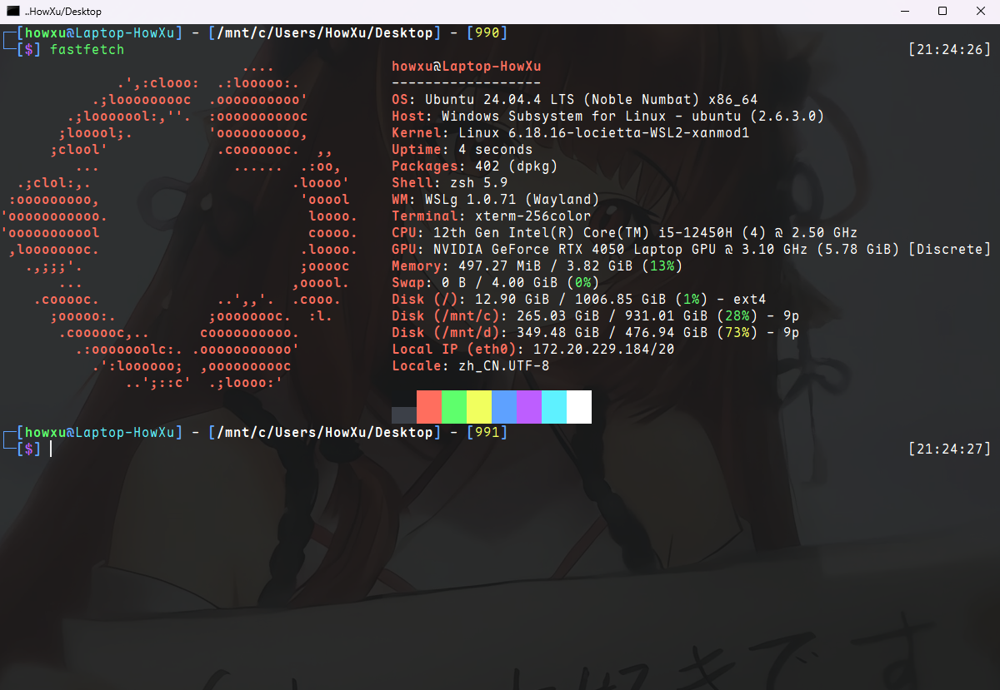

使用cyberdream的配色方案。

除此之外还有一个 [WezTerm]() 的备用方案，但是它没有Smooth Cursor(也可能有但是我们找到)，所以是备用方案。手感和 Alacritty 差不了太多，就是能多标签页和分页而已。

## Linux

实际上有了 [WSL 2](https://learn.microsoft.com/zh-cn/windows/wsl/) 的Windows就是最好的Linux发行版，事实上也是这样的，WSL在不需要图形化开发的场景下简直碾压一切了。

除此之外呢，我给它换了个[XanMod Kernel](https://github.com/Locietta/xanmod-kernel-WSL2)

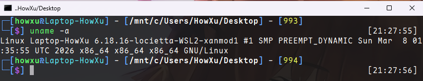

## 输入法

Windows上的输入法我只觉得 [Rime](https://rime.im/) 好用，我的配置文件在[这个仓库](https://github.com/HowXu/rime)，有基于白霜拼音和基于薄荷拼音的两款。

后台占用只有80m左右，CPU占用更低，几乎是无感而且适配百分之九十九场景使用。

最大的优点是所有快捷键可以自己拿Lua写，可以disable掉Shift了。

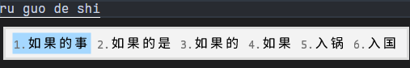

## 软件包管理

[Scoop](https://scoop.sh/)

我已经受够了Windows上到处拉屎的各种SDK了，在chocolatey / winget / scoop里面做出选择的话，我将毫不犹豫掏出scoop解决心智负担。

一劳永逸地解决所有工具管理之痛。

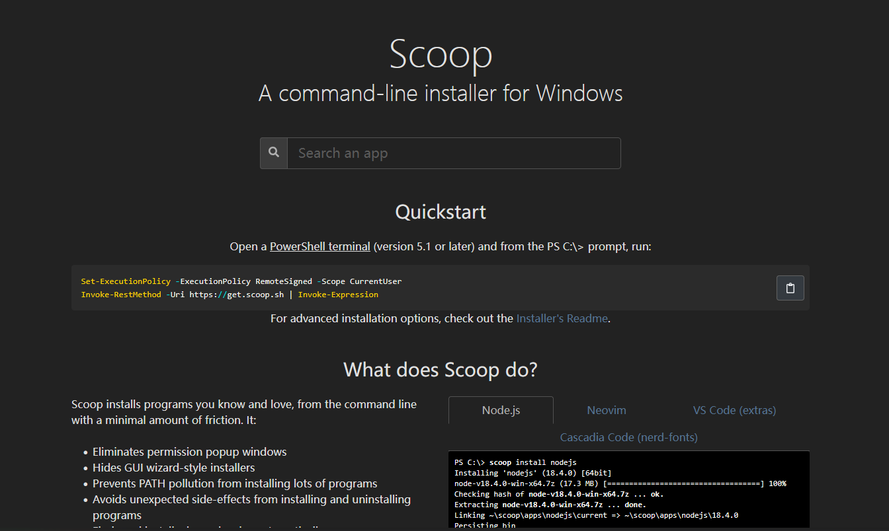

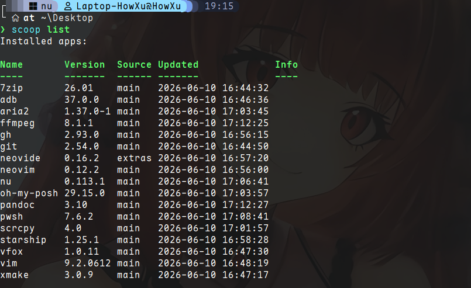

## Shell

强力推荐 [Nushell](https://www.nushell.sh/)。依旧Rust编写的神级Shell，依旧所有配置可自定义，依旧有Conda适配(虽然现在Conda用的不多了)。

对于Shell，只要快就可以当世界第一了。

唯一不太好用的就是内置的nu语法，虽然其兼容shell语法，但是这个nu语法有些时候是不太好处理。

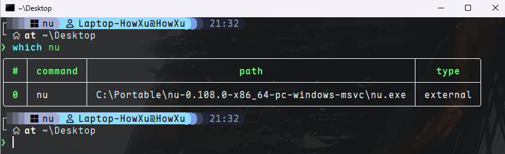

配置文件见仓库

## 提示符

[Starship](https://starship.rs/)，当然不是马斯克那个：

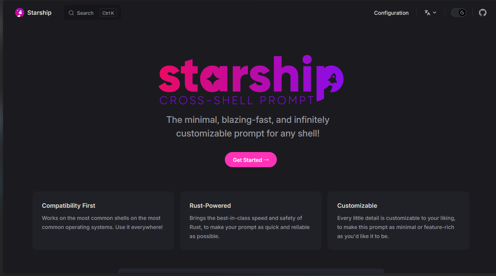

依旧基于Rust，依旧超快启动速度，搭配起来整个终端只需要不到1s就可以拉起来，而且极其漂亮丝滑美观。

配置文件见仓库

## NeoVim

我的 [NeoVim](https://neovim.io/) 配置基于 [LazyVim](https://www.lazyvim.org/)，而且用到了 [Neovide](https://neovide.dev/)，不过在Windows上我不推荐使用Neovide(Alacritty比它快还比它流畅)。

[配置地址](https://github.com/HowXu/NeoVim-Configuration)

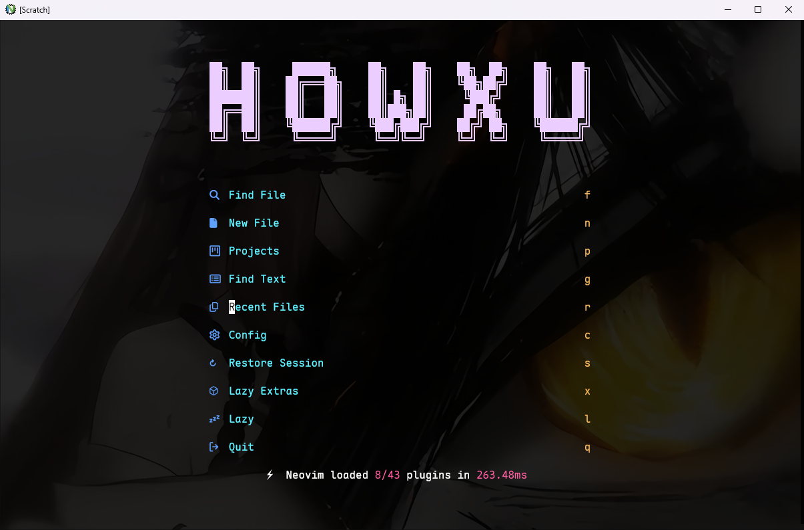

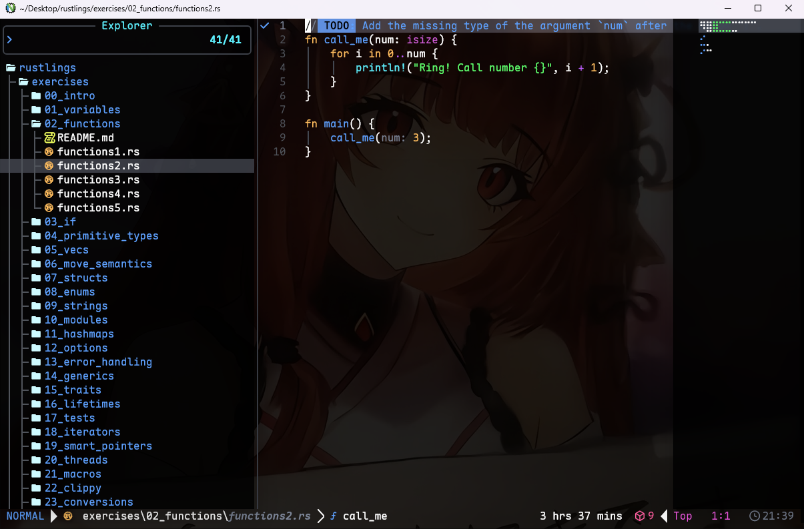

## Vim

没想到我居然还有一套Vim配置吧n_n，就在上面那个Nvim配置的仓库里，有一份_vimrc配置文件

不过说实话，和nvim比vim真是个纯粹的编辑器了，我也没打算给它弄LSP(coc.vim)，所以只有简单的代码高亮和补全什么的，格式化，缩进这样的很编辑器的东西。

使用vim-plugin插件安装插件，记得运行一下:PlugInstall

## 代码编辑器

现在已经是 [LSP](https://microsoft.github.io/language-server-protocol/) 时代了，所以我比较喜欢VSCode的开源版 [VSCodium](https://vscodium.com/)，相当地纯粹，可以一键关闭AI功能。除此之外，我用 [Custom CSS and JS Loader](https://github.com/be5invis/vscode-custom-css) 注入了一些别的特性，比如彩虹标签页，彩虹行号，彩虹提示框描边，Neovide同款Cursor，并且尽量保证整体性能。在正常情况下内存占用在600M左右，是正常的 [Electron](https://www.electronjs.org/) 水平。

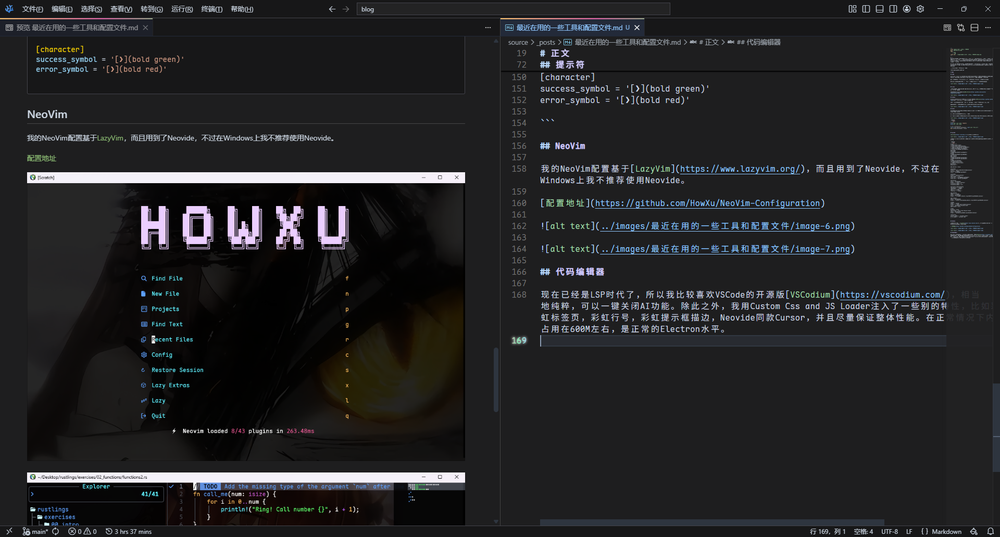

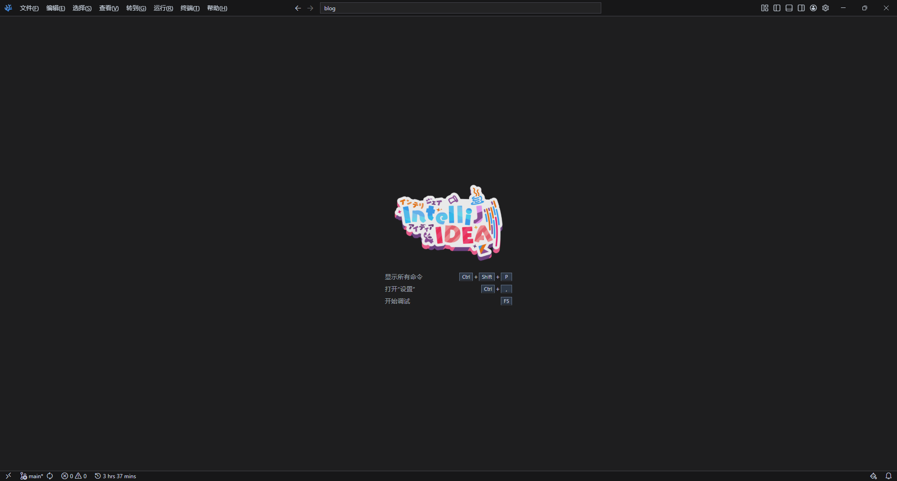

当然，写Java还是用 [IntelliJ IDEA](https://www.jetbrains.com/idea/)，Java的LSP真难用。[Gradle](https://gradle.org/) 也真难用。

配置文件见仓库

涵盖了Rust/C/Java/Python/以及一些简单的前端响应能力，性能微调以及一些符合人体工程学的设计。我比较喜欢切配置文件，但是配置是同一份，这样虽然对不同配置文件有点冗余，不过切得快，容易改。

## 文本编辑器

[Zed](https://zed.dev/)(又是Rust+GPU)，新时代高性能编辑器，刚上线Windows。总体来说响应很快，而且也可以接LSP，不过整体UI设计实在是难评价，如果以上做的好当个 [Notepad++](https://notepad-plus-plus.org/) 平替还是不错的，但是以上做的也不好。

所以我隆重推荐[Gram](https://codeberg.org/GramEditor/gram)，依旧Zed fork，但是原生支持Windows，而且百分百无AI，比市面上多数Notepad++极其衍生物更强而且在同样占用情况下表现更出色，而且可以接WakaTime。

这个是Zed的截图:
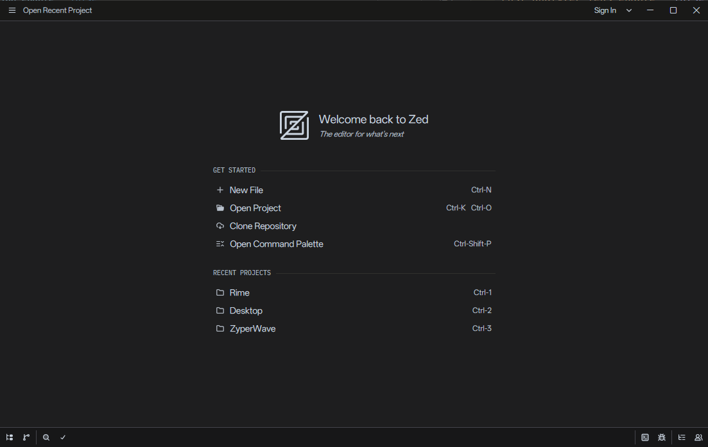

## 快捷启动

[gravel](https://github.com/thorio/gravel) 是一个仿Mac的spotlight启动器，依旧Rust，依旧快。

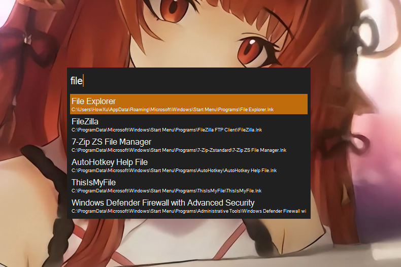

## 字体

[Maple Font NF CN](https://github.com/subframe7536/Maple-font)，等宽字体的佼佼者，完美支持Nerd Font和中文。

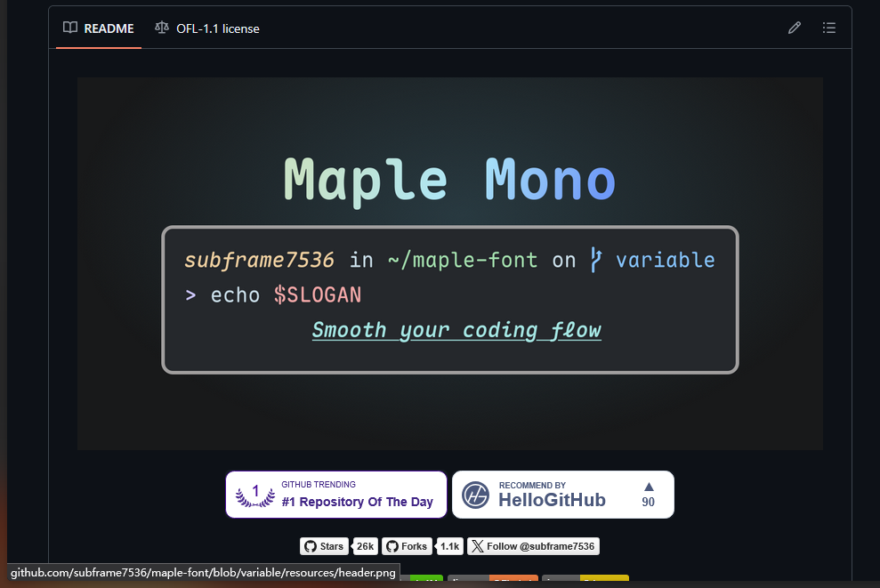

## 主题

[Maple Theme](https://github.com/subframe7536/vscode-theme-maple)，几乎全平台(没有Nvim)，简单，不腻，好看。

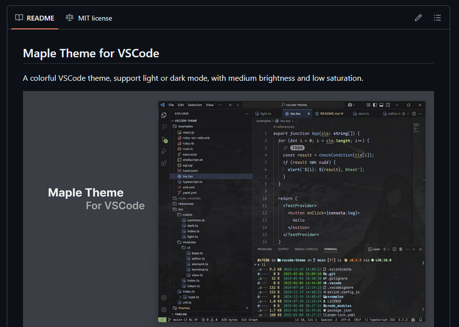

## Windows Hook

[Windhawk](https://windhawk.net/)，简单的Windows Hook插件管理器，后台占用极低，但是效果比 [Explorer Patcher](https://github.com/valinet/ExplorerPatcher) 好。

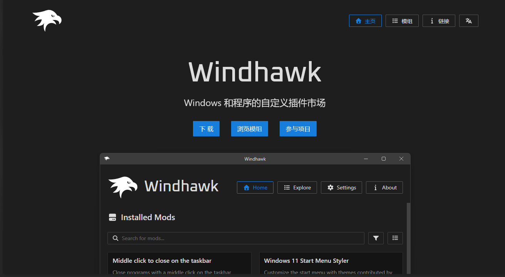

不得不说Windows 11没有圆角之后真的是极品住了。

## 魔法

[Clash Verge](https://github.com/Clash-Verge-rev/clash-verge-rev/releases)

这个不多说，依旧Rust依旧GPU加速，而且支持轻量模式(即后台只有Rust和 [Mihomo](https://github.com/MetaCubeX/mihomo) 后端)，几乎无感使用。

截图就不放了。

## 工具版本管理

[vfox](https://vfox.dev/zh-hans/)，相信我，你不需要npm和conda了。

目前我用它控制Java/Nodejs/Gradle/Python(在Linux上有点问题)/Maven。

不推荐用它控制Rust，其一就是插件写的一般，其二是 [Rustup](https://rustup.rs/) 更好用。

## 浏览器

类Firefox用的是[Zen](https://zen-browser.app/)，类Chrome用的是[Thorium](https://thorium.rocks/)，各有各的好，我喜欢Firefox多一点。

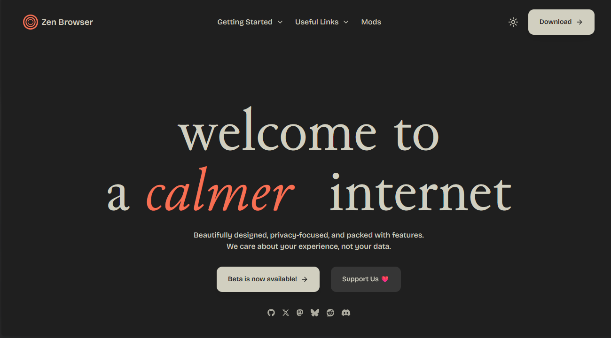

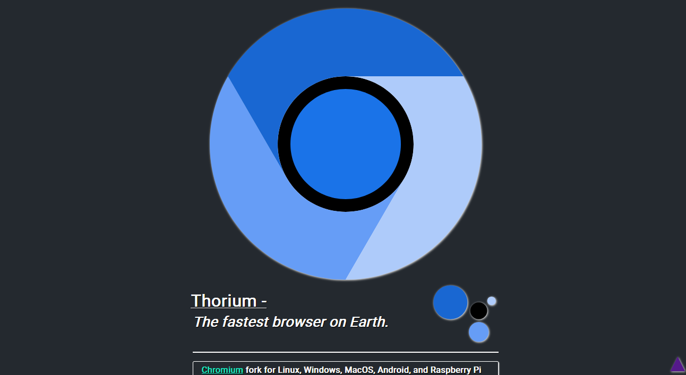

## 快捷粘贴

[Ditto](https://sabrogden.github.io/Ditto/)，小而美。

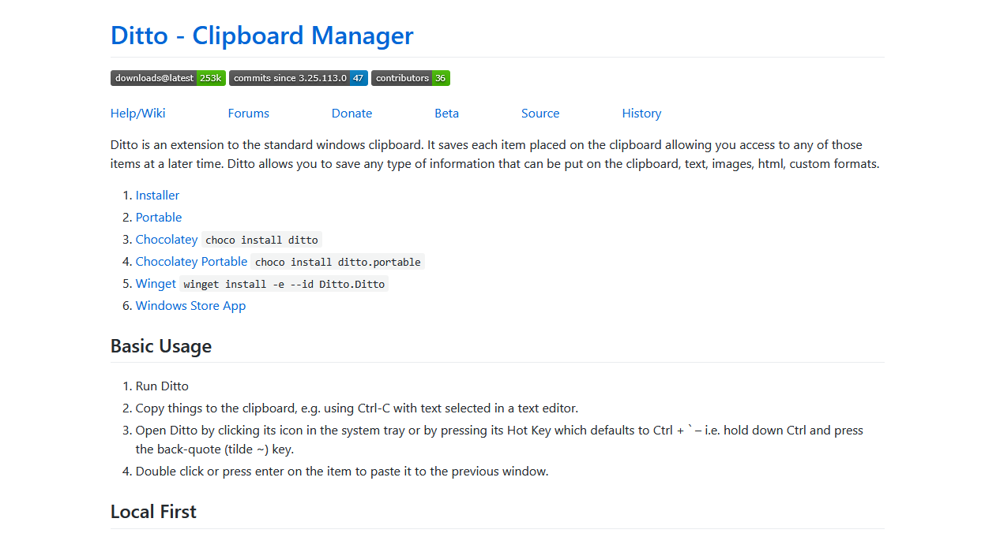

## 截图

[Snipaste](https://zh.snipaste.com/)，小而美。免费版就够用了。

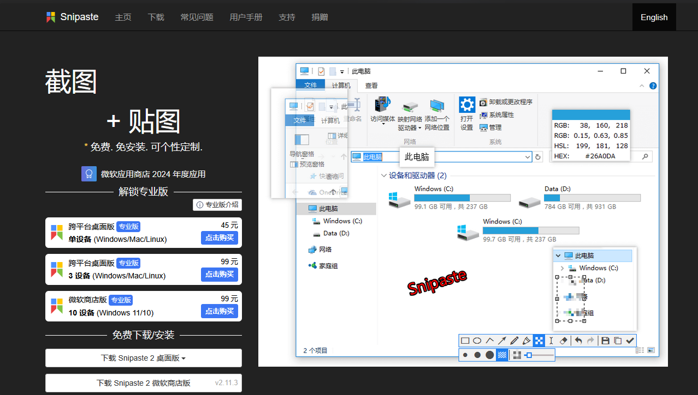

## Zip

[7-Zip-zstd](https://github.com/mcmilk/7-Zip-zstd)，依旧Fork，依旧轻量，依旧快。

我自己构建了一个有Bandizip图标的，[Here](https://github.com/HowXu/Better-7Zip-Build)。

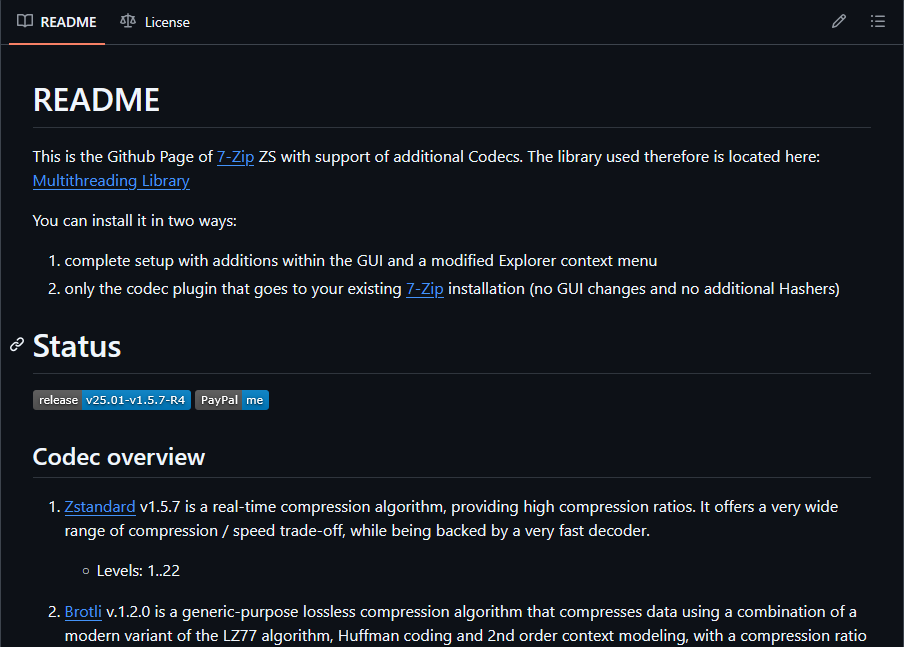

## MSVC工具链

其实是可以绕过安装VS，单独安装MSVC编译器套件的，只需要[visual-cpp-build-tools](https://visualstudio.microsoft.com/zh-hans/visual-cpp-build-tools/)就可以了。

同时会携带Visual Installer，可以用这个卸载或者安装新的负载。

## WSL 可视化管理

[WSL UI](https://github.com/octasoft-ltd/wsl-ui)，依旧Rust依旧 [Tauri](https://tauri.app/)。AI味道有点重，总体还行。

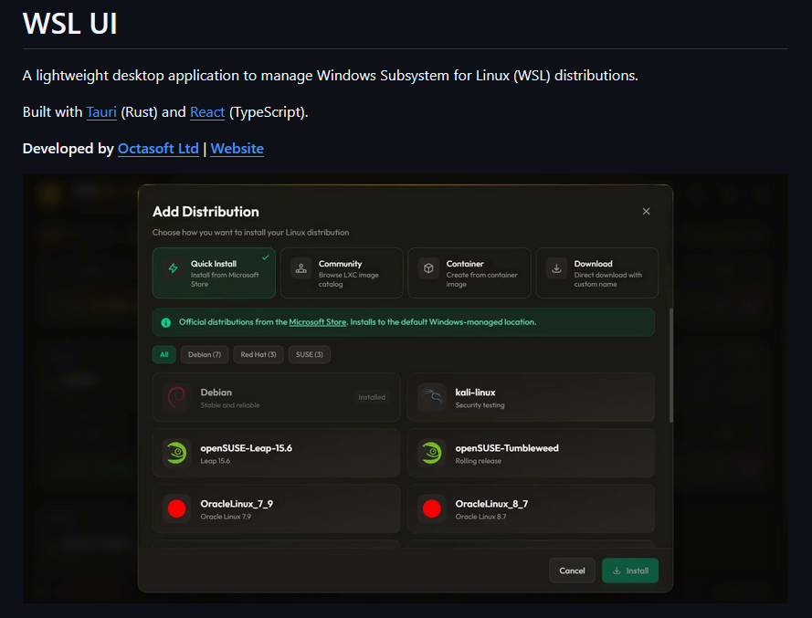

# 结语

其实是备忘录。。。