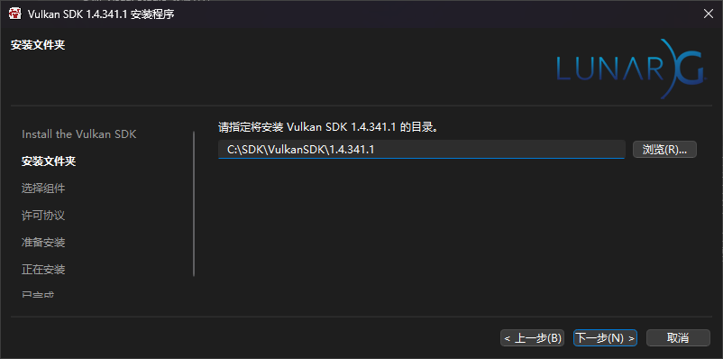
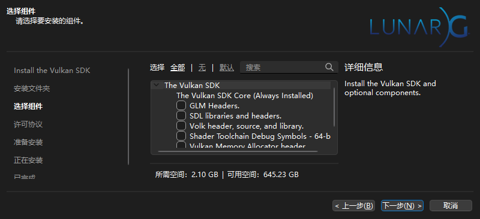
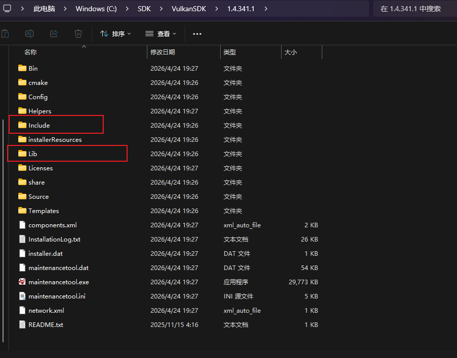
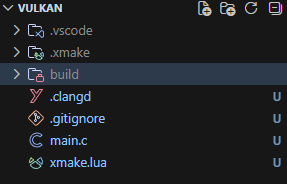
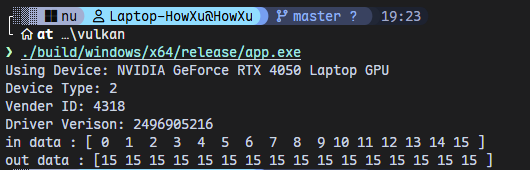

# 写在前面

很久没有写博客了，编辑器也从[VSCode](https://code.visualstudio.com/)迁移到[VSCodium](https://vscodium.com/)，很多配置都跟着没了。花了点时间重新部署
[Github Pages](https://pages.github.com/)，又重新配了一下[clangd](https://clangd.llvm.org/)什么的，简单地学一点点[Vulkan](https://www.vulkan.org/)相关的东西。  

不得不说现在的大模型真是越来越好用了，这篇博客也会用到大模型的，比如补充一些知识，帮我插入超链接什么的，纠正一些说法之类的。现在大家真是有一个很好的老师了，再也不用像苦行僧一样了。

---

*这篇博客在[Trae](https://www.trae.com.cn/)中辅助写作完成。*

# 许愿一个不用配环境的明天

Vulkan实际上是支持很多平台的，在多数编译型二进制语言中也是可以直接拿SDK里的lib链接的。这里我选用C语言，除了相比于[Rust](https://www.rust-lang.org/)和[Zig](https://ziglang.org/)要方便许多，还有一个就是我比较熟这个东西。

编辑器用的是VSCodium，插件用的是Kylin Clangd，没有用插件自带的clangd，[Github上的 clangd 22.1.0](https://github.com/clangd/clangd/releases/download/22.1.0/clangd-windows-22.1.0.zip)。

clangd已经变得成熟许多了，现在它能直接读[MinGW](https://www.mingw-w64.org/)的gcc输出的信息然后自动补全头文件依赖什么的。我的MinGW直接用的[CLion](https://www.jetbrains.com/clion/)捆绑的，只添加bin目录就可以了。环境变量如下：


之后改一下VSC里的clangd路径就可以了。

然后需要下载一下Vulkan的SDK，[这里](https://www.vulkan.org/sdk/home)。

安装



这个额外组件可以什么都不选。



安装后的SDK如下，需要Include和Lib目录下的文件。



然后调一个c的简单项目，我这里用的[xmake](https://xmake.io/)，用[CMake](https://cmake.org/)也可以。注意如果是xmake要改一下toolchain指向MinGW的路径，在Windows上是默认选用MSVC的。

```shell
xmake f --toolchain=gcc --mingw=C:\App\JetBrains\CLion\bin\mingw
```

这个配置看喜好。

题外话，[MSVC](https://visualstudio.microsoft.com/visual-cpp-build-tools/)套件可能是Windows平台上真正最好的编译器了，但是我不喜欢[VS](https://visualstudio.microsoft.com/)，平时喜欢用CLion。所以如果要只下载MSVC不下载VS，可以去VS下载页找一个叫[vs_BuildTools](https://visualstudio.microsoft.com/downloads/#build-tools-for-visual-studio-2022)的东西，只安装那个，然后组件只勾选MSVC和Windows Kits（如果不做Windows开发，连这个也不用）。这样就得到纯净的MSVC套件了。用x64 Native Developer Command Prompt启动命令行就可以用MSVC了。

然后下面是xmake的配置。

```lua
set_project("vulkan")
set_toolchains("mingw")

target("app")
    set_kind("binary")
    add_files("main.c")
    add_includedirs("C:\\SDK\\VulkanSDK\\1.4.341.1\\Include")
    add_linkdirs("C:\\SDK\\VulkanSDK\\1.4.341.1\\Lib")
    add_links("vulkan-1") -- 这个就是vulkan库
```

根目录新建一个.clangd文件，写入以下配置然后重启IDE，让clangd自动找头文件

```yaml
CompileFlags:
  Add: [-IC:\SDK\VulkanSDK\1.4.341.1\Include]
```

以上SDK目录不同自行处理。

看一下目录结构。



# 正文

## 关于Vulkan是什么

[Vulkan](https://www.vulkan.org/)是一个跨平台的二维、三维图形与计算的应用程序接口（API），由[科纳斯组织（Khronos Group）](https://www.khronos.org/)在2015年的游戏开发者大会（GDC）上首次宣布，并在2016年正式发布。最早它曾被称为"下一代OpenGL行动"或"glNext"，后来基于AMD捐赠的[Mantle](https://www.amd.com/en/technologies/mantle) API构建而成，最终成为了今天这个开放标准。

Vulkan的设计目标是解决OpenGL和Direct3D 11这些传统API在现代硬件上的瓶颈。过去的API是基于单核CPU时代的思路设计的，驱动层做了大量的隐式管理工作，虽然降低了开发者的入门门槛，但也带来了不小的CPU开销。而且OpenGL的状态机模型在多线程环境下表现并不理想，无法有效利用现代CPU的多核优势。

Vulkan在这方面做了彻底的改变，它是一个底层（Low-level）的显式API，把GPU的控制权更多地交给了开发者。简单来说就是驱动做更少的事情，开发者做更多的事情。虽然这意味着你要写更多的代码才能画出第一个三角形，但换来的是更低的CPU开销、更直接的GPU控制，以及更好的多线程支持。从PC和游戏主机到手机和嵌入式设备，Vulkan几乎覆盖了所有主流平台，也是Android系统级别支持的图形API之一。

Vulkan还有一个很有意思的特点是它的着色器系统。传统API如OpenGL使用GLSL这样的高级着色语言，驱动在运行时需要编译着色器代码。而Vulkan采用的是[SPIR-V](https://www.khronos.org/spir/)（Standard Portable Intermediate Representation），一种中间二进制格式。你提前把着色器编译成SPIR-V，驱动只需要把它翻译成GPU的机器码就行了。这样做的好处是加载速度更快、更稳定，也不会出现以前那种"同样一份GLSL代码，在不同的显卡上表现不一样"的尴尬情况。

总之, Vulkan可以让你极大地控制GPU，甚至达到cuda/cuBLAS的性能。

我的实战是跟着教学写一个简单的Vulkan着色器，[视频链接](https://www.bilibili.com/video/BV1XfzVBoE1Y)

## 实战

> **Vulkan供有点：Vulkan开发通常是沿着**"资源创建 → 配置绑定 → 提交执行 → 读取结果 → 销毁"的主线逐段推进。每遇到一个 `vkCreate*`，就要记住对应的 `vkDestroy*` 的位置；每遇到一个 `vkAllocate*`，就有对应的 `vkFree*`。Vulkan 的显式性意味着没有"自动回收"，一切生命周期必须手动管理。

### 1. 头文件与类型别名

引入 SDK 提供的 `<vulkan/vulkan.h>`，再定义一套趁手的类型缩写，减少后续代码的噪音。

```c
#include <stdbool.h>
#include <stddef.h>
#include <stdint.h>
#include <stdio.h>
#include <stdlib.h>
#include <string.h>
#include <vulkan/vulkan.h>

typedef uint8_t u8;
typedef uint32_t u32;
typedef uint64_t u64;

#define ALIGN_UP(n, a) (((n) + (a) - 1) - (((n) + (a) - 1) % (a)))

typedef uint32_t b32;

typedef float f32;
```

- `<vulkan/vulkan.h>` 是 Vulkan SDK 提供的**唯一入口头文件**，包含了所有类型、函数声明和扩展。
- `u8`/`u32`/`u64` 缩写：Vulkan API 大量使用 `uint32_t` 等定长类型，缩写能显著减轻视觉负担。
- `ALIGN_UP` 宏：将 `n` 向上对齐到 `a` 的整数倍。后面内存分配时会用到，因为不同硬件对缓冲区起始地址有对齐要求（通常 64–256 字节不等）。
- `b32` 是“布尔型 32 位”的缩写：在需要传入布尔量到结构体字段时，用 `u32` 比 C 的 `bool` 更明确地表达了 Vulkan 的结构体对齐语义。

### 2. main 入口与验证层检测

Vulkan 的 main 函数通常很长，但结构清晰。  

从变量声明和验证层开始。

```c
int main()
{
    const char* validation_layer_name = "VK_LAYER_KHRONOS_validation";
    b32 use_validation_layer = false;

    VkInstance instance = NULL; // manager 管理GPU和设备
    // 初始化instance
    // vulkan的api多数是函数+对象形式的
    {
        // 根据vkCreateInstance函数需要的参数 提前声明一些对象
        VkInstanceCreateInfo instance_create_info = {
            // with c99 create a struct
            .sType = VK_STRUCTURE_TYPE_INSTANCE_CREATE_INFO,
            .pApplicationInfo = &(VkApplicationInfo) { .sType = VK_STRUCTURE_TYPE_APPLICATION_INFO,
                .apiVersion = VK_API_VERSION_1_0 }
        };
// 验证层
#ifndef NDEBUG

        u32 num_layers = 0;
        vkEnumerateInstanceLayerProperties(&num_layers,
            NULL); // this is for num_layers

        VkLayerProperties* layer_props = (VkLayerProperties*)malloc(sizeof(VkLayerProperties) * num_layers);
        vkEnumerateInstanceLayerProperties(&num_layers, layer_props);

        for (u32 i = 0; i < num_layers; i++) {
            if (strcmp(layer_props[i].layerName, validation_layer_name) == 0) {
                use_validation_layer = true;
                break;
            }
        }

        free(layer_props);

        if (use_validation_layer) {
            instance_create_info.enabledLayerCount = 1;
            instance_create_info.ppEnabledLayerNames = &validation_layer_name; // need a pointer to string
        }
#endif

        vkCreateInstance(&instance_create_info, NULL, &instance);
    }
```

**逐行解释（关联上下文中距较远的语句一并说明）：**

| 代码行/段 | 说明 |
|-----------|------|
| `const char* validation_layer_name` | Vulkan 标准验证层名。`VK_LAYER_KHRONOS_validation` 是 Khronos 官方提供的**调试层**，非发布构建下用 `#ifndef NDEBUG` 控制。 |
| `VkInstance instance = NULL` | **VkInstance**——Vulkan 顶层对象，托管驱动连接、物理设备枚举。末尾 `vkDestroyInstance` 与它**远距配对**。 |
| `VkInstanceCreateInfo` + `VkApplicationInfo` | 创建对象的标准模式：填 `*CreateInfo` 结构体，`.sType` 标明结构类型。 |
| `vkEnumerateInstanceLayerProperties(&num_layers, NULL)` | **两段式枚举**（Vulkan 通用模式）：第一段传 NULL 获取数量；第二段分配数组后再调拿到数据。 |
| `strcmp` 循环查找 | 遍历层列表匹配 `VK_LAYER_KHRONOS_validation`。 |
| `ppEnabledLayerNames` | `ppEnabledLayerNames` 类型是 `const char* const*`，需取字符串指针的地址。 |
| `vkCreateInstance` | 三个参数：CreateInfo 指针、分配器回调（NULL=默认）、输出句柄指针。|

### 3. 选择物理设备（VkPhysicalDevice）

> **VkPhysicalDevice** 代表实际 GPU 硬件。用枚举+查询属性确认"在用哪块卡"。

```c
    // 创建物理设备 通常是GPU
    VkPhysicalDevice physical_device = NULL;
    {
        u32 num_physical_devices = 1;
        vkEnumeratePhysicalDevices(instance, &num_physical_devices,
            &physical_device);

        VkPhysicalDeviceProperties physical_device_properities = {
            0
        };

        vkGetPhysicalDeviceProperties(physical_device,
            &physical_device_properities);

        printf(
            "Using Device: %s\nDevice Type: %u\nVender ID: %u\nDriver Verison: "
            "%u\n",
            physical_device_properities.deviceName,
            physical_device_properities.deviceType,
            physical_device_properities.vendorID,
            physical_device_properities.driverVersion);
    }
```

**逐行解释：**

| 代码行/段 | 说明 |
|-----------|------|
| `num_physical_devices = 1` | 告诉 Vulkan"最多取 1 个"。函数返回后该变量变为实际获取数。 |
| `vkEnumeratePhysicalDevices` | 从 Instance 枚举设备句柄，同样两段式。 |
| `VkPhysicalDeviceProperties = { 0 }` | 零初始化结构体。C 中 `{0}` 是零初始化写法，避免未初始化的垃圾值。 |
| `vkGetPhysicalDeviceProperties` | 读取 `deviceName`、`vendorID`（NV=0x10DE）、`driverVersion`、`deviceType`。 |
| `printf` | 打印设备信息，验证选到的 GPU 是否符合预期。

### 4. 创建逻辑设备（VkDevice）

> **VkDevice** 类比 OpenGL 的 Context。创建前需确定**队列族（Queue Family）**——不同队列族提供不同功能（图形/计算/传输）。做计算找 `VK_QUEUE_COMPUTE_BIT`。

```c
    // 创建vulkan device
    u32 queue_family_index = 0;
    VkDevice device = NULL;
    {
        u32 queue_family_count = 0;
        vkGetPhysicalDeviceQueueFamilyProperties(physical_device,
            &queue_family_count, NULL);

        VkQueueFamilyProperties* queue_family_properties = (VkQueueFamilyProperties*)malloc(sizeof(VkQueueFamilyProperties) * queue_family_count);
        vkGetPhysicalDeviceQueueFamilyProperties(physical_device,
            &queue_family_count, queue_family_properties);
        for (u32 i = 0; i < queue_family_count; i++) {
            if (queue_family_properties[i].queueFlags & VK_QUEUE_COMPUTE_BIT) {
                queue_family_index = i;
                break;
            }
        }

        free(queue_family_properties);

        f32 priority = 0.0f;
        VkDeviceCreateInfo device_create_info = {
            .sType = VK_STRUCTURE_TYPE_DEVICE_CREATE_INFO,
            .queueCreateInfoCount = 1,
            .pQueueCreateInfos = &(VkDeviceQueueCreateInfo) {
                .sType = VK_STRUCTURE_TYPE_DEVICE_QUEUE_CREATE_INFO,
                .queueFamilyIndex = queue_family_index,
                .queueCount = 1,
                .pQueuePriorities = &priority },

        };
        // 验证层
#ifndef NDEBUG
        if (use_validation_layer) {
            device_create_info.enabledLayerCount = 1;
            device_create_info.ppEnabledLayerNames = &validation_layer_name;
        }
#endif
        vkCreateDevice(physical_device, &device_create_info, NULL, &device);
    }
```

**逐行解释：**

| 代码行/段 | 说明 |
|-----------|------|
| `queue_family_index = 0` | 存储匹配到的队列族编号。 |
| `vkGetPhysicalDeviceQueueFamilyProperties` | 两段式枚举队列族属性，包含 `queueFlags`（能力位掩码）和 `queueCount`。 |
| `VK_QUEUE_COMPUTE_BIT` 遍历 | 找支持计算能力的队列族。`break` 取第一个匹配项。 |
| `f32 priority = 0.0f` | 队列优先级 0.0~1.0，单队列时设为 0 即可。 |
| `VkDeviceQueueCreateInfo` | 指定需要创建的队列数量（1 个）、族编号、优先级。 |
| 验证层条件编译 | 验证层需同时在 Instance 和 Device 级别激活。 |
| `vkCreateDevice` | 创建逻辑设备。末尾 `vkDestroyDevice` 与此处**远距配对**。 |

### 5. 创建缓冲区（VkBuffer）

> **VkBuffer** 是显存缓冲区的**逻辑句柄**，不携带实际内存。内存需 `vkAllocateMemory` 另分，再用 `vkBindBufferMemory` 绑定。两个 VkBuffer 可以共享同一块 VkDeviceMemory 的不同偏移区域。

```c
    u32 vector_size = 16;
    u32 buffer_size = sizeof(f32) * vector_size;
    // 这里的策略是多变的 用的是共享内存但是为输入输出创建单独的缓冲区
    VkBuffer in_buffer = NULL, out_buffer = NULL;

    {
        VkBufferCreateInfo buffer_create_info = {
            .sType = VK_STRUCTURE_TYPE_BUFFER_CREATE_INFO,
            .size = buffer_size,
            .usage = VK_BUFFER_USAGE_2_STORAGE_BUFFER_BIT,
            .sharingMode = VK_SHARING_MODE_EXCLUSIVE,
            .queueFamilyIndexCount = 1,
            .pQueueFamilyIndices = &queue_family_index
        };

        vkCreateBuffer(device, &buffer_create_info, NULL, &in_buffer);
        vkCreateBuffer(device, &buffer_create_info, NULL, &out_buffer);
    }
```

**逐行解释：**

| 代码行/段 | 说明 |
|-----------|------|
| `vector_size = 16` | 数组长度，GPU 对 16 个元素做并行加法。 |
| `buffer_size = sizeof(f32) * 16` | 每个 float 4 字节 × 16 = 64 字节。 |
| 原注释"共享内存但是为输入输出创建单独的缓冲区" | 两个 VkBuffer 句柄 → 同一块 VkDeviceMemory 的不同偏移。 |
| `VK_BUFFER_USAGE_2_STORAGE_BUFFER_BIT` | 标记为 **Storage Buffer（SSBO）**，计算着色器可读写。Vulkan 1.3 新枚举（等价旧版无 `_2`）。 |
| `VK_SHARING_MODE_EXCLUSIVE` | 独占模式：缓冲区只被一个队列族使用，简单且性能好。 |
| 两次 `vkCreateBuffer` | 同样 CreateInfo 创建 in/out 两个句柄。**此刻内存尚未分配**。

### 6. 内存需求查询、对齐计算与分配

```c
    // 创建组合内存池 注意对齐方式
    VkMemoryRequirements in_mem_reqs = { 0 }, out_mem_reqs = { 0 };
    vkGetBufferMemoryRequirements(device, in_buffer, &in_mem_reqs);
    vkGetBufferMemoryRequirements(device, out_buffer, &out_mem_reqs);

    // 对齐
    u64 in_buffer_offset = 0;
    u64 in_buffer_size = in_mem_reqs.size;
    u64 out_buffer_offset = ALIGN_UP(in_mem_reqs.size, out_mem_reqs.alignment);
    u64 out_buffer_size = out_mem_reqs.size;
    u64 total_size = out_buffer_offset + out_buffer_size;

    VkPhysicalDeviceMemoryProperties mem_properities = { 0 };
    vkGetPhysicalDeviceMemoryProperties(physical_device, &mem_properities);

    // 寻找一个可用的堆 实践中应该是有一个CPU可用内存 一个GPU可用内存
    // 然后互相传数据
    u32 mem_type_index = 0;
    for (u32 i = 0; i < mem_properities.memoryTypeCount; i++) {
        if ((mem_properities.memoryTypes[i].propertyFlags & VK_MEMORY_PROPERTY_HOST_VISIBLE_BIT) && (mem_properities.memoryTypes[i].propertyFlags & VK_MEMORY_PROPERTY_HOST_COHERENT_BIT)) {
            mem_type_index = i;
            break;
        }
    }

    // 创建设备内存
    VkMemoryAllocateInfo mem_allocate_info = {
        .sType = VK_STRUCTURE_TYPE_MEMORY_ALLOCATE_INFO,
        .memoryTypeIndex = mem_type_index,
        .allocationSize = total_size
    };
    // 这样就可以用一个内存容纳两个缓冲区
    VkDeviceMemory memory = NULL;
    vkAllocateMemory(device, &mem_allocate_info, NULL, &memory);
```

**逐行解释：**

| 代码行/段 | 说明 |
|-----------|------|
| `vkGetBufferMemoryRequirements` | 查询对齐要求：`size`（实际字节数，可能>buffer_size）、`alignment`（对齐边界）、`memoryTypeBits`（位掩码）。 |
| `ALIGN_UP(in_mem_reqs.size, out_mem_reqs.alignment)` | 让 out_buffer 从已对齐位置开始，两缓冲区不重叠且各自对齐。 |
| `VK_MEMORY_PROPERTY_HOST_VISIBLE \| HOST_COHERENT` | **Host-Visible + Host-Coherent**：CPU 可访问（map），且无需手动 flush。 |
| `vkAllocateMemory` | 分配物理显存。`VkDeviceMemory` 是实际显存块句柄，与 VkBuffer 分离，通过 `vkBindBufferMemory` 关联。 |

### 7. 内存映射、写入数据、解除映射

```c
    {
        f32* data = NULL; // 这个变量用来存储将被用于进行着色器计算(向量加法)的数据
        // 内存映射
        vkMapMemory(device, memory, 0, total_size, 0, (void**)(&data));
        f32* in_data = data;
        f32* out_data = data + (out_buffer_offset / sizeof(f32)); // 直接指针偏移就可以得到输出数据的数组起点了

        // 创建一些数据
        for (u32 i = 0; i < vector_size; i++) {
            in_data[i] = i;
            out_data[i] = vector_size - i - 1;
            // 意味着左右操作数的和其实都是vector_size
        }

        vkUnmapMemory(device, memory);
    }
```

| 代码行/段 | 说明 |
|-----------|------|
| `vkMapMemory` | 将显存映射到 CPU 地址空间，`(void**)(&data)` 输出 CPU 可读写的指针。 |
| `out_data = data + (out_buffer_offset / sizeof(f32))` | 指针算术跳到输出缓冲区。除以 `sizeof(f32)` 得到 float 下标偏移。 |
| 填充数据 | 输入 `[0..15]`，输出初始值 `[15..0]`。两者之和恒为 `vector_size-1`，便于验证 GPU 计算结果。 |
| `vkUnmapMemory` | 解除映射。`HOST_COHERENT` 内存类型下数据自动写回显存。 |

### 8. 绑定缓冲区到内存

```c
    // 绑定缓冲区到内存
    vkBindBufferMemory(device, in_buffer, memory, 0);
    vkBindBufferMemory(device, out_buffer, memory, out_buffer_offset);
```

- `vkBindBufferMemory`：将 VkBuffer 句柄与 VkDeviceMemory 关联。`in_buffer` 从偏移 0 开始，`out_buffer` 从已对齐的 `out_buffer_offset` 开始。

### 9. 加载着色器模块（VkShaderModule）

> **VkShaderModule** 是 SPIR-V 字节码的薄包装，把 `.spv` 文件中的二进制数据交给 Vulkan 驱动。注意 GPU 机器码的编译要到管线创建时才发生，ShaderModule 可以提前销毁。

```c
    // 加载着色器Module
    VkShaderModule shader_module = NULL;
    {
        FILE* file = fopen("add.spv", "rb");
        fseek(file, 0, SEEK_END);
        u64 size = ftell(file);
        fseek(file, 0, SEEK_SET);

        u32* shader_file = (u32*)malloc(size);
        fread(shader_file, 1, size, file);

        VkShaderModuleCreateInfo shader_module_create_info = {
            .sType = VK_STRUCTURE_TYPE_SHADER_MODULE_CREATE_INFO,
            .codeSize = size,
            .pCode = shader_file
        };
        vkCreateShaderModule(device, &shader_module_create_info, NULL,
            &shader_module);
        free(shader_file);
    }
```

| 代码行/段 | 说明 |
|-----------|------|
| `fopen("add.spv", "rb")` | 以二进制方式打开编译好的 SPIR-V 文件。`.spv` 是着色器预编译输出。 |
| `ftell / malloc / fread` | 标准 C 读文件流程：获取大小→分配内存→读取。 |
| `u32* shader_file = (u32*)malloc(size)` | SPIR-V 规范要求按 `uint32_t` 对齐读取，因为 SPIR-V 指令是 32 位定长。但 `fread` 用 `size`（字节数）而非元素数，所以安全。 |
| `VkShaderModuleCreateInfo` | 填入 `codeSize`（字节）和 `pCode`（指向 SPIR-V 数据的指针）。 |
| `vkCreateShaderModule` | 创建着色器模块。注意 `free(shader_file)` 紧随其后——一旦创建成功，字节码已复制到驱动内部。 |
| **远距配对** | 末尾 `vkDestroyShaderModule` 与此处配对。

### 10. 描述集布局（Descriptor Set Layout）

> **Descriptor Set** 是着色器与缓冲区之间的"接线板"。Layout 定义接口（几个 binding、各是什么类型），Descriptor Set 则是实际的绑定实例。这里着色器需要 3 个 Storage Buffer：binding=0 输入，binding=1 输出，binding=2 也是输出（原代码第 3 个 binding 指向 `out_buffer`）。

```c
    // 描述集布局
    // 告诉管线我们如何管理shader中的缓冲区的 以及缓冲区的数据类型
    VkDescriptorSetLayoutBinding binding[] = {
        { 0, VK_DESCRIPTOR_TYPE_STORAGE_BUFFER, 1, VK_SHADER_STAGE_COMPUTE_BIT,
            NULL },
        { 1, VK_DESCRIPTOR_TYPE_STORAGE_BUFFER, 1, VK_SHADER_STAGE_COMPUTE_BIT,
            NULL },
        { 2, VK_DESCRIPTOR_TYPE_STORAGE_BUFFER, 1, VK_SHADER_STAGE_COMPUTE_BIT,
            NULL }
    };
    VkDescriptorSetLayout descriptor_set_layout = NULL;
    {
        VkDescriptorSetLayoutCreateInfo descriptor_set_layout_create_info = {
            .sType = VK_STRUCTURE_TYPE_DESCRIPTOR_SET_LAYOUT_CREATE_INFO,
            .bindingCount = sizeof(binding) / sizeof(binding[0]),
            .pBindings = binding
        };
        vkCreateDescriptorSetLayout(device, &descriptor_set_layout_create_info,
            NULL, &descriptor_set_layout);
    }
```

| 代码行/段 | 说明 |
|-----------|------|
| `VkDescriptorSetLayoutBinding binding[3]` | 定义 3 个绑定槽：binding=0/1/2，类型均为 `STORAGE_BUFFER`，在计算着色器阶段可见。|
| `vkCreateDescriptorSetLayout` | 创建布局。数量用 `sizeof(binding)/sizeof(binding[0])` 避免硬编码。 |

### 11. 描述池与分配描述集

> **VkDescriptorPool** 是描述集分配器，类似内存池。**VkDescriptorSet** 是 pool 中分配出的实际实例。

```c
    VkDescriptorPool descriptor_pool = NULL;
    VkDescriptorPoolCreateInfo descriptor_pool_create_info = {
        .sType = VK_STRUCTURE_TYPE_DESCRIPTOR_POOL_CREATE_INFO,
        .maxSets = 1,
        .poolSizeCount = 1,
        .pPoolSizes = &(VkDescriptorPoolSize) {
            .type = VK_DESCRIPTOR_TYPE_STORAGE_BUFFER,
            .descriptorCount = sizeof(binding) / sizeof(binding[0]) },
        .flags = VK_DESCRIPTOR_POOL_CREATE_FREE_DESCRIPTOR_SET_BIT // must for destroy
    };
    vkCreateDescriptorPool(device, &descriptor_pool_create_info, NULL,
        &descriptor_pool);

    VkDescriptorSet descriptor_set = NULL;
    VkDescriptorSetAllocateInfo descriptor_set_allcate_info = {
        .sType = VK_STRUCTURE_TYPE_DESCRIPTOR_SET_ALLOCATE_INFO,
        .descriptorPool = descriptor_pool,
        .descriptorSetCount = 1,
        .pSetLayouts = &descriptor_set_layout
    };
    vkAllocateDescriptorSets(device, &descriptor_set_allcate_info,
        &descriptor_set);
```

| 代码行/段 | 说明 |
|-----------|------|
| `VkDescriptorPoolCreateInfo` | `maxSets=1` 最多分配 1 个描述集；`descriptorCount=3` 声明池中有 3 个 Storage Buffer 描述符的容量。 |
| `FREE_DESCRIPTOR_SET_BIT` | 允许释放单个描述集。 |
| `vkAllocateDescriptorSets` | 从 pool 中分配 1 个描述集，按 `descriptor_set_layout` 组织。 |

### 12. 写入描述集 —— 把缓冲区挂接到着色器

```c
    VkWriteDescriptorSet write_set[] = {
        (VkWriteDescriptorSet) {
            .sType = VK_STRUCTURE_TYPE_WRITE_DESCRIPTOR_SET,
            .dstSet = descriptor_set,
            .dstBinding = 0,
            .descriptorCount = 1,
            .descriptorType = VK_DESCRIPTOR_TYPE_STORAGE_BUFFER, // dont forget
            .pBufferInfo = &(VkDescriptorBufferInfo) {
                .buffer = in_buffer, .offset = 0, .range = VK_WHOLE_SIZE } },
        (VkWriteDescriptorSet) { .sType = VK_STRUCTURE_TYPE_WRITE_DESCRIPTOR_SET, .dstSet = descriptor_set, .dstBinding = 1, .descriptorCount = 1,
            .descriptorType = VK_DESCRIPTOR_TYPE_STORAGE_BUFFER, // dont forget
            .pBufferInfo = &(VkDescriptorBufferInfo) { .buffer = out_buffer, .offset = 0, .range = VK_WHOLE_SIZE } },
        (VkWriteDescriptorSet) { .sType = VK_STRUCTURE_TYPE_WRITE_DESCRIPTOR_SET, .dstSet = descriptor_set, .dstBinding = 2, .descriptorCount = 1,
            .descriptorType = VK_DESCRIPTOR_TYPE_STORAGE_BUFFER, // dont forget
            .pBufferInfo = &(VkDescriptorBufferInfo) { .buffer = out_buffer, .offset = 0, .range = VK_WHOLE_SIZE } }
    };

    vkUpdateDescriptorSets(device, sizeof(write_set) / sizeof(write_set[0]),
        write_set, 0, NULL);
```

| 代码行/段 | 说明 |
|-----------|------|
| `VkWriteDescriptorSet[3]` | 将 in_buffer 写入 binding=0，out_buffer 写入 binding=1 和 2。`VK_WHOLE_SIZE` 表示整个缓冲区范围。`descriptorType` 必须与 Layout 声明一致。 |
| `vkUpdateDescriptorSets` | 批量提交描述符写入。第四个参数 0 和第五个 NULL 表示没有 copy 操作（copy 用于描述集间迁移数据）。 |

### 13. 管线布局与管线（Pipeline Layout & Pipeline）

> **VkPipelineLayout** 声明管线使用的描述集布局。**VkPipeline** 则把着色器模块、布局、管线状态打包成一个不可变对象。这里是计算管线，所以用 `vkCreateComputePipelines`。

```c
    // 创建管线 终于要来了吗
    VkPipelineLayoutCreateInfo pipeline_layout_create_info = {
        .sType = VK_STRUCTURE_TYPE_PIPELINE_LAYOUT_CREATE_INFO,
        .setLayoutCount = 1,
        .pSetLayouts = &descriptor_set_layout

    };

    VkPipelineLayout pipeline_layout = NULL;
    vkCreatePipelineLayout(device, &pipeline_layout_create_info, NULL,
        &pipeline_layout);

    VkPipeline pipeline = NULL;

    VkComputePipelineCreateInfo compute_pipeline_create_info = {
        .sType = VK_STRUCTURE_TYPE_COMPUTE_PIPELINE_CREATE_INFO,
        .layout = pipeline_layout,
        .stage = (VkPipelineShaderStageCreateInfo) {
            .sType = VK_STRUCTURE_TYPE_PIPELINE_SHADER_STAGE_CREATE_INFO,
            .stage = VK_SHADER_STAGE_COMPUTE_BIT,
            .module = shader_module,
            .pName = "main" // the entry function name
        }
    };

    // 实际上创建管线是一个消耗资源的事情 最好有一个cache在第二个参数位置
    vkCreateComputePipelines(device, NULL, 1, &compute_pipeline_create_info, NULL,
        &pipeline);
```

| 代码行/段 | 说明 |
|-----------|------|
| `VkPipelineLayoutCreateInfo` | 传入 `descriptor_set_layout`，告诉管线它用哪些描述集。 |
| `VkComputePipelineCreateInfo` | 计算管线只需一个着色器阶段，`pName = "main"` 指定入口函数名。 |
| `vkCreateComputePipelines(device, NULL, ...)` | 第二个参数是 **PipelineCache**，可缓存编译结果跨次复用。传 NULL 表示不用缓存。 |

### 14. 命令池与命令缓冲区（Command Pool & Command Buffer）

> **VkCommandPool** 是命令缓冲区的分配器。**VkCommandBuffer** 记录 GPU 要执行的指令。所有 `vkCmd*` 函数都是向命令缓冲区写入指令。

```c
    // 最后一步 告诉GPU去跑我们的管线 这里又要一个 命令池和命令buffer
    VkCommandPool command_pool = NULL;

    VkCommandPoolCreateInfo command_pool_create_info = {
        .sType = VK_STRUCTURE_TYPE_COMMAND_POOL_CREATE_INFO,
        .queueFamilyIndex = queue_family_index
    };
    vkCreateCommandPool(device, &command_pool_create_info, NULL, &command_pool);

    VkCommandBuffer command_buffer = NULL;
    VkCommandBufferAllocateInfo command_buffer_allocate_info = {
        .sType = VK_STRUCTURE_TYPE_COMMAND_BUFFER_ALLOCATE_INFO,
        .commandPool = command_pool,
        .commandBufferCount = 1,
        .level = VK_COMMAND_BUFFER_LEVEL_PRIMARY // 主区
    };
    vkAllocateCommandBuffers(device, &command_buffer_allocate_info,
        &command_buffer);
```

| 代码行/段 | 说明 |
|-----------|------|
| `VkCommandPoolCreateInfo` | 绑定到 `queue_family_index`——命令缓冲区只能提交到同族的队列。 |
| `VK_COMMAND_BUFFER_LEVEL_PRIMARY` | 主缓冲区：可直接提交到队列。Secondary 只能被 Primary 调用。 |

### 15. 录制命令——4 步完成一次计算调度

```c
    // 现在写入命令
    vkBeginCommandBuffer(
        command_buffer,
        &(VkCommandBufferBeginInfo) {
            .sType = VK_STRUCTURE_TYPE_COMMAND_BUFFER_BEGIN_INFO });
    vkCmdBindPipeline(command_buffer, VK_PIPELINE_BIND_POINT_COMPUTE, pipeline);
    vkCmdBindDescriptorSets(command_buffer, VK_PIPELINE_BIND_POINT_COMPUTE,
        pipeline_layout, 0, 1, &descriptor_set, 0, NULL);
    vkCmdDispatch(command_buffer, vector_size, 1, 1);
    vkEndCommandBuffer(command_buffer);
```

| 代码行/段 | 说明 |
|-----------|------|
| `vkBeginCommandBuffer` | 开始录制。`VkCommandBufferBeginInfo.flags` 默认 0 表示一次性提交。 |
| `vkCmdBindPipeline` | 绑定计算管线。`VK_PIPELINE_BIND_POINT_COMPUTE` 指定绑定目标是计算（非图形）。 |
| `vkCmdBindDescriptorSets` | 将 `descriptor_set` 绑定到 set=0。参数含义：`pipeline_layout`、firstSet=0、1个set、`&descriptor_set`。 |
| `vkCmdDispatch(16, 1, 1)` | **核心调用**：启动 16×1×1=16 个工作组，每个工作组的计算着色器负责一个数组元素。 |
| `vkEndCommandBuffer` | 结束录制。至此命令缓冲区已包含 4 条指令，准备提交。 |

### 16. 提交与同步——让 GPU 跑起来

> **VkQueue** 是实际执行命令的通道。**VkFence** 是 GPU→CPU 的同步信号——GPU 完成后发信号，CPU 在 `vkWaitForFences` 上等待。

```c
    VkQueue queue = NULL;
    vkGetDeviceQueue(device, queue_family_index, 0, &queue);

    // 这个是同步锁
    VkFence fence = NULL;
    vkCreateFence(
        device,
        &(VkFenceCreateInfo) { .sType = VK_STRUCTURE_TYPE_FENCE_CREATE_INFO }, NULL,
        &fence);

    // 现在提交任务
    vkQueueSubmit(queue, 1,
        &(VkSubmitInfo) { .sType = VK_STRUCTURE_TYPE_SUBMIT_INFO,
            .commandBufferCount = 1,
            .pCommandBuffers = &command_buffer },
        fence);

    // 等待线程同步
    vkWaitForFences(device, 1, &fence, true, ~(u64)(0)); 
```

| 代码行/段 | 说明 |
|-----------|------|
| `vkGetDeviceQueue` | 从 Device 中获取队列句柄。第二个参数 0 取该族中的第 0 个队列。 |
| `vkCreateFence` | 创建一个 Fence，初始状态 unsignaled。 |
| `VkSubmitInfo` | 提交 1 个命令缓冲区，`fence` 在 GPU 完成所有命令后 signaled。 |
| `vkWaitForFences(..., ~(u64)(0))` | **阻塞等待**直到 fence 信号。`~(u64)(0)` = `UINT64_MAX`：这是 C 语言中快速生成全 1 最大值的写法（等价 `0xFFFFFFFFFFFFFFFF`），表示无限等待。 |

### 17. 读取结果

```c
    // 为了看结果 这里再分配一次内存
    {
        f32* data = NULL;
        // 注意这类的mapMemory 我们得到的指针位置是完全一样的
        vkMapMemory(device, memory, 0, total_size, 0, (void**)(&data));
        f32* in_data = data;
        f32* out_data = data + (out_buffer_offset / sizeof(f32));

        printf("in data : [");
        for (u32 i = 0; i < vector_size; i++) {
            printf("%2.0f ", in_data[i]);
        }
        printf("]\n");

        printf("out data : [");
        for (u32 i = 0; i < vector_size; i++) {
            printf("%2.0f ", out_data[i]);
        }
        printf("]\n");

        vkUnmapMemory(device, memory);
    }
```

- 第二次 `vkMapMemory`：GPU 已将 `in_data + out_initial` 的结果写回 `out_buffer`。重新 map 读取指针。同一个 `memory` 对象、同样的偏移，返回的地址相同。
- 预期结果：`out_data[i] = in_data[i] + out_data_old[i] = i + (16-1-i) = 15`（每个元素都是 15）。

### 18. 资源清理——逆序销毁

> Vulkan 没有垃圾回收。**销毁顺序必须与创建顺序相反**：先销毁依赖其他资源的对象，最后销毁顶层对象。

```c
    vkDestroyFence(device, fence, NULL);
    vkDestroyCommandPool(device, command_pool, NULL);
    vkDestroyPipeline(device, pipeline, NULL);
    vkDestroyPipelineLayout(device, pipeline_layout, NULL);
    vkFreeDescriptorSets(device, descriptor_pool, 1, &descriptor_set);
    vkDestroyDescriptorPool(device, descriptor_pool, NULL);
    vkDestroyDescriptorSetLayout(device, descriptor_set_layout, NULL);
    vkDestroyShaderModule(device, shader_module, NULL);
    vkFreeMemory(device, memory, NULL);
    vkDestroyBuffer(device, in_buffer, NULL);
    vkDestroyBuffer(device, out_buffer, NULL);
    vkDestroyDevice(device, NULL);
    vkDestroyInstance(instance, NULL); // free

    return 0;
}
```

| 行 | 创建 | 销毁 | 注意 |
|----|------|------|------|
| Fence | `vkCreateFence` (§16) | `vkDestroyFence` | |
| CommandPool | `vkCreateCommandPool` (§14) | `vkDestroyCommandPool` | 会隐式销毁池中所有 CommandBuffer |
| Pipeline | `vkCreateComputePipelines` (§13) | `vkDestroyPipeline` | |
| PipelineLayout | `vkCreatePipelineLayout` (§13) | `vkDestroyPipelineLayout` | |
| DescriptorSet | `vkAllocateDescriptorSets` (§11) | `vkFreeDescriptorSets` | 注意是 Free 不是 Destroy |
| DescriptorPool | `vkCreateDescriptorPool` (§11) | `vkDestroyDescriptorPool` | flags 决定了能否 free 单个 set |
| ShaderModule | `vkCreateShaderModule` (§9) | `vkDestroyShaderModule` | |
| DeviceMemory | `vkAllocateMemory` (§6) | `vkFreeMemory` | Free 不是 Destroy |
| Buffer | `vkCreateBuffer` (§5) | `vkDestroyBuffer` | ×2（in + out） |
| Device | `vkCreateDevice` (§4) | `vkDestroyDevice` | |
| Instance | `vkCreateInstance` (§2) | `vkDestroyInstance` | 最后一个销毁 |

### 运行测试

```shell
glslang add.comp.glsl -V -o add.spv # 编译着色器
xmake #构建
```
运行结果:


# 结语

这个着色器用了400行代码，而且只实现了简单的向量加法功能。由此可见Vulkan真的是难度陡峭而且相当难写。但是好处也是很明显的，每个步骤都可以被显式的干预，更高的代码质量意味着更逆天的性能。希望有朝一日Vulkan也会有高等抽象的封装库或者框架。