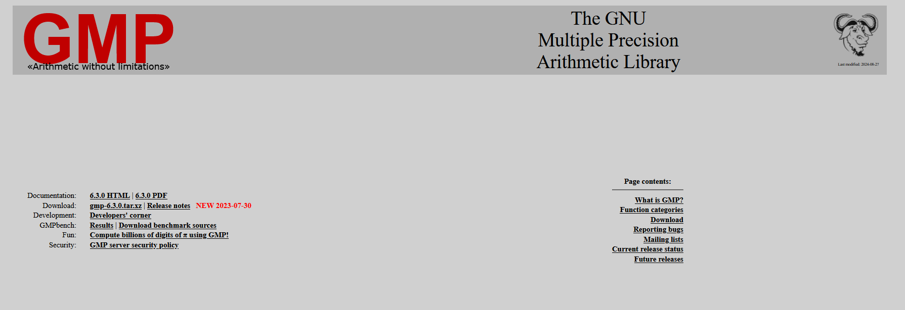
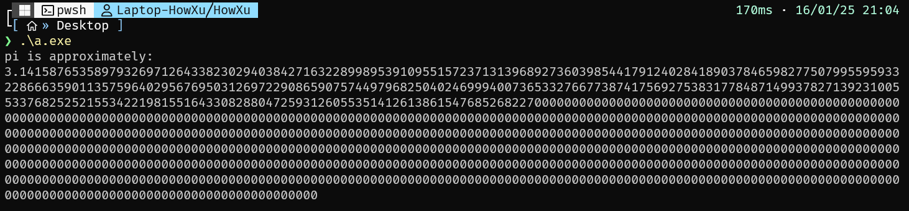

# 正文


刷b站看到一个cython的东西, 例子用的是算pi, 忽然就想起之前看李天意的高数视频也说到了一种算pi方法, 就是泰勒展开arctan函数, 取1, 交给计算机迭代. 想了一下, 代码实现应该不是很难, 我用C写了下:


```c
int main()
{
    double result = 0.0;
    int base = 1;
    //泰勒展开式求Pi 精度取决于数据类型
    for (int i = 1; i < 2000001; i++)
    {
        result += i % 2 != 0 ? (1.0 / base) : -(1.0 / base);
        base += 2;
    }
    result *= 4;
    printf("pi is %f\n", result);
    return 0;
}
```

代码很简单(甚至可以缩更少), 先不说泰勒展开求pi的性能, 精度这些东西.这个做法取得的位数就非常有限, for循环完全可以改成while, 无论进行多少循环, double的最大位数就是输出的最高精度.

这肯定不合理啊,如果要求更高的精度就只能依靠外部库了:



大名鼎鼎的牛头人GMP !

C语言自带的东西很少, 像C#, Java都自带BigDecimal对象. 不过你知道的, C写着速.

我用的是纯Windows, GMP没有Windows构建,所以要自己构建一下. 除此之外, GMP用的是autoconf那一套编译系统, 所以不可能用MingW的make一发做完, 必须要借助MSYS或者Cygwin这类拟Linux环境进行.

安装什么的就不说了, 在configure中还依靠了m4和diffutils两个库, 我用的是MSYS应该是:

```bash
pacman -S m4
pacman -S diffutils
```

我没有在MSYS力额外装编译器,所以要把MingW路径加进去:

```bash
PATH=$PATH:/c/SDK/Mingw/bin
```

Include和Lib两个变量MSYS直接继承了, 可以不用管.

然后在MSYS的终端里:

```bash
./configure
make -j核心数自己定
```

正常来说编译完成就OK了,然后在目录里找到libgmp.a和gmp.h两个文件, 这就是我们需要的全部了.

那么就可以用GMP高精度计算来造了:

```c
int main()
{
    mpf_set_default_prec(1024); // 设置 GMP 浮点数精度（以位为单位）

    mpf_t result, term, one, base;
    mpf_init(result); // 初始化结果
    mpf_init(term);   // 初始化每项的值
    mpf_init(one);    // 用于存储常量 1
    mpf_init(base);   // 当前分母

    mpf_set_ui(result, 0); // result = 0
    mpf_set_ui(one, 1);    // one = 1
    mpf_set_ui(base, 1);   // base = 1

    // 泰勒展开式计算 π，循环次数决定精度
    for (int i = 1; i <= 200000; i++)
    {
        // term = 1 / base
        mpf_div(term, one, base);

        // 判断正负号
        if (i % 2 == 0)
        {
            mpf_sub(result, result, term); // result -= term
        }
        else
        {
            mpf_add(result, result, term); // result += term
        }

        // base += 2
        mpf_add_ui(base, base, 2);
    }

    // result *= 4
    mpf_mul_ui(result, result, 4);

    // 打印结果
    gmp_printf("pi is approximately:\n%.1000Ff\n", result);

    // 清理内存
    mpf_clear(result);
    mpf_clear(term);
    mpf_clear(one);
    mpf_clear(base);

    return 0;
}
```

大体的代码没有改, 比如循环什么的应该换成别的办法, 还有关于循环次数控制这些东西, 不过呢不用太纠结.

```bash
gcc pi.c -L(libgmp.a在的文件夹位置) -lgmp
# 可以直接在Powershell里面
gcc pi.c -L. -lgmp
```



有的兄弟, 有的. 这样算pi的方法还有八种, 都是当前版本t0.5的算pi方法.