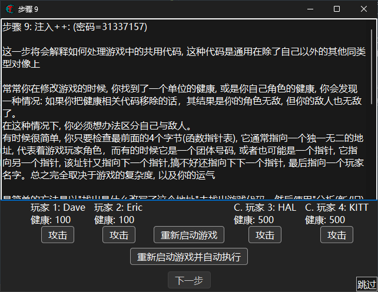
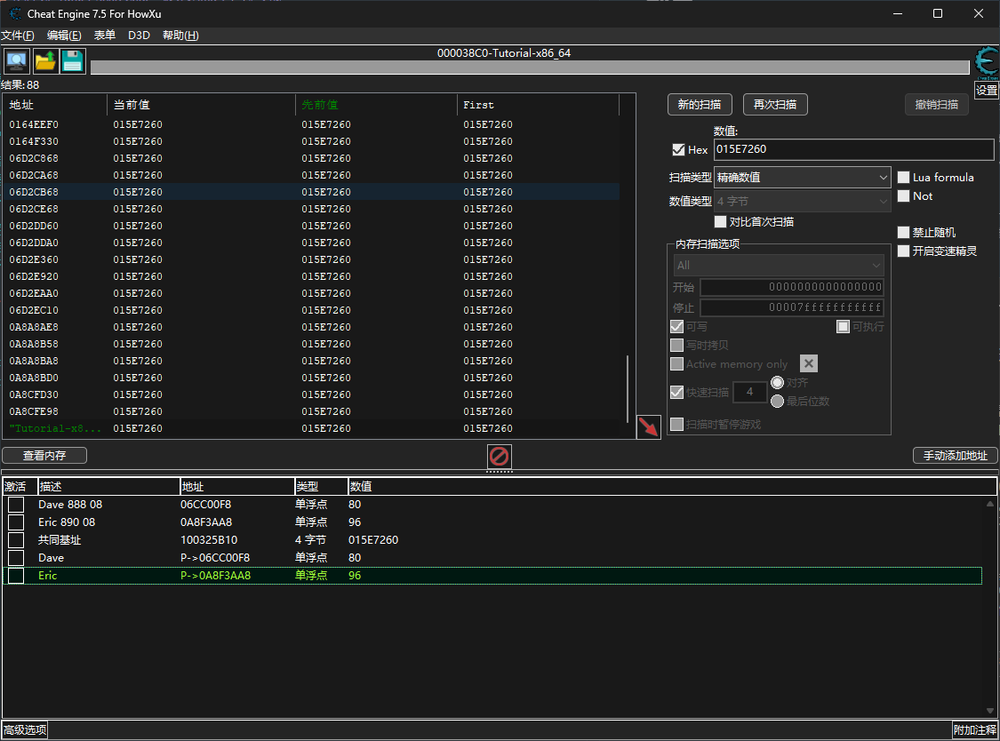
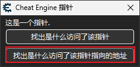
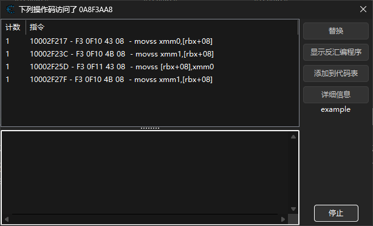
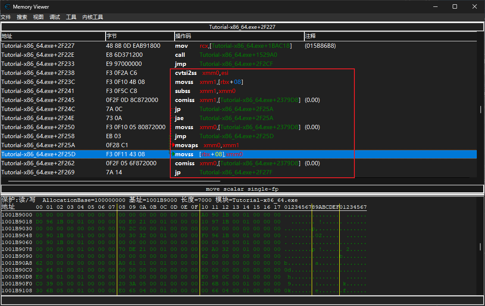
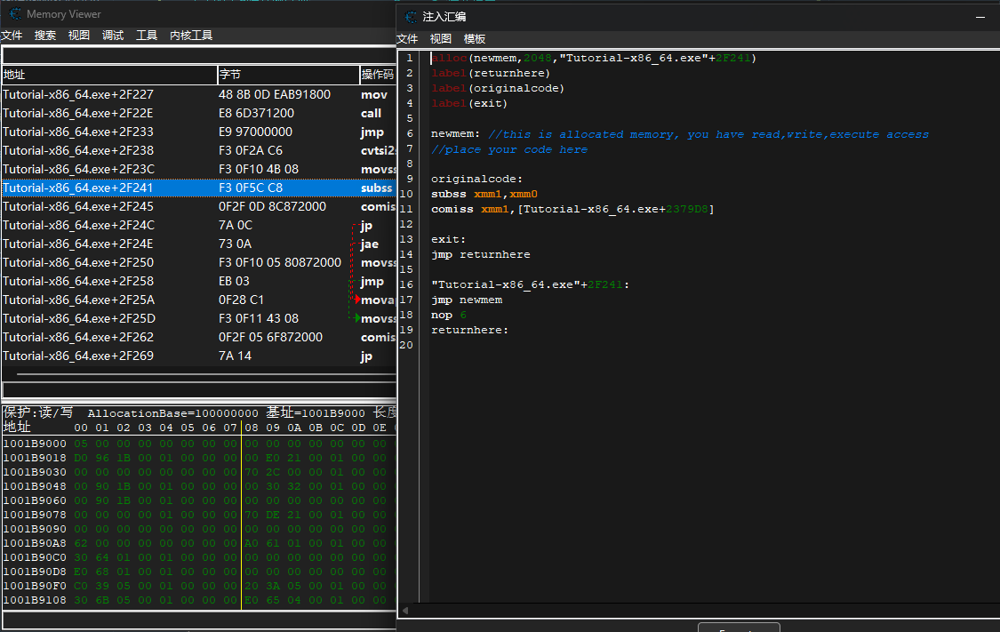
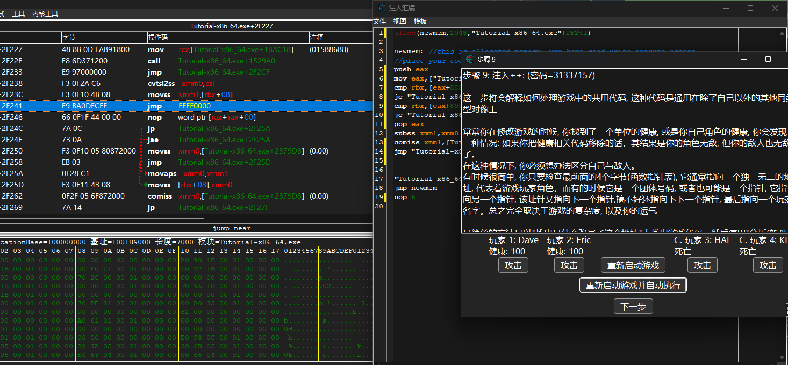

# 前言

这里我们来谈一下ShareCode的问题.

ShareCode顾名思义,指的是被共同使用的代码片段.很多时候在游戏里敌人和玩家是同一种结构体,修改是通过同样的方法,这样就会导致当我们修改函数时,效果不仅仅对字迹有效也对敌人有效,常见于锁血这个功能.

那怎么做能够让处理只对自己生效呢?很简单,加个判断,判断当前执行目标是自己还是敌人.那要怎么加判断呢?在Tutur的教程中是通过分析数据结构找到一个专门的字段表示阵营,当然这种方法适用范围非常小(因为多数时候不可能有这么简单的变量表示阵营).

更加普适的方法是分析当前操作的地址是否是代表自己的地址.上一篇CE教程是找基址的,我们在Tutur9中也可以通过寻找自己的基址,然后在伤害相关的代码前加上一段判断当前操作的地址是否与自己的地址相同,这样就可以实现锁血只对自己有效.



# 实战

找基址就不说了,我这里直接找了Dave和Eric两个人的地址,可以看到这两人是同一阵营,有相同的基址,但是Dave的血量地址是`基址+偏移888+偏移08`,Eric的血量地址是`基址+偏移890+偏移08`



接下来随便选中其中一人的血量地址,查找哪一行是确切的修改代码:





一共有四个操作,根据汇编表现直接判断就知道第三个肯定是修改相关,找到这一段的汇编内容:



很明显上个jmp之后才是真正相关的代码,接下来分析一下代码的逻辑:

`cvtsi2ss xmm0,esi`是把`esi`的值转化为浮点数存到`xmm0`中

下一行的`mov`把当前血量值复制到xmm1,然后`subss xmm1,xmm0`是当前血量减去某个值再存回`xmm1`,接着比较`xmm1`的值和0的关系

后面两个跳转`jp`和`jae`是跳转到同一个位置了,`jp`是对数字位的奇偶数量的判断(看不出来啥用),`jae`表示大于等于0时会跳转到`movaps xmm0,xmm1`这个位置.

继续向下看,如果没有发生跳转(即血量小于0),`xmm0`会被设置为0,然后跳转到`movss [rbx+08],xmm0`也就是直接把玩家血量设置为0;如果发生跳转,就会把血量相减的结果放到`xmm0`再转移到玩家血量地址.

再往后又是判断玩家血量和0的大小关系,显然到这里是判断是否死亡了.

到这里扣血的逻辑已经很明显了,下一步就是喜闻乐见的`Hook`环节n_n,我们直接hook血量相减的部分,也就是`subss xmm1,xmm0`这里,`Ctrl+a`开启注入汇编功能,然后选择模板代码注入:



它这个模板没什么用只是少写两行,下面是简单的一个Hook:

```asm
alloc(newmem,2048,"Tutorial-x86_64.exe"+2F241) //CE自带的宏,分配内存并自动设置钩子

newmem:
//movss只用到了rbx+08,rbx显然是来自基址+偏移888,因为不是简单加法而且存在解引用
//因为涉及到计算偏移,这里需要用一下`eax`寄存器
push eax //保存当前eax值
mov eax,["Tutorial-x86_64.exe"+325B10] //获得基址指向的值,第一层解引用
cmp rbx,[eax+888] //解引用后偏移888再获取指向值,和rbx比较是否为Dave
je "Tutorial-x86_64.exe"+2F25A //是Dave直接跳过减法部分血量返还
cmp rbx,[eax+890] 
je "Tutorial-x86_64.exe"+2F25A //相同的对Eric的处理
pop eax //把eax还原
subss xmm1,xmm0 //接下来的操作只对敌人有效
comiss xmm1,[Tutorial-x86_64.exe+2379D8]
//因为不知道上面的两串是不是有别的条件作用,所以先保留
jmp "Tutorial-x86_64.exe"+2F250 //直接跳转到把xmm0设置为0的部分,在这之后会跳转到血量设置为0,实现一击必杀

"Tutorial-x86_64.exe"+2F241:
jmp newmem
nop 6

```

没有注释:

```asm
alloc(newmem,2048,"Tutorial-x86_64.exe"+2F241)

newmem:
push eax
mov eax,["Tutorial-x86_64.exe"+325B10]
cmp rbx,[eax+888]
je "Tutorial-x86_64.exe"+2F25A
cmp rbx,[eax+890]
je "Tutorial-x86_64.exe"+2F25A
pop eax
subss xmm1,xmm0
comiss xmm1,[Tutorial-x86_64.exe+2379D8]
jmp "Tutorial-x86_64.exe"+2F250


"Tutorial-x86_64.exe"+2F241:
jmp newmem
nop 6
```

题外话,这里的0.0这个值是直接从已有的数据,即`Tutorial-x86_64.exe+2379D8`地址拿的.如果要获得一个0.0浮点数,一种方法是初始化:

```asm
alloc(float_zero, 4)
float_zero:
dd (float)0.0
```

你也可以分配大块内存然后使用label写法:

```asm
alloc(block,128)
label(zero)
block:
zero:
dd (float)0.0
```

还有一种办法是直接使用`xor`语法:

```asm
push eax
xor eax,eax
//接下来eax里的值就是0了,在这里使用它,在jmp前pop它
pop eax
```

注意,这里用的是浮点数,`eax`应该换成`xmm0`或者`xmm1`这样的浮点数寄存器.

说回来,现在直接注入,回到Tutur9重启游戏,可以看到效果:



(不是谁家好人还给Eric整个无敌的)
