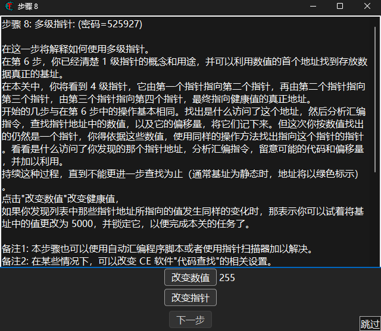

# 引文

这是一篇简单的记录通过CE修改器寻找程序运行中数据基址的博客,我会逐步分析每个步骤的含义和大部分的汇编代码.

CheatEngine除了是一款优秀的游戏作弊工具以外,同样是很好用的一款逆向工具.

在继续之前，我应该假设你知道指针,地址等概念,并且掌握一定的汇编语言.

很多时候程序修改一个值并不是直接通过对变量的赋值进行的,其中可能涉及多个结构体之间的访问和比较,比如玩家Player这个结构里面包含了血量信息HealthInfo这个结构,HealthInfo结构体才真正有着Health这个变量.

正因为有多个结构体,指针之间会存在多层的相指关系,并且由于结构体中存在其他变量,数组操作和malloc/free等等函数的使用,函数会需要使用访问指针的值和偏移来访问下一个指针.

但是程序初始化时声明变量,初始化等等操作是一个相当固定的情况,也就是说正常情况下,程序创建变量时地址是从一个位置开始固定排列的,每个结构体里的变量追根到底总有一个稳定的指针记录最外层结构体的位置(这个变量在程序运行中地址是相对稳定的,大致为程序根地址+固定偏移的格式).这个地址称为基址.

附上两张图,来源[52pojie](https://www.52pojie.cn/thread-1131081-1-1.html)

# 练习:寻找CE Tutur步骤8的基址

打开CE自带的教程软件,跳过到步骤八找基址部分:

现在把CE附加到Tutur的进程上,搜索数值,多次筛选即可:

很明显就是这个了,现在把它添加到记录中,右键选择`找出是什么访问了这个地址`,开启附加调试:

可以看到有两个操作访问了这个地址,注意到这个变量的地址是01562E8,我们来看一下汇编里是怎么写的:

第一条指令是将寄存器`eax`的值移动到`01562E8`中,`01562E8`表现为`rsi`的值偏移18位.显然,这条指令做到了修改值.

第二条指令是将`01562E8`的值复制到ecx中,对`01562E8`地址所在值的复制实际上也反应了这个值的访问是通过`rsi`的值偏移18位作为地址进行的.

我们都知道指针本身有一个地址,指针的内容又是另一个地址,通过指针+十六进制数可以直接获得另一个地址,这里`rsi`+18实际上是直接获得了一个地址进行使用,我们需要找到哪个指针的内容是`rsi`内的值,因为寄存器的值不可能是恒定的,一定有个指针记录了`rsi`的值并且一直保持不变,这样才能做到进行某个操作就可以访问到`01562E8`这个地址.

rsi的值是`01562AD0`,搜索这个值(记得勾选HEX选项),搜出来只有一个值:

继续追踪什么访问了这个地址:

可以看到有两个操作都访问了这个地址,一个一个看:

第一条`cmp`比较指令,不是对值的直接修改,但是这个操作是确确实实可以访问到值`01562E8`的,根据我上面说的思路,我们只关心**通过什么方式我们最终可以访问到`01562E8`这个值**,`rsi`中的值为`076B68D0`,正好是`01562AD0`这个值的指针.那么逻辑就是:

通过访问`076B68D0`是可以得到`01562AD0`这个值,通过操作`01562AD0`运算可以获得`01562E8`地址来修改值.

第二条是一个`mov`指令,取`01562AD0`地址处的值到`rax`中,再将`01562AD0+04`地址所在的值移动到`edx`中.

上面提到`01562AD0`这个值是用来`+18`进行值访问的,上述操作并没有涉及如何得到`01562AD0`这个值,仅仅是`01562AD0`地址所在值的访问(甚至可以说和找数据没有关系).其原因是这时的`rax`值是`076B68D0`,CE判定有对这个地址的访问.仅仅是作为左对象是不可能找到下一级指针的.

继续追踪`076B68D0`,需要指出的是这里没有进行偏移运算而是直接访问,但是在最终添加指针偏移时不能省略这一步的解引用操作.

这次的访问逻辑和上面一样,但是这次访问有18的偏移.

总的逻辑现在变成:访问`076D79F0+18`得到`076B68D0`,访问`076B68D0`得到`01562AD0`,计算`01562AD0+18`获得`01562AE8`地址对值进行修改.

再寻找`076D79F0`:

一样,这次的偏移是10,寻找`076D6F10`:

出现了绿色的地址,这个就是我们要找的基址了.基址的地址表示为`"Tutorial-x86_64.exe"+325B00`.

现在手动添加指针,把上述四次解引用和偏移加上去:

可以看到值直接对应当前的应用,说明这个基址是正确的.

# 实战: 植物大战僵尸

(你别问)

现在挂载CE,进入关卡,找到阳光的地址(一步就找到了我能说什么):

依旧是查看什么访问了这个地址,等待数据更新:

(这个访问量很大不知道为什么)

一个是add一个是mov,但是很明显,此时`edx`和`esi`的值都是一样的,`23D44238`偏移`5560`.

查找`23D44238`:

这里筛出来很多值都是这个,我们继续更新数据,期待找到值不变的代表指针的地址:

原本有40个地址,接下来自己进行逆向分析,通过观察地址运算等等,寻找固定值,去掉没有访问的地址:

十条记录是相关的,接下来分析汇编,和分析上面的`cmp`一样，仅仅是访问该处的值或者作为mov的左对象都是无关的记录.

最终这条记录是相关的,是通过`027EA108`偏移0768来得到`23D44238`并进行值访问,接下来找`027EA108`:

有1000+记录,但是其中已经出现了四个基址,接下来测试4个基址是否正确:

简单试了一下,四个基址都是有效的.接下来关掉游戏再打开,看看是否确实是正确的基址:

不必多言
