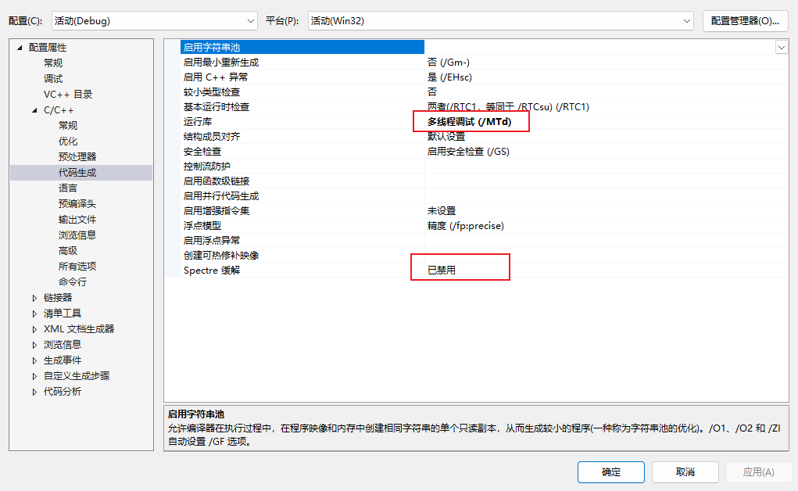
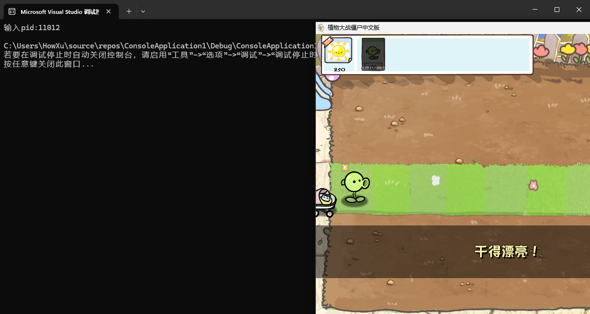

# 前言

上一篇文章里我们做了两种比较广泛的注入,但是我们的DLL注入部分是直接依赖CE的,为了保证纯度今天来做一个DLL注入器.

DLL注入的方法也很多很多,最最基础的劫持注入(只狼的Mod引擎就是劫持了F社魂游的`dinput8.dll`来实现修改游戏加载内容的),这个办法可以说是属于比较lowB的了.

再普适一点就是这里讲到的远程线程注入,这个办法很简单因此早就被反作弊和杀毒软件重点监控了.

再高级一点的就是反射注入,将DLL加载到注入器内存然后通过修改待注入进程的PE表(类似映射).

反正种类是特别特别多的,你可以看看[Windows十种注入方式](https://kkem.me/blog/10-windows%E5%8D%81%E7%A7%8D%E6%B3%A8%E5%85%A5%E6%96%B9%E5%BC%8F/)

# 实战

要做一个简单的DLL注入器其实特别简单,原理就是利用WindowsAPI提供的`CreateRemoteThread`函数创建一个目标进程的子线程,然后在子线程里调用`LoadLibrary`这个WindowsAPI提供的函数动态加载我们想要注入的DLL.

就是三步:

1. 在目标进程开一块内存存放DLL文件路径的字符串
2. 调用`CreateRemoteThread`并且运行`LoadLibrary`
3. 清理内存和线程

最最简单的实现代码:

```c
int main() {
    //这一步你也可以使用FindWindow或者通过遍历进程快照的方式获取句柄
	unsigned pid = 10384;
	HANDLE game = OpenProcess(PROCESS_ALL_ACCESS, FALSE, pid);
    //路径地址,你可以用一些特别的方法进行构造 注意这里必须是绝对路径
    const WCHAR *path = L"C:\\Dll1.dll"
    //内存分配和写入
    LPVOID lpaddr = VirtualAllocEx(game, NULL, 0x128, MEM_COMMIT | MEM_RESERVE, PAGE_READWRITE);
	SIZE_T write = 0;
	WriteProcessMemory(game, lpaddr, path, (wcslen(path) + 1) * 2, &write);
    //创建远程线程并自动调用`LoadLibrary`
	HANDLE hThread = CreateRemoteThread(game, NULL, NULL, (LPTHREAD_START_ROUTINE)LoadLibrary, lpaddr, NULL, NULL);
    //等待线程执行返回
    WaitForSingleObject(hThread, -1);
    //清理内存,关闭句柄
	VirtualFreeEx(game, lpaddr, 0, MEM_RELEASE);
	CloseHandle(hThread);
    CloseHandle(game);
	return 0;
}
```

需要注意一下这里传入的DLL地址类型`WCHAR`,是用来配合`wcslen`计算长度的,你也可以直接用普通的`CHAR`或者`DWORD`类型,但是这里长度要用别的方法计算或者直接传值.

可以看到这里调用`LoadLibrary`函数的地址是直接取得注入器进程的地址,因为`kernel32.dll`加载时的地址在各个进程都是相同的,你也可以使用`HMOUDLE`的方法找目标进程的``地址:

```c
HMODULE hKernel32 = GetModuleHandle("kernel32.dll");
FARPROC pLoadLibrary = GetProcAddress(hKernel32, "LoadLibrary");
HANDLE hThread = CreateRemoteThread(game, NULL, NULL, (LPTHREAD_START_ROUTINE)pLoadLibrary, lpaddr, NULL, NULL);
```

以上代码只有在VS里编译才能正常工作,而且产生的文件在第一时间被火绒删掉了(T_T).



这里还是要注意一下架构问题,如果你想注入64位程序,注入器也应该使用64位模式构建.

使用VS2017工作集或者VS2015工作集.如果某些特定程序可能不允许多线程调试,请使用`多线程(/MT)`进行构建.

如果你发现注入时某些运行库不能满足,请在生成时选择发布模式`Release`,这样可以对减少某些调试库的依赖.

现在,使用自己写的注入器配合自己写的软件断点hook的DLL,纯度直接就上来了.

