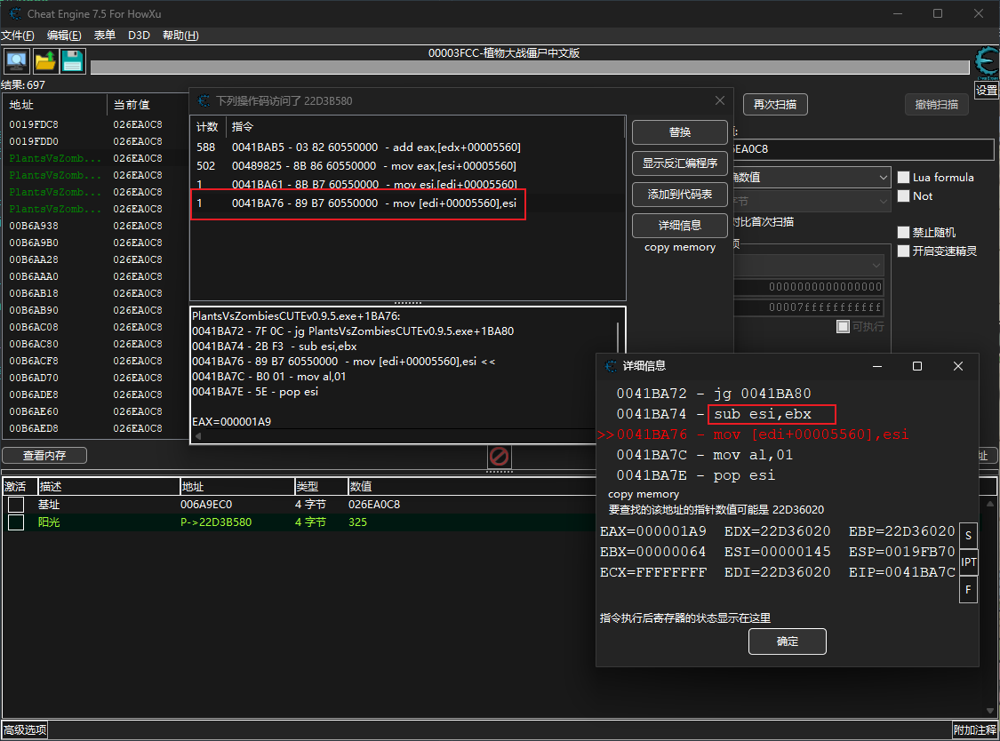
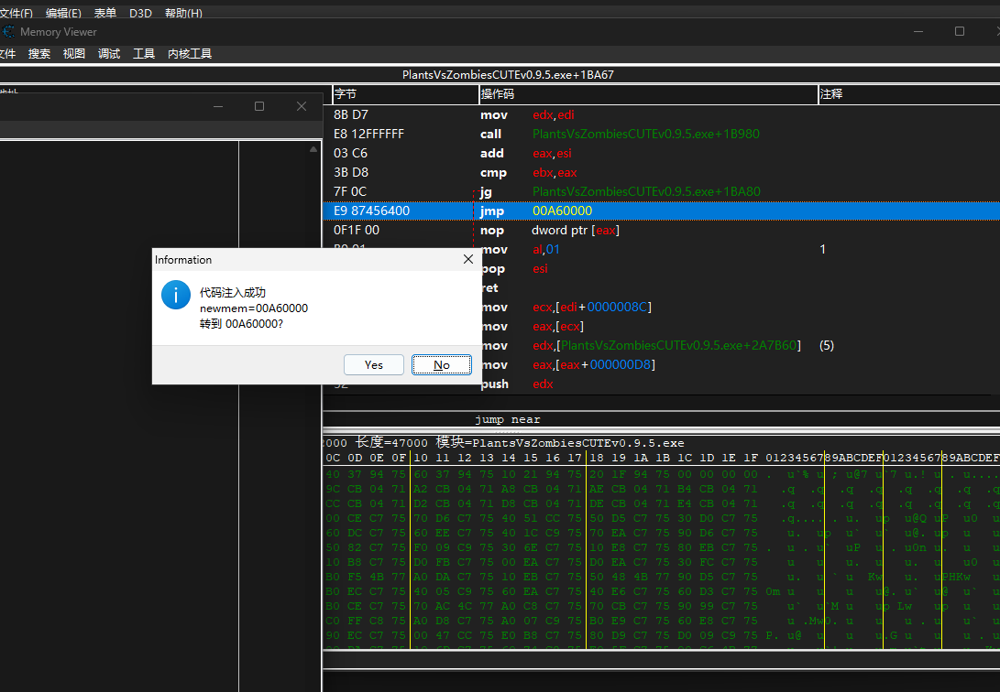
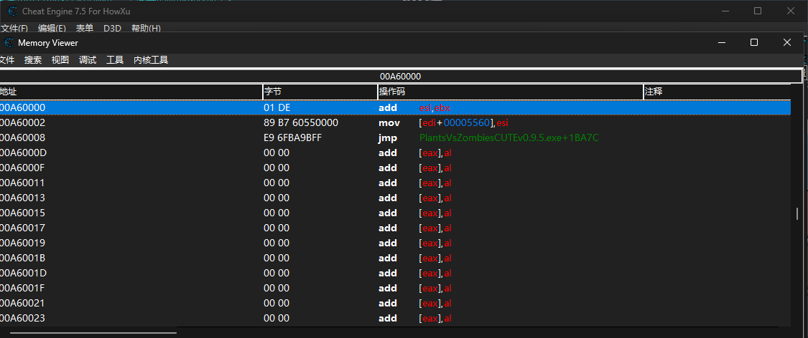
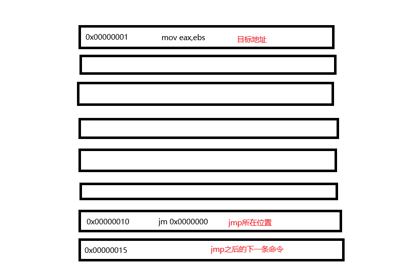
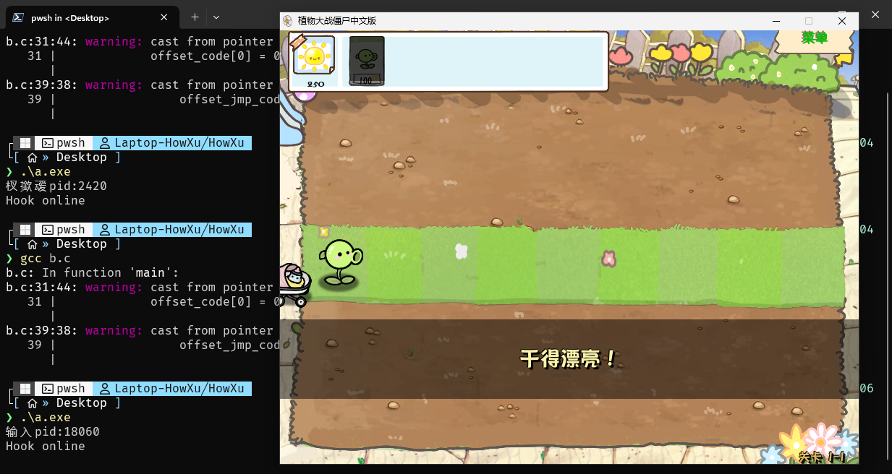

# 前言

上一篇文章是有关ShareCode的处理的,里面涉及到了把关键代码劫持到另一个位置进行自己的处理然后再返回的行为,也就是Hook. 当然上一篇文章的Hook非常简陋非常LowB,而且是依赖CE才能进行的,你也不希望每次开游戏都要先找地址再手写一段汇编吧.

所以这篇文章里我们会用最简单的内存读写的方式手写一个Hook.把Hook的二进制代码封装成一个应用程序,每次只需要启动该程序就可以自动完成代码劫持的功能,没错这就是一个简单的游戏修改器了.

# 实战

## CE部分

我们还是用老朋友PVZ做实验,目标不是很高,我们希望把种植植物阳光减少修改为种植植物阳光增加(当然你也可以修改为种植不减少,但是那个只需要nop就行了).


还是先用CE找到阳光的基址,然后设置指针,调查访问地址情况找到反汇编部分,这个上两篇已经有过程了,这里直接展示结果:



明显下面的指令是含有一个减法的,就是阳光值减少的逻辑了:


## 程序实现

首先我们要手写一段汇编代码保证我们的修改逻辑是正确的,直接在`sub`处注入汇编,如下即可:

```asm
alloc(newmem,2048)

newmem:
add esi,ebx //只是把sub改成add
mov [edi+00005560],esi
jmp "PlantsVsZombiesCUTEv0.9.5.exe"+1BA7C

"PlantsVsZombiesCUTEv0.9.5.exe"+1BA74:
jmp newmem
nop 3
```

注入之后可以直接跳转到CE为我们开辟的新内存区域查看代码的字节码:





接下来就是写C程序的部分了.可以看到CE代替我们做了内存偏移计算,内存空间开辟和汇编翻译为字节码的工作,接下来只需要在程序中手动实现这些部分就行了.

```c
#include <windows.h>
#include <stdio.h>
#include <stdlib.h>

char code[] = {
    0x01, 0xDE,                         // add
    0x89, 0xB7, 0x60, 0x55, 0x00, 0x00, // mov
    0xE9, 0x00, 0x00, 0x00, 0x00        // jmp 后面的地址要手动算
};

char jmp_code[] = {
    0xE9, 0x00, 0x00, 0x00, 0x00,0x90,0x90,0x90
}; // 一串单独的jmp指令

int main()
{
    printf("输入pid:");
    unsigned pid = 0;
    scanf("%d", &pid);
    //打开游戏进程
    HANDLE game = OpenProcess(PROCESS_ALL_ACCESS, FALSE, pid);
    if (game)
    {
        //内存分配
        LPVOID code_mem = VirtualAllocEx(game, NULL, 1024, MEM_COMMIT, PAGE_EXECUTE_READWRITE);
        if (code_mem)
        {
            //为了把正确的jmp偏移加到code里
            unsigned *offset_code = (LPVOID)code + sizeof(code) - 0x4;
            //计算偏移并赋值
            offset_code[0] = 0x0041BA7C - ((unsigned)code_mem + sizeof(code));
            //写内存
            BOOL write_mem = WriteProcessMemory(game, code_mem, code, sizeof(code), NULL);
            if (write_mem)
            {
                //为了把正确的jmp偏移加到jmp_code里
                unsigned *offset_jmp_code = (LPVOID)jmp_code + sizeof(jmp_code) - 0x7;
                //计算偏移并赋值
                offset_jmp_code[0] = (unsigned)code_mem - 0x0041BA74 - 0x5;
                //写内存
                BOOL write_mem = WriteProcessMemory(game, (LPVOID)0x0041BA74, jmp_code, sizeof(jmp_code), NULL);
                if (write_mem)
                {
                    printf("Hook online\n");
                    while(1); //程序不退出
                }
                else
                {
                    printf("写不了内存你不炸了吗?\n");
                    return -1;
                }
            }
            else
            {
                printf("写不了内存你不炸了吗?\n");
                return -1;
            }
        }
        else
        {
            printf("分配不了内存你不就炸了吗?\n");
            return -1;
        }
    }
    else
    {
        printf("打不开句柄你不炸了吗?\n");
        return -1;
    }
    return 0;
}
```

除掉下面的异常处理部分,解释一下代码的大部分函数调用和变量.

两个`char`数组的初始化,很明显两个char数组里装的就是汇编对应的字节码,一个是从`sub`跳转后的汇编代码,一个是从原本`sub`跳转过去的代码.

选择`char`这个类型完全是因为C语言中这个类型的大小刚好是1字节且没有负值,刚好可以放入一个字节码(机器码是按照1字节进行翻译的).获取汇编转字节码方式很多,你既可以直接手写,也可以直接从CE那里注入之后复制过来用.

这里需要注意`jmp_code`的后面填充了很多`0x90`,也就是`nop`,因为这里直接转移了`sub`和`mov`两条指令一共有8字节,但是`jmp`只需要五个字节,剩下的三个字节最好进行填充.

```c
HANDLE game = OpenProcess(PROCESS_ALL_ACCESS, FALSE, pid);
```

WindowsAPI提供的一个函数,返回进程的句柄,`ALL_ACESS`权限让我们能够直接操纵进程的内存.

```c
LPVOID code_mem = VirtualAllocEx(game, NULL, 1024, MEM_COMMIT, PAGE_EXECUTE_READWRITE);
```

在`game`句柄代表的程序开辟一块1024字节大小的内存,要求该页内存可读可写可执行.

```c
unsigned *offset_code = (LPVOID)code + sizeof(code) - 0x4;
```

这里比较难理解,首先`code`是个数组,`LPVOID`是typedef的`void *`类型,这里转换之后可以获得`code`的指针,加上`code`的整个字节大小就可以来到`code`的最后一个字节所在位置,`-0x4`就可以来到`jmp`,也就是`0xE9`的后面一个位置.

同时声明为四字节大小的`unsigned`,我们就可以利用C语言指针的特点,对offset[0]赋值,把一个八位地址填充到`0xE9`的后面.

```c
offset_code[0] = 0x0041BA7C - ((unsigned)code_mem + sizeof(code));
```
这个更难理解,首先要知道在机器码层面,`jmp`跳转接的对象是**下一条指令的地址相对目标地址的偏移**.如下:



先阐明三个关键,第一,`VirtualAllocEx`分配的地址在上层,地址比应用程序代码在的地址要大;第二,因为`jmp`指令本身有五个字节长度,所以最后会减去`0x5`;第三,jmp的操作对象是一个**有符号的数**,从高向低跳是一个负数,从低向高是正数(然而实际上CPU根本不分正负,这只是人的理解).

`0x0041BA7C`是要跳转回去的地址,`(unsigned)code_mem`获得分配内存区域的第一个字节码的地址,加上size实际上已经超过了code的大小,来自code最后一个字节的下一个字节位置,即下一条指令的地址,二者相减就可以得到所要的偏移量了.需要注意的是这其实是一种做完运算后的形式,原来的形式应该是:

```c
offset_code[0] = 0x0041BA7C - ((unsigned)code_mem + sizeof(code) - 0x5 + 0x5);
//或者是:
offset_code[0] = 0x0041BA7C - ((unsigned)code_mem + sizeof(code) - 0x5) - 0x5;
```

先`-0x5`来到`jmp`的位置,再`+0x5`来到下一条指令的位置然后再做运算.

```c
BOOL write_mem = WriteProcessMemory(game, code_mem, code, sizeof(code), NULL);
```

这一行是写入内存,写入进程为`game`,写入位置为`code_mem`指向的地址,写入内容为`code`整个数组,写入大小为size.

```c
unsigned *offset_jmp_code = (LPVOID)jmp_code + sizeof(jmp_code) - 0x7;
offset_jmp_code[0] = (unsigned)code_mem - 0x0041BA74 - 0x5;
BOOL write_mem = WriteProcessMemory(game, (LPVOID)0x0041BA74, jmp_code, sizeof(jmp_code), NULL);
```

这几行就是一样的了,修改`jmp_code`数组内容赋予正确的跳转地址.这里的偏移计算也是一样的,其原本格式为:

```c
offset_jmp_code[0] = (unsigned)code_mem - (0x0041BA74 + 0x5);
```

目标地址`code_mem`减去`0x0041BA74`当前位置(这个位置会被替换成5个字节的jmp指令),加上5来到下一条指令的位置.

其实可以总结一个公式(任意情况都可以用):

<font color=red size=6px>偏移=目标地址-(jmp所在地址+5)</font>

最后就是一些异常处理了.

## 看看效果:



# 题外话

虽然效果实现了,但其实这是最最lowB的一种hook方法,理论上我们应该还要做一下字节码保存机制让字节码可以恢复回去.而且这种hook直接修改内存,非常容易被CRC32这类计算内存区域的摘要算法手段检测出来(当然你再hook一下CRC32检测的DLL就又能跑了).

更好的hook方法有很多(甚至可以达到无痕hook),一种是依赖Windows下的异常处理机制,比如软件断点类型的hook,其将原有部分设置为`int 3`强制中断跳转到异常处理函数;硬件断点直接设置`dr0-dr3`调试寄存器强制开启异常处理(这种方法甚至不会修改原有地址的代码).

还有一种用的比较多的vt-ept hook,操作EPT，把要HOOK的函数的对应的页面的pte属性改成只能读写,不能执行,把函数页面复制一份,在复制出来的页面做HOOK,页面属性为只能执行,同样可以做到不修改原有代码而实现hook.

再就是还可以使用DLL注入技术,DLL注入也有很多种,比较基础的劫持注入(只狼的Mod引擎就是劫持了F社魂游的`dinput8.dll`来实现修改游戏加载内容的),高级一点的反射注入,直接将DLL内容加载到内存然后通过远程线程注入.五花八门非常地多.但是DLL注入更多是直接操作一整个函数,而且需要大量时间来逆向整个游戏.