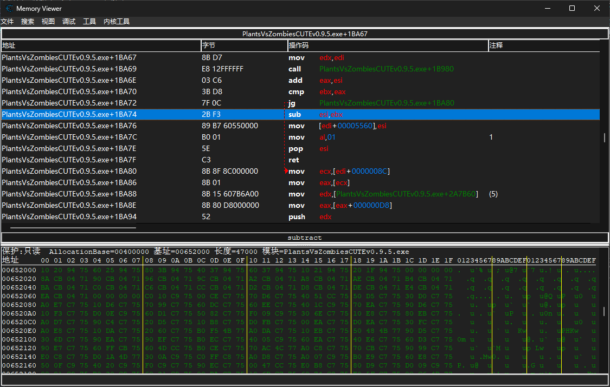
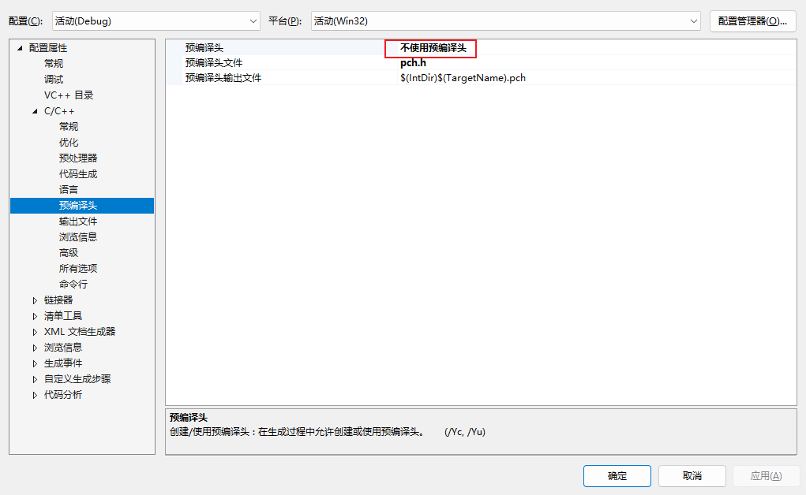
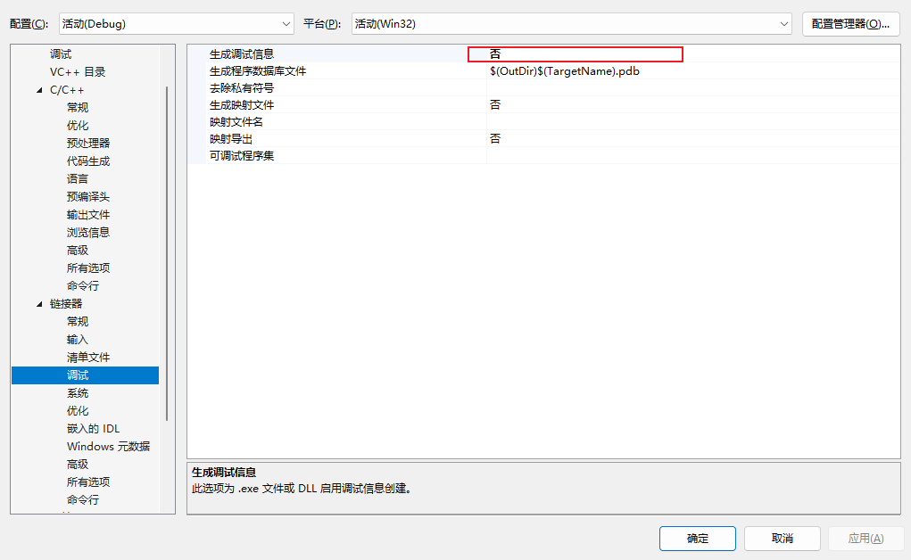
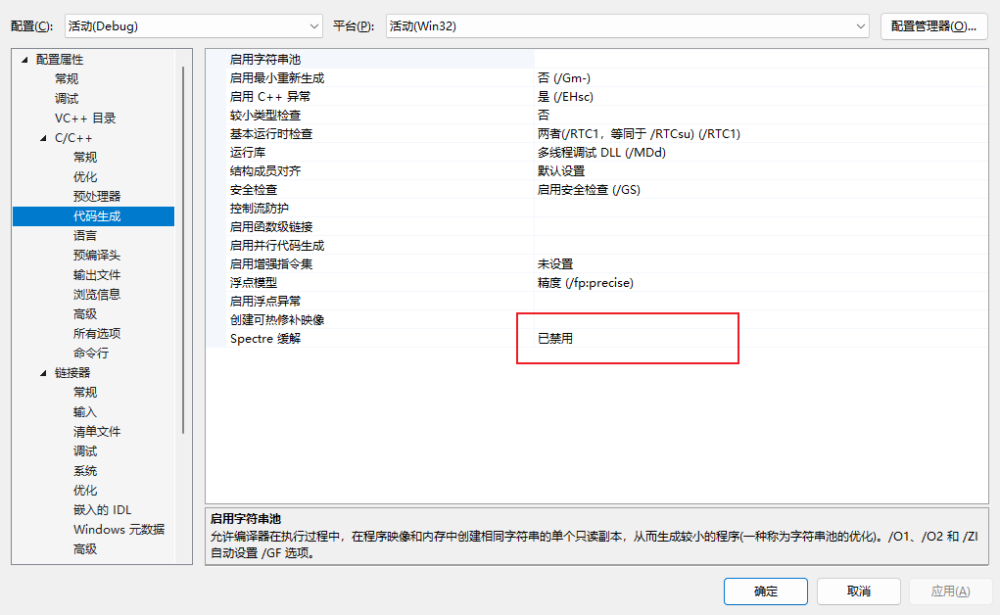
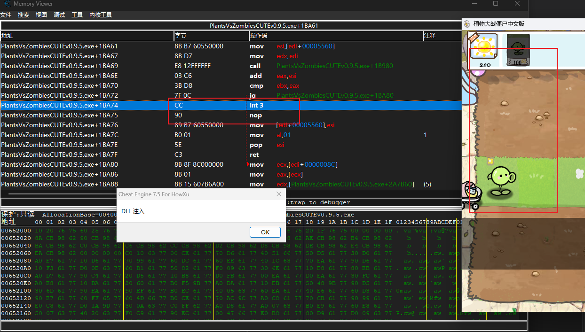
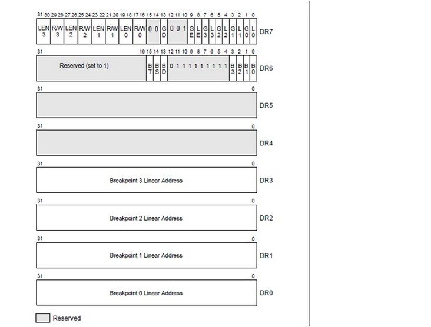
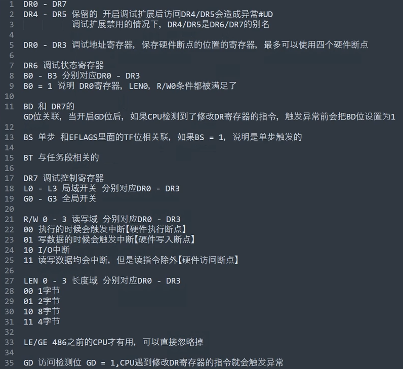
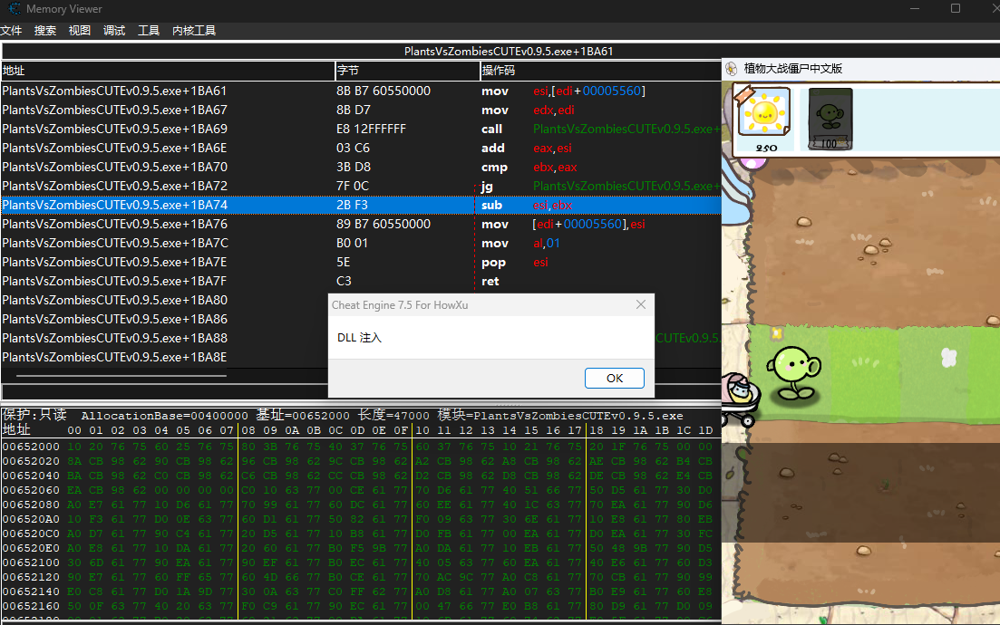

# 前言

上篇文章讲的是一种最简单的hook,这种hook容易被发现而且相当繁琐,需要计算地址,翻译汇编字节码等等,明显不是普适性的方法.

题外话里提到了Windows下依赖veh异常处理机制的两种hook方式,软件断点hook和硬件断点hook,这两种hook方式需要使用DLL注入技术(不然的话异常处理的函数是不能被正常调用的).二者也各有优缺点,依赖的底层原理也不相同,在这篇文章里会稍微谈谈.

在继续之前，我应该假设你有稍微的操作系统底层知识.

这篇文章依旧以更改种植植物减少阳光的代码片段:



# 软件断点Hook

## 原理

这种hook方式是依赖`int 3`这个汇编指令进行的,`int 3`是一个断点标志,程序运行到`int 3`的位置后就会发生异常,操作系统会按照异常处理表寻找异常处理函数进行处理,在异常处理完之后再返回.这不就是hook的过程吗?o.O

这里实际用到的原理是veh处理(向量异常处理,Vectored Exception Handling).这是 Windows 提供的一种异常处理机制,允许应用程序注册一个全局的异常处理程序,在异常发生时优先处理.

从这个角度讲,我们要做的就是想办法给程序里插进去一段异常处理函数,把原来要执行的代码设置成`int 3`(字节码为`0xCC`),注册异常处理函数.换句话说,软件断点Hook是上一篇Hook的高级版本.

## 实战

这里的动态链接库DLL文件只能用VS编译,不能使用Mingw(否则会出现函数找不到的情况),此外你需要做一些简单的设定,VS自带有制作动态链接库的功能:







实现代码如下:

```c
#include <windows.h>
#include <stdio.h>

#define address 0x0041BA74 //要注入的代码地址

struct {
	ULONG_PTR info_address;
	UCHAR byte1;
	UCHAR byte2;
} HookInfo;

LONG hook_code(struct _EXCEPTION_POINTERS *ExceptionInfo) {
	//异常值相同且异常地址相同
	if (ExceptionInfo->ExceptionRecord->ExceptionCode == EXCEPTION_BREAKPOINT && (ULONG_PTR)ExceptionInfo->ExceptionRecord->ExceptionAddress == HookInfo.info_address)
	{
		ExceptionInfo->ContextRecord->Esi += ExceptionInfo->ContextRecord->Ebx;
		//然后跳过异常部分
		ExceptionInfo->ContextRecord->Eip += 2;
		return EXCEPTION_CONTINUE_EXECUTION;
	}
	//如果不是就找别的异常处理
	return EXCEPTION_CONTINUE_SEARCH;
}

void register_hook(ULONG_PTR addr) {
	DWORD privilege = 0;
	VirtualProtect((LPVOID)addr, 1, PAGE_EXECUTE_READWRITE, &privilege);//修改权限并把旧的权限保存
	//保存信息
	HookInfo.info_address = addr;
	HookInfo.byte1 = *((UCHAR*)addr); //取指针再解引用
	HookInfo.byte2 = *((UCHAR*)addr+0x1); //取指针再解引用
	*(UCHAR*)addr = 0xCC;//改成int 3
	*((UCHAR*)addr+0x1) = 0x90;//改成nop
	VirtualProtect((LPVOID)addr, 1, privilege, &privilege);//权限还原
}

BOOL APIENTRY DllMain(HMODULE hModule,DWORD  ul_reason_for_call,LPVOID lpReserved)
{
    switch (ul_reason_for_call){
    case DLL_PROCESS_ATTACH:
		AddVectoredExceptionHandler(1, (PVECTORED_EXCEPTION_HANDLER)hook_code);
		register_hook(address);
		break;
    case DLL_PROCESS_DETACH:
		//去掉注入时做什么
		break;
    }
    return TRUE;
}
```

注意这里我们只修改`sub`一行就可以了,下面那个完全可以留着.

首先我们定义了一个结构体用来存储Hook的相关信息,因为`sub`所在部分有两个字节码,而`int 3`只有一个字节码,所以我们需要两个`UCHAR`(无符号char)来保存原来的两个字节码,并保存修改处的地址.明显这个地址是静态的.

跳过`register_hook`和`hook_code`,先看`DllMain`.在Windows平台,绝大多数DLL文件在被注入时会默认调用`DllMain`作为入口.

`ul_reason_for_call`是被调用的判定码,其中`DLL_PROCESS_ATTACH`指的是**当DLL被注入到进程中时**,在这个选项下我们使用`AddVectoredExceptionHandler`向程序添加一个异常处理函数,第一个参数不为1,这个函数会被优先使用.`hook_code`就是异常处理的函数,或者说是我们插入的函数.

```c
void register_hook(ULONG_PTR addr) {
	DWORD privilege = 0;
	VirtualProtect((LPVOID)addr, 1, PAGE_EXECUTE_READWRITE, &privilege);
	HookInfo.info_address = addr;
	HookInfo.byte1 = *((UCHAR*)addr);
	HookInfo.byte2 = *((UCHAR*)addr+0x1);
	*(UCHAR*)addr = 0xCC;
	*((UCHAR*)addr+0x1) = 0x90;
	VirtualProtect((LPVOID)addr, 1, privilege, &privilege);
}
```

这里`register_hook`的功能在把`sub`所在的两个字节码修改成`int 3`和`nop`,首先这个DLL已经被注入到进程中了,我们不再需要使用句柄和WriteMemory的方法.

首先需要修改目标地址的内存页的权限,最后一个参数可以保留修改前的权限.之后把原来的字节码保存起来,再直接通过强制指针转换改写目标地址的字节码,最后还原权限.

```c
LONG hook_code(struct _EXCEPTION_POINTERS *ExceptionInfo) {
	//异常值相同且异常地址相同
	if (ExceptionInfo->ExceptionRecord->ExceptionCode == EXCEPTION_BREAKPOINT && (ULONG_PTR)ExceptionInfo->ExceptionRecord->ExceptionAddress == HookInfo.info_address)
	{
		ExceptionInfo->ContextRecord->Esi += ExceptionInfo->ContextRecord->Ebx;
		//然后跳过异常部分
		ExceptionInfo->ContextRecord->Eip += 2;
		return EXCEPTION_CONTINUE_EXECUTION;
	}
	//如果不是就找别的异常处理
	return EXCEPTION_CONTINUE_SEARCH;
}
```

这里就是跳转之后的代码了,首先需要判断记录中的跳转码是不是`3`,再判断是不是`sub`所在地址的中断,不是则返回`EXCEPTION_CONTINUE_SEARCH`表示继续寻找别的中断程序.

这里需要声明一个易错点,中断处理时只有处理`ExceptionInfo->ContextRecord`保存的上下文才有用,直接内嵌汇编操作`esi`和`ebx`是无效的,你应该知道中断处理之后上下文会被返回.

`ExceptionInfo->ContextRecord->Eip += 2`,修改`eip`的值为发生中断的地址下两位,也就是`nop`之后第一个执行的`mov`.`eip`寄存器存的就是下一条要执行的指令,发生中断之后`eip`的值为发生中断的地址,如果不偏移到下一个地址将会无限中断.

最后返回`EXCEPTION_CONTINUE_EXECUTION`表示程序继续执行.

编译它为一个dll文件,使用CE自带的注入DLL功能(你也可以使用别的注入器)注入,看看效果:



可以看到原本的`sub`已经换成了`int 3`,并且修改完全有效.

软件中断注入明显不再需要使用汇编代码,而且对程序修改更小,甚至可以把原来修改的地方还原回去.


# 硬件断点Hook

## 原理

和软件中断不同,硬件中断直接依靠CPU底层的debug寄存器,通过修改关键寄存器的值为目标代码地址强制在CPU运行到目标地址时进行中断,这甚至不需要修改原本的字节码,也就是常说的`无痕hook`,具体的实现细节需要参看intel手册:



这里直接抄[BV1Ez4y1w731](https://www.bilibili.com/video/BV1Ez4y1w731)这里的解释



这样来看,只需要给`dr0-dr3`任意一个寄存器一个地址,然后把`dr7`设置为`0x1`就可以了.这样刚好可以处理一字节的位置,也就是刚好处理函数头.

需要注意这里`dr7`刚好是一个八位的十六进制数,每个`Len`和`R/W`寄存器可以各占两位二进制数,非常的巧妙.


## 实战

还是直接贴代码:

```c
#include <windows.h>
#include <stdio.h>
#include <TlHelp32.h>

#define address 0x0041BA74 //要注入的代码地址

LONG hook_code(struct _EXCEPTION_POINTERS *ExceptionInfo) {
	//异常地址相同
	if ((ULONG_PTR)ExceptionInfo->ExceptionRecord->ExceptionAddress == address)
	{
		ExceptionInfo->ContextRecord->Esi += ExceptionInfo->ContextRecord->Ebx;
		//然后跳过异常部分
		ExceptionInfo->ContextRecord->Eip += 2;
		return EXCEPTION_CONTINUE_EXECUTION;
	}
	//防止因为别的异常处理中断顶掉我们设置的dr0和dr7
	ExceptionInfo->ContextRecord->Dr0 = address;
	ExceptionInfo->ContextRecord->Dr7 = 0x1;
	return EXCEPTION_CONTINUE_SEARCH;
}

void register_thread_hook(HANDLE thread, ULONG_PTR adr) {
	CONTEXT context;
	context.ContextFlags = CONTEXT_ALL; //要访问和保存所有可能的 CPU 寄存器上下文信息
	GetThreadContext(thread, &context);//获取线程上下文句柄
	context.Dr0 = adr;//要断点的地址
	context.Dr7 = 0x1;
	SetThreadContext(thread, &context);//设置回去
}

void register_hook(ULONG_PTR addr) {
	HANDLE process = CreateToolhelp32Snapshot(TH32CS_SNAPTHREAD, GetCurrentProcessId()); //获取当前系统进程的线程的资源副本
	THREADENTRY32 entry;
	entry.dwSize = sizeof(THREADENTRY32);//这个dwsize和系统的读写有关,必须初始化
	HANDLE tmp = NULL;
	while (Thread32Next(process,&entry)) //遍历process中的所有线程资源
	{
		if (GetCurrentProcessId() == entry.th32OwnerProcessID) //首先看一下是不是本进程的
		{
			tmp = OpenThread(THREAD_ALL_ACCESS, FALSE, entry.th32ThreadID); //获取线程句柄
			register_thread_hook(tmp, addr); //注册hook
			CloseHandle(tmp);//停止线程访问
		}
	}
	CloseHandle(tmp);//停止线程访问
}

BOOL APIENTRY DllMain(HMODULE hModule,DWORD  ul_reason_for_call,LPVOID lpReserved)
{
    switch (ul_reason_for_call){
    case DLL_PROCESS_ATTACH:
		//进程注入时做什么
		AddVectoredExceptionHandler(1, (PVECTORED_EXCEPTION_HANDLER)hook_code);
		register_hook(address);
		break;
    case DLL_THREAD_ATTACH:
		//线程注入时做什么
		register_thread_hook(GetCurrentThread(),address); //获取当前线程
		break;
    }
    return TRUE;
}
```

可以说和软件断点hook的格式很像,但是又有很多地方不一样.

首先必须注意的一个点是,硬件中断只对当前线程有效,一个游戏通常是多线程的(除了Minecraft Java),因此我们需要给每个线程都打上断点,`DLL_THREAD_ATTACH`判断注入线程时做什么.

```c
void register_thread_hook(HANDLE thread, ULONG_PTR adr) {
	CONTEXT context;
	context.ContextFlags = CONTEXT_ALL; //要访问和保存所有可能的 CPU 寄存器上下文信息
	GetThreadContext(thread, &context);//获取线程上下文句柄
	context.Dr0 = adr;//要断点的地址
	context.Dr7 = 0x1;
	SetThreadContext(thread, &context);//设置回去
}
```

对单独一个线程进行hook,首先保存寄存器上下文,然后修改`dr0`和`dr7`就可以了.

```c
void register_hook(ULONG_PTR addr) {
	HANDLE process = CreateToolhelp32Snapshot(TH32CS_SNAPTHREAD, GetCurrentProcessId()); //获取当前系统进程的线程的资源副本
	THREADENTRY32 entry;
	entry.dwSize = sizeof(THREADENTRY32);//这个dwsize和系统的读写有关,必须初始化
	HANDLE tmp = NULL;
	while (Thread32Next(process,&entry)) //遍历process中的所有线程资源
	{
		if (GetCurrentProcessId() == entry.th32OwnerProcessID) //首先看一下是不是本进程的
		{
			tmp = OpenThread(THREAD_ALL_ACCESS, FALSE, entry.th32ThreadID); //获取线程句柄
			register_thread_hook(tmp, addr); //注册hook
			CloseHandle(tmp);//停止线程访问
		}
	}
	CloseHandle(tmp);//停止线程访问
}
```

首先使用WindowsAPI获取进程的所有线程的副本,每个副本创建一个`THREADENTRY32`对象供访问,之后进行线程遍历,让每个线程都有断点,最后关掉对线程的访问.

```c
LONG hook_code(struct _EXCEPTION_POINTERS *ExceptionInfo) {
	//异常地址相同
	if ((ULONG_PTR)ExceptionInfo->ExceptionRecord->ExceptionAddress == address)
	{
		ExceptionInfo->ContextRecord->Esi += ExceptionInfo->ContextRecord->Ebx;
		//然后跳过异常部分
		ExceptionInfo->ContextRecord->Eip += 2;
		return EXCEPTION_CONTINUE_EXECUTION;
	}
	//防止因为别的异常处理中断顶掉我们设置的dr0和dr7
	ExceptionInfo->ContextRecord->Dr0 = address;
	ExceptionInfo->ContextRecord->Dr7 = 0x1;
	return EXCEPTION_CONTINUE_SEARCH;
}
```

hook代码不再需要结构体保存因为根本不会破坏原来的代码,只需要判断断点来的位置就可以了,这里额外有一个防止其他硬件断点的干扰需要额外设置一遍.

好了,看看效果:



可以看到原本的代码并没有被破坏,但是还是实现了hook功能.

美中不足的是,硬件断点最多只能同时存在四个,并且通过简单的寄存器访问就能进行检测,不过倒是能过CRC32了.