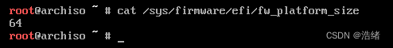
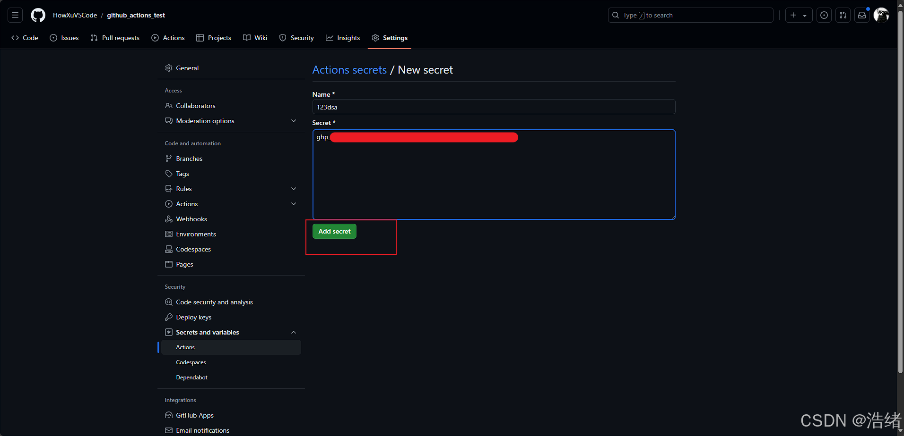

# 前言
Arch Linux最大的特点就是干净，它只预装了Linux和Linux驱动，浏览器、桌面环境、文件管理器、记事本等等都要通过用户自己安装。这也就给了Arch非常多的定制空间。除此之外，这样干净的系统和高度定制化的设计给了开发者很好的体验。

一台已经安装Windows 10操作系统的虚拟机，现在我们为它再安装一个Arch Linux系统，并实现由Arch的GRUB来引导两个系统随心切换。

[Arch官网](https://archlinux.org/)

首先到官网下载最新版本的镜像文件，Arch是滚动发行的，所以版本一般会很新，你也可以用以前的版本。

Arch的安装是**纯命令行安装**，很抽象容易错，所以有了这篇文。

推荐的文章：

[Arch Linux 详细安装教程，萌新再也不怕了！「2023.10」](https://zhuanlan.zhihu.com/p/596227524)
[archlinux 基础安装 ](https://arch.icekylin.online/guide/rookie/basic-install.html)

# 安装过程

## 1.引导进入镜像文件

是的，我一上来直接开干了不检查什么的。

这一步不是很难，你可以用Ventoy也可以用上述的教程中的方法。Arch安装是**先使用安装镜像里的系统进行配置，再通过chroot命令切换到配置完成的系统**。

进到镜像系统后会有b的一声，然后是GRUB的选择界面。


直接选择默认，回车即可。然后会出现一大堆的检查环节。


在所有检查结束后就会进到彩色的Shell中。然后就要开始用命令行了。


## 2.UEFI检查，网络连接和时钟更新


首先使用下列命令验证启动模式（虽然都2024年了我不相信还有电脑不用UEFI启动的）。

```shell
cat /sys/firmware/efi/fw_platform_size
```
返回



Arch的安装是需要联网的，如果插的光纤自然最好，没有的话可以用USB连接手机使用**通过USB共享网络**的方式。最好不要连WIFI，因为不一定有网卡驱动。如果只有WIFI可以用，请移步到最上面的第一篇推荐文章中查看教程。

联网之后更新一下时间(当然也可以不更新)

```bash
timedatectl
```


## 3.磁盘分区

这是最难的一步。

首先查看所有的磁盘，<font color=red>不包括未分配的区域</font>：

```bash
lsblk
```
  
之后使用`fdisk`命令开始分区操作。

```bash
fdisk /dev/nvme0n1 #这里的具体代号和上面准备安装的磁盘有关
```

  
输入p查看所有分区看下选错没有：

 
Linux系统的安装需要三个分区，如下：
|分区|用途|
|-|-|
|/|作为文件系统根目录|
|/boot|EFI启动分区，存放启动相关文件|
|/swap|交换分区，一般是内存大小的1-1.5倍|

我一般不把home分区和整个根目录分开(事实上也不需要，毕竟Windows自古以来用户目录都在C盘下面)，所以不用特别分一个区挂载/home路径。如果需要单独分区/home，请移步推荐教程。

我们的分区目标就只有这三个，输入`n`创建新的分区：

文件系统`Linux filesystem`可以不用改，它和分区的文件系统类型是无关的。

接下来是/swap分区：  


然后是/boot分区：

  
再次使用p打印分区表：  
  
确保正常后使用w进行写入：  


自动退回到命令行中，接下来对分区进行格式化，记住刚刚分好的区对应的代号和用途。

<font color=red>请务必小心，因为弄不好别的已有的分区就没了。</font>


```bash
mkfs.ext4 /dev/nvme0n1p5 #格式化根目录为ext4类型
mkswap /dev/nvme0n1p6 #格式化交换分区
mkfs.fat -F 32 /dev/nvme0n1p7 #格式化EFI分区为FAT32文件系统
```
  
之后对分区进行挂载；

首先把根分区挂载在`/mnt`目录下：

```bash
mount dev/nvme0n1p5 /mnt
```
然后挂载/boot分区的同时为其创建文件夹：

```bash
mount --mkdir /dev/nvme0n1p7 /mnt/boot
```

最后声明一下swap分区就可以了：

```bash
swapon /dev/nvme0n1p7
```


你可以使用`df -h`和`free -h`查看挂载情况。

## 4.安装系统
首先使用Vim编辑一下pacman的镜像。

```bash
vim /etc/pacman.d/mirrorlist
```
更换内容为：

```bash
Server = https://mirrors.ustc.edu.cn/archlinux/$repo/os/$arch
```

:wq保存。

之后执行一连串命令：

```bash
pacman -Sy #更新包
pacstrap -K /mnt base linux linux-firmware #安装Linux基本
```
然后可以去喝个小茶等一下，最后是这样的：
然后生成一下fatab文件(不然根目录和swap分区不会自动挂载)：

```bash
genfstab -U /mnt >> /mnt/etc/fstab
```

最后就可以使用chroot更换到安装好的系统中了：
```bash
arch-chroot /mnt
```

## 5.初始化系统
这个事情比较多直接照着命令打就行了。

```bash
ln -sf /usr/share/zoneinfo/Asia/Shanghai /etc/localtime #软件时区修改
hwclock --systohc #硬件时区修改
pacman -S vim terminus-font #安装Vim和终端字体
```
然后使用vim打开`/etc/locale.gen`文件，在最前面添加`en_US.UTF-8 UTF-8`和`zh_CN.UTF-8 UTF-8`。


```bash
locale-gen #本地化
echo "LANG=en_US.UTF-8" > /etc/locale.conf
pacman -S wqy-microhei wqy-zenhei #安装中文字体 
```

```bash
echo "howxu" > /etc/hostname #设置主机名称为howxu
pacman -S networkmanager #安装网络管理器
systemctl enable NetworkManager.service #设置管理器自启动
passwd root #修改root密码

cat /proc/cpuinfo # 查看cpu型号
pacman -S amd-ucode # amdCPU安装
pacman -S intel-ucode # intelCPU安装

pacman -S grub efibootmgr #安装grub引导
grub-install --target=x86_64-efi --efi-directory=/boot --bootloader-id=GRUB #将GRUB安装到计算机
```
因为这里是Windows+Arch双系统所以还有些额外工作：

```shell
pacman -S os-prober #安装多系统支持
```

使用vim打开`/etc/default/grub`文件，搜索“GRUB_DISABLE_OS_PROBER=false”，并去掉这行开头的“#”。
最后无论是否是双系统，输入下面命令

```shell
grub-mkconfig -o /boot/grub/grub.cfg
```

正常这里应该有Windows的字符串出现的，但是没有（。

接下来的步骤你可以跳过，因为我这里是有点问题的。
```bash
mkdir /boot/EFI/win #创建Windows的启动项挂载路径
mount /dev/nvme0n1p1 /boot/EFI/win #挂载Windows的启动项
grub-mkconfig -o /boot/grub/grub.cfg #再次更新
```

  
这样就正常了。

## 6.安装收尾

```bash
exit #退出chroot
umount -R /mnt #取消挂载
reboot #重启
```

重启之后会来到这样的GRUB界面，选择第一个即可进入刚刚安装的Arch系统，你也可以看到Windows的启动项。


当然呢，如果你现在跑到BIOS里看一眼就会发现Windows的启动项WindowsBootManager还在，但是跑到了第二个位置，第一个位置是GRUB。

选中上图GRUB第一个选项即可进入Arch：


前面是主机名，要求login，用刚刚的root账户登录即可。

## 7.安装一个桌面环境
照着命令敲就行，这里安装的是KDE。

首先需要一个**非root的用户**，这个可以参考别的Linux发行版的添加用户的方式，然后登录这个用户。

```
sudo useradd 用户名 #创建用户
sudo useradd -m 用户名 #创建用户同时创建家目录
sudo passwd 用户名 #修改密码
```

除此之外，添加的用户应该具有`/home/用户名`目录，不然KDE登录之后会瞬间退出来，而且启动不了终端。这个事也不用急，拿Arch镜像系统挂载然后chroot上去新建一下然后chown就行了。

输入以下命令进行桌面环境的安装。

```bash
sudo pacman -S plasma-meta konsole dolphin #安装基础软件包
sudo systemctl enable sddm #桌面环境自启动
sudo reboot
```

# 后言
Arch的玩法很多别的什么我就不列举了，最终，我们得到一个Arch和Windows双系统！
